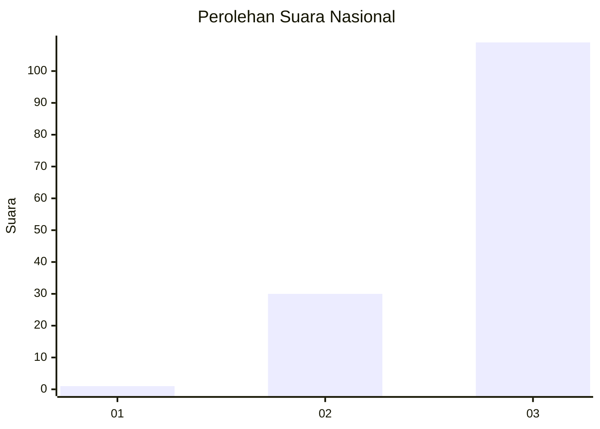
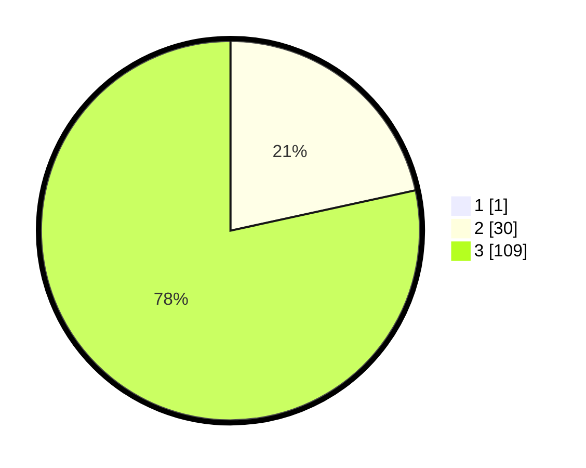

# Hasil

## Grafik

## Tabel

| No. | Nama Paslon    | Suara | Suara (raw) | Persentase |
|:--- |:-------------- | -----:| -----------:| ----------:|
| 1   | ANIES MUHAIMIN | 1     | [1][p-1]    | 0,71       |
| 2   | PRABOWO GIBRAN | 30    | [30][p-2]   | 21,43      |
| 3   | GANJAR MAHFUD  | 109   | [109][p-3]  | 77,86      |

[p-1]: https://github.com/gigit-pemilu/pemilu-2024/blob/main/pilpres/hitung-suara/sub/53-nusa-tenggara-timur/sub/02-kab-timor-tengah-selatan/sub/31-tobu/sub/2003-tune/sub/003-tps/sub/paslon-1.txt
[p-2]: https://github.com/gigit-pemilu/pemilu-2024/blob/main/pilpres/hitung-suara/sub/53-nusa-tenggara-timur/sub/02-kab-timor-tengah-selatan/sub/31-tobu/sub/2003-tune/sub/003-tps/sub/paslon-2.txt
[p-3]: https://github.com/gigit-pemilu/pemilu-2024/blob/main/pilpres/hitung-suara/sub/53-nusa-tenggara-timur/sub/02-kab-timor-tengah-selatan/sub/31-tobu/sub/2003-tune/sub/003-tps/sub/paslon-3.txt

## Foto C Plano

https://sirekap-obj-formc.kpu.go.id/19a4/pemilu/ppwp/53/02/31/20/03/5302312003003-20240216-094838--1171822c-d691-492d-9ea6-8ba6a5b7eb23.jpg

https://sirekap-obj-formc.kpu.go.id/19a4/pemilu/ppwp/53/02/31/20/03/5302312003003-20240216-095138--ea28fede-1e72-475a-beec-c54723e5631a.jpg

https://sirekap-obj-formc.kpu.go.id/19a4/pemilu/ppwp/53/02/31/20/03/5302312003003-20240216-095336--2a600559-7bb9-4af9-a499-7b43bb5320d1.jpg

## Metadata

| Key        | Value               |
| ---------- | ------------------- |
| Time Stamp | 2024-02-25 18:00:00 |

