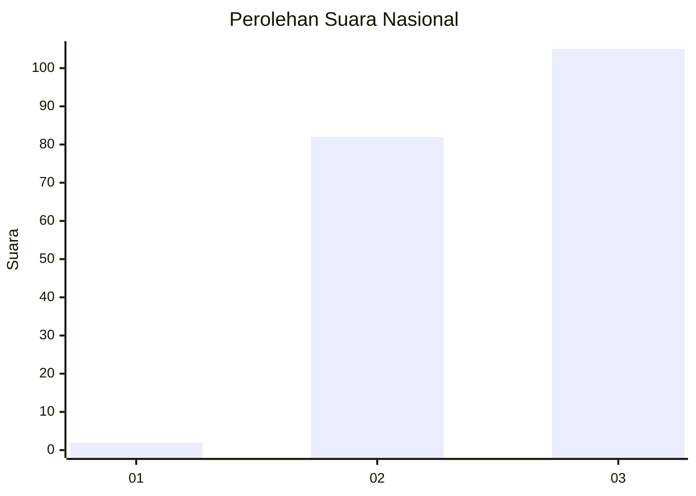
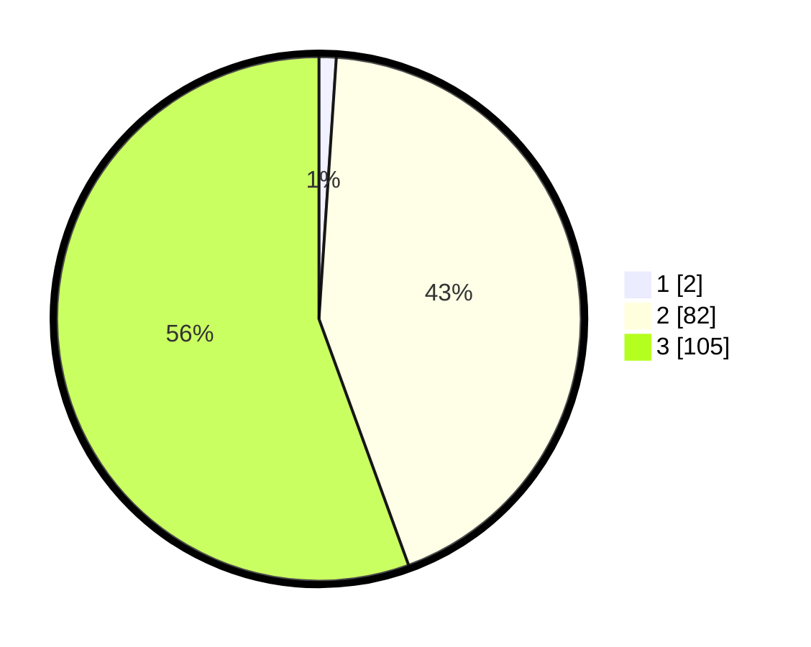

# Hasil

## Grafik

## Tabel

| No. | Nama Paslon    | Suara | Suara (raw) | Persentase |
|:--- |:-------------- | -----:| -----------:| ----------:|
| 1   | ANIES MUHAIMIN | 2     | [2][p-1]    | 1,06       |
| 2   | PRABOWO GIBRAN | 82    | [82][p-2]   | 43,39      |
| 3   | GANJAR MAHFUD  | 105   | [105][p-3]  | 55,56      |

[p-1]: https://github.com/gigit-pemilu/pemilu-2024/blob/main/pilpres/hitung-suara/sub/53-nusa-tenggara-timur/sub/03-timor-tengah-utara/sub/02-miomaffo-barat/sub/2001-noepesu/sub/001-tps/sub/paslon-1.txt
[p-2]: https://github.com/gigit-pemilu/pemilu-2024/blob/main/pilpres/hitung-suara/sub/53-nusa-tenggara-timur/sub/03-timor-tengah-utara/sub/02-miomaffo-barat/sub/2001-noepesu/sub/001-tps/sub/paslon-2.txt
[p-3]: https://github.com/gigit-pemilu/pemilu-2024/blob/main/pilpres/hitung-suara/sub/53-nusa-tenggara-timur/sub/03-timor-tengah-utara/sub/02-miomaffo-barat/sub/2001-noepesu/sub/001-tps/sub/paslon-3.txt

## Foto C Plano

https://sirekap-obj-formc.kpu.go.id/4420/pemilu/ppwp/53/03/02/20/01/5303022001001-20240215-152359--a81767b6-8c25-4d5e-84c3-6706ca2d3386.jpg

https://sirekap-obj-formc.kpu.go.id/4420/pemilu/ppwp/53/03/02/20/01/5303022001001-20240215-120653--874185fa-7036-4de8-8609-089cacf89280.jpg

https://sirekap-obj-formc.kpu.go.id/4420/pemilu/ppwp/53/03/02/20/01/5303022001001-20240215-131219--c2846440-c891-4d9b-bd35-9e2a2c217861.jpg

## Metadata

| Key        | Value               |
| ---------- | ------------------- |
| Time Stamp | 2024-02-15 22:00:27 |

