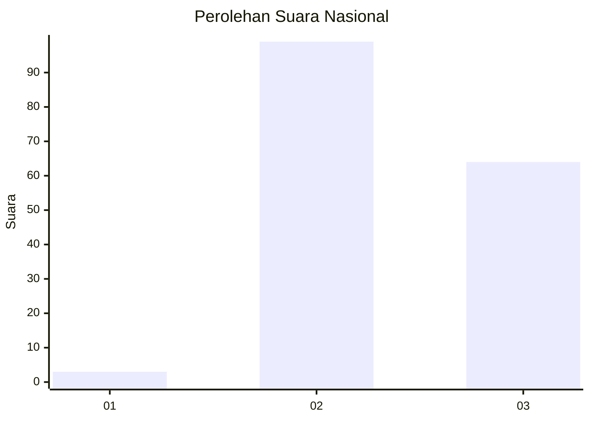
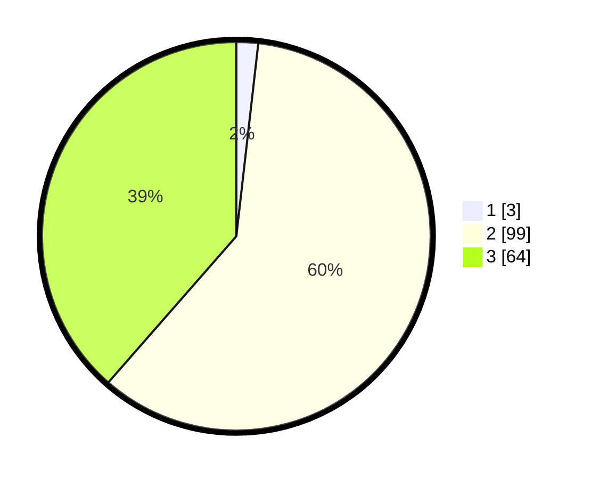

# Hasil

## Grafik

## Tabel

| No. | Nama Paslon    | Suara | Suara (raw) | Persentase |
|:--- |:-------------- | -----:| -----------:| ----------:|
| 1   | ANIES MUHAIMIN | 3     | [3][p-1]    | 1,81       |
| 2   | PRABOWO GIBRAN | 99    | [99][p-2]   | 59,64      |
| 3   | GANJAR MAHFUD  | 64    | [64][p-3]   | 38,55      |

[p-1]: https://github.com/gigit-pemilu/pemilu-2024/blob/main/pilpres/hitung-suara/sub/53-nusa-tenggara-timur/sub/03-timor-tengah-utara/sub/02-miomaffo-barat/sub/2001-noepesu/sub/005-tps/sub/paslon-1.txt
[p-2]: https://github.com/gigit-pemilu/pemilu-2024/blob/main/pilpres/hitung-suara/sub/53-nusa-tenggara-timur/sub/03-timor-tengah-utara/sub/02-miomaffo-barat/sub/2001-noepesu/sub/005-tps/sub/paslon-2.txt
[p-3]: https://github.com/gigit-pemilu/pemilu-2024/blob/main/pilpres/hitung-suara/sub/53-nusa-tenggara-timur/sub/03-timor-tengah-utara/sub/02-miomaffo-barat/sub/2001-noepesu/sub/005-tps/sub/paslon-3.txt

## Foto C Plano

https://sirekap-obj-formc.kpu.go.id/2a13/pemilu/ppwp/53/03/02/20/01/5303022001005-20240215-204306--c1a3b353-de88-4cd1-9c0e-752c84a21866.jpg

https://sirekap-obj-formc.kpu.go.id/2a13/pemilu/ppwp/53/03/02/20/01/5303022001005-20240215-190055--efcf8208-c913-4f5c-a869-ac5d211ef9d8.jpg

https://sirekap-obj-formc.kpu.go.id/2a13/pemilu/ppwp/53/03/02/20/01/5303022001005-20240215-204750--4722b71b-78b1-4d16-b26e-9e3807840eeb.jpg

## Metadata

| Key        | Value               |
| ---------- | ------------------- |
| Time Stamp | 2024-02-25 16:00:00 |

