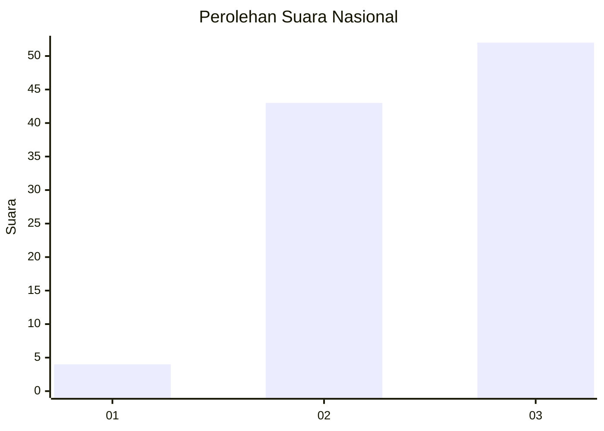
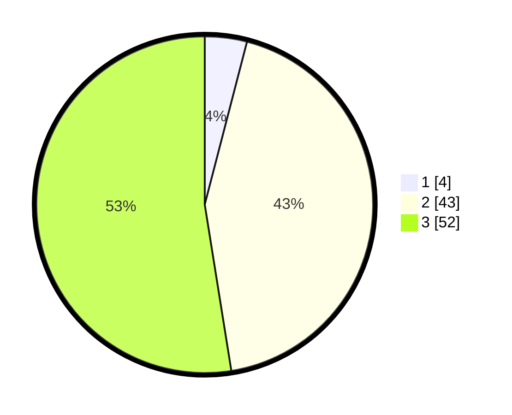

# Hasil

## Grafik

## Tabel

| No. | Nama Paslon    | Suara | Suara (raw) | Persentase |
|:--- |:-------------- | -----:| -----------:| ----------:|
| 1   | ANIES MUHAIMIN | 4     | [4][p-1]    | 4,04       |
| 2   | PRABOWO GIBRAN | 43    | [43][p-2]   | 43,43      |
| 3   | GANJAR MAHFUD  | 52    | [52][p-3]   | 52,53      |

[p-1]: https://github.com/gigit-pemilu/pemilu-2024/blob/main/pilpres/hitung-suara/sub/53-nusa-tenggara-timur/sub/03-timor-tengah-utara/sub/02-miomaffo-barat/sub/2004-lemon/sub/002-tps/sub/paslon-1.txt
[p-2]: https://github.com/gigit-pemilu/pemilu-2024/blob/main/pilpres/hitung-suara/sub/53-nusa-tenggara-timur/sub/03-timor-tengah-utara/sub/02-miomaffo-barat/sub/2004-lemon/sub/002-tps/sub/paslon-2.txt
[p-3]: https://github.com/gigit-pemilu/pemilu-2024/blob/main/pilpres/hitung-suara/sub/53-nusa-tenggara-timur/sub/03-timor-tengah-utara/sub/02-miomaffo-barat/sub/2004-lemon/sub/002-tps/sub/paslon-3.txt

## Foto C Plano

https://sirekap-obj-formc.kpu.go.id/1bbe/pemilu/ppwp/53/03/02/20/04/5303022004002-20240214-224407--2aac4d80-2631-4558-bda0-298652ace725.jpg

https://sirekap-obj-formc.kpu.go.id/1bbe/pemilu/ppwp/53/03/02/20/04/5303022004002-20240214-234335--157b3808-275b-413c-86b7-9b895d82f27b.jpg

https://sirekap-obj-formc.kpu.go.id/1bbe/pemilu/ppwp/53/03/02/20/04/5303022004002-20240216-135445--e5d6581c-29c7-4a4b-8b2f-3f9c39ea27e8.jpg

## Metadata

| Key        | Value               |
| ---------- | ------------------- |
| Time Stamp | 2024-02-25 18:00:00 |

