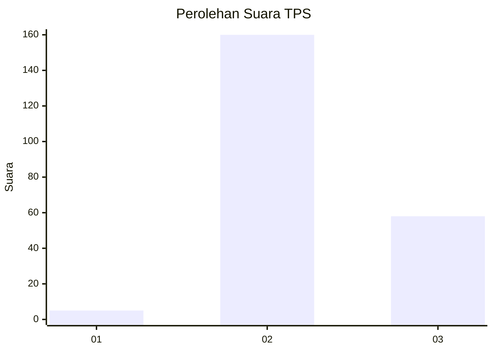
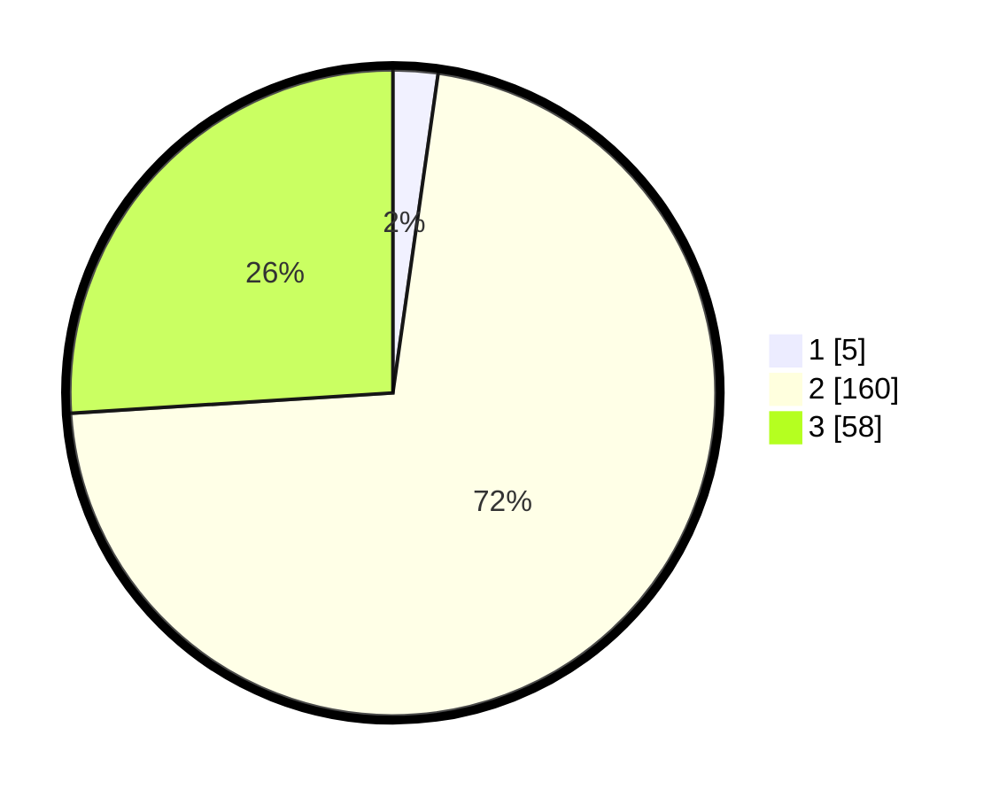

# Hasil

## Grafik

## Tabel

| No. | Nama Paslon    | Suara | Suara (raw) | Persentase |
|:--- |:-------------- | -----:| -----------:| ----------:|
| 1   | ANIES MUHAIMIN | 5     | [5][p-1]    | 2,24       |
| 2   | PRABOWO GIBRAN | 160   | [160][p-2]  | 71,75      |
| 3   | GANJAR MAHFUD  | 58    | [58][p-3]   | 26,01      |

[p-1]: https://github.com/gigit-pemilu/pemilu-2024-53-nusa-tenggara-timur/blob/main/pilpres/hitung-suara/sub/53-nusa-tenggara-timur/sub/03-timor-tengah-utara/sub/05-kota-kefamenanu/sub/1002-aplasi/sub/001-tps/sub/paslon-1.txt
[p-2]: https://github.com/gigit-pemilu/pemilu-2024-53-nusa-tenggara-timur/blob/main/pilpres/hitung-suara/sub/53-nusa-tenggara-timur/sub/03-timor-tengah-utara/sub/05-kota-kefamenanu/sub/1002-aplasi/sub/001-tps/sub/paslon-2.txt
[p-3]: https://github.com/gigit-pemilu/pemilu-2024-53-nusa-tenggara-timur/blob/main/pilpres/hitung-suara/sub/53-nusa-tenggara-timur/sub/03-timor-tengah-utara/sub/05-kota-kefamenanu/sub/1002-aplasi/sub/001-tps/sub/paslon-3.txt

## Foto C Plano

https://sirekap-obj-formc.kpu.go.id/2b04/pemilu/ppwp/53/03/05/10/02/5303051002001-20240215-091659--e673057d-f195-497e-9f14-35aad015dfdf.jpg

https://sirekap-obj-formc.kpu.go.id/2b04/pemilu/ppwp/53/03/05/10/02/5303051002001-20240215-092032--e0730714-3535-4a4a-9b4b-fe191d86545d.jpg

https://sirekap-obj-formc.kpu.go.id/2b04/pemilu/ppwp/53/03/05/10/02/5303051002001-20240215-092138--a3bf1a93-4c60-4986-860b-4b37c25127bc.jpg

## Metadata

| Key        | Value               |
| ---------- | ------------------- |
| Time Stamp | 2024-02-24 22:31:28 |

