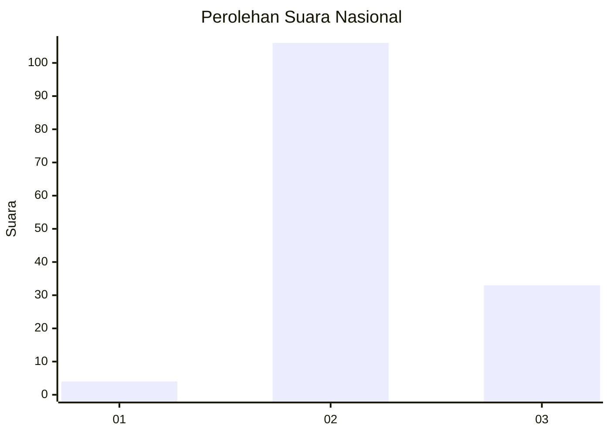
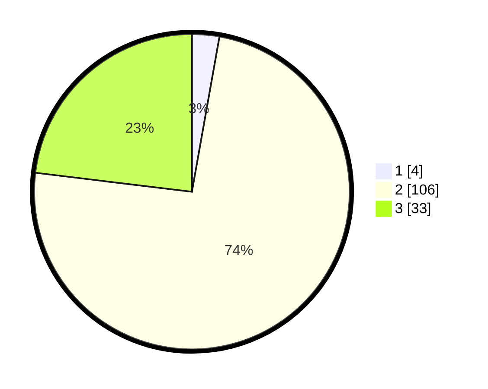

# Hasil

## Grafik

## Tabel

| No. | Nama Paslon    | Suara | Suara (raw) | Persentase |
|:--- |:-------------- | -----:| -----------:| ----------:|
| 1   | ANIES MUHAIMIN | 4     | [4][p-1]    | 2,80       |
| 2   | PRABOWO GIBRAN | 106   | [106][p-2]  | 74,13      |
| 3   | GANJAR MAHFUD  | 33    | [33][p-3]   | 23,08      |

[p-1]: https://github.com/gigit-pemilu/pemilu-2024/blob/main/pilpres/hitung-suara/sub/53-nusa-tenggara-timur/sub/03-timor-tengah-utara/sub/09-insana-utara/sub/2007-oesoko/sub/003-tps/sub/paslon-1.txt
[p-2]: https://github.com/gigit-pemilu/pemilu-2024/blob/main/pilpres/hitung-suara/sub/53-nusa-tenggara-timur/sub/03-timor-tengah-utara/sub/09-insana-utara/sub/2007-oesoko/sub/003-tps/sub/paslon-2.txt
[p-3]: https://github.com/gigit-pemilu/pemilu-2024/blob/main/pilpres/hitung-suara/sub/53-nusa-tenggara-timur/sub/03-timor-tengah-utara/sub/09-insana-utara/sub/2007-oesoko/sub/003-tps/sub/paslon-3.txt

## Foto C Plano

https://sirekap-obj-formc.kpu.go.id/5573/pemilu/ppwp/53/03/09/20/07/5303092007003-20240215-055141--f50d4bdc-8153-4123-889e-856cc4cad6b8.jpg

https://sirekap-obj-formc.kpu.go.id/5573/pemilu/ppwp/53/03/09/20/07/5303092007003-20240215-055247--ce17ec2e-495f-40df-973d-3aaf4ee863a3.jpg

https://sirekap-obj-formc.kpu.go.id/5573/pemilu/ppwp/53/03/09/20/07/5303092007003-20240215-055358--e8ab53e0-cc5b-4d10-8145-ba4f2611f459.jpg

## Metadata

| Key        | Value               |
| ---------- | ------------------- |
| Time Stamp | 2024-02-17 19:00:04 |

