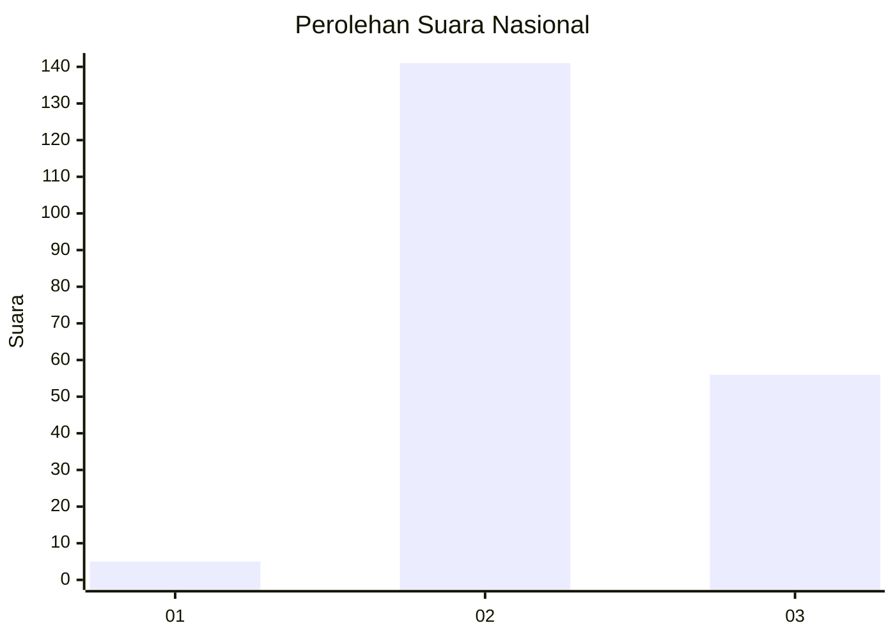
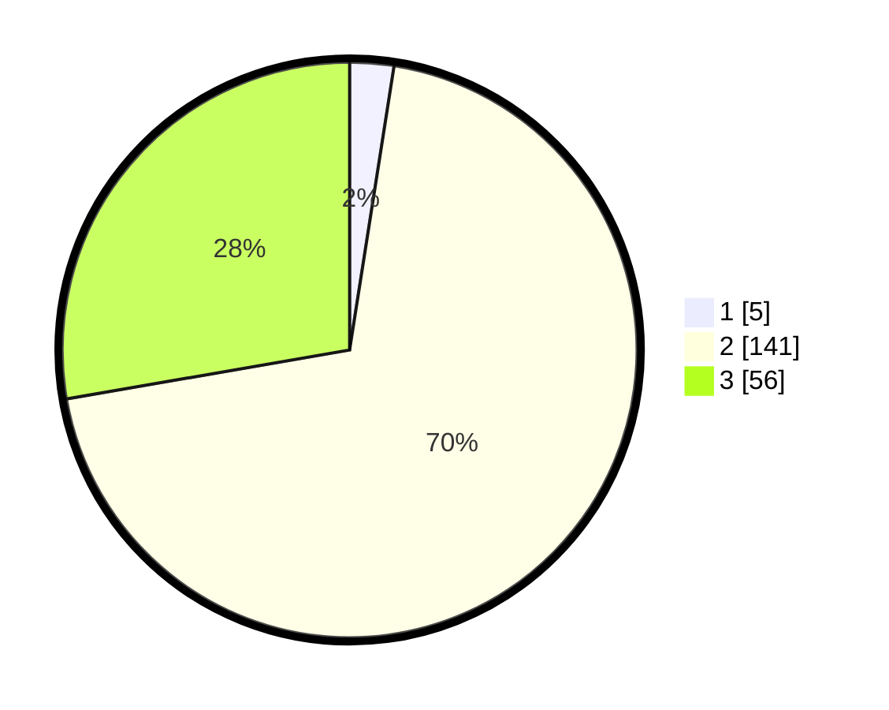

# Hasil

## Grafik

## Tabel

| No. | Nama Paslon    | Suara | Suara (raw) | Persentase |
|:--- |:-------------- | -----:| -----------:| ----------:|
| 1   | ANIES MUHAIMIN | 5     | [5][p-1]    | 2,48       |
| 2   | PRABOWO GIBRAN | 141   | [141][p-2]  | 69,80      |
| 3   | GANJAR MAHFUD  | 56    | [56][p-3]   | 27,72      |

[p-1]: https://github.com/gigit-pemilu/pemilu-2024/blob/main/pilpres/hitung-suara/sub/53-nusa-tenggara-timur/sub/03-timor-tengah-utara/sub/09-insana-utara/sub/2007-oesoko/sub/004-tps/sub/paslon-1.txt
[p-2]: https://github.com/gigit-pemilu/pemilu-2024/blob/main/pilpres/hitung-suara/sub/53-nusa-tenggara-timur/sub/03-timor-tengah-utara/sub/09-insana-utara/sub/2007-oesoko/sub/004-tps/sub/paslon-2.txt
[p-3]: https://github.com/gigit-pemilu/pemilu-2024/blob/main/pilpres/hitung-suara/sub/53-nusa-tenggara-timur/sub/03-timor-tengah-utara/sub/09-insana-utara/sub/2007-oesoko/sub/004-tps/sub/paslon-3.txt

## Foto C Plano

https://sirekap-obj-formc.kpu.go.id/f7ed/pemilu/ppwp/53/03/09/20/07/5303092007004-20240215-070145--1247df34-7673-4ad3-af00-82d077f5dcff.jpg

https://sirekap-obj-formc.kpu.go.id/f7ed/pemilu/ppwp/53/03/09/20/07/5303092007004-20240215-101044--586eeb22-0e59-413c-b55a-d8621b087b28.jpg

https://sirekap-obj-formc.kpu.go.id/f7ed/pemilu/ppwp/53/03/09/20/07/5303092007004-20240215-070604--6080e350-ad1a-4222-b78c-52e659d2c196.jpg

## Metadata

| Key        | Value               |
| ---------- | ------------------- |
| Time Stamp | 2024-02-17 19:00:04 |

