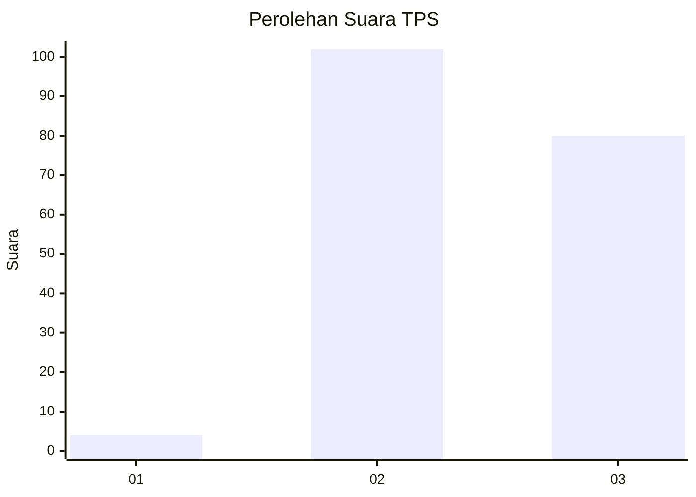
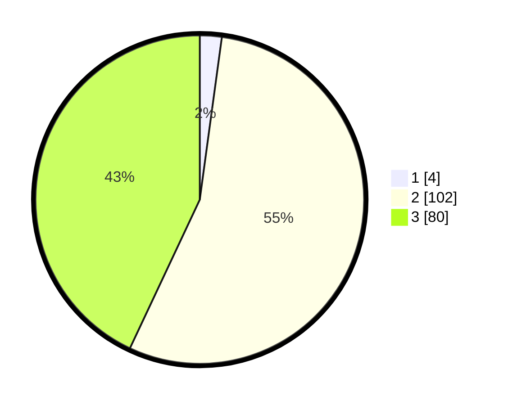

# Hasil

## Grafik

## Tabel

| No. | Nama Paslon    | Suara | Suara (raw) | Persentase |
|:--- |:-------------- | -----:| -----------:| ----------:|
| 1   | ANIES MUHAIMIN | 4     | [4][p-1]    | 2,15       |
| 2   | PRABOWO GIBRAN | 102   | [102][p-2]  | 54,84      |
| 3   | GANJAR MAHFUD  | 80    | [80][p-3]   | 43,01      |

[p-1]: https://github.com/gigit-pemilu/pemilu-2024-53-nusa-tenggara-timur/blob/main/pilpres/hitung-suara/sub/53-nusa-tenggara-timur/sub/03-timor-tengah-utara/sub/11-miomaffo-tengah/sub/2001-tuabatan/sub/001-tps/sub/paslon-1.txt
[p-2]: https://github.com/gigit-pemilu/pemilu-2024-53-nusa-tenggara-timur/blob/main/pilpres/hitung-suara/sub/53-nusa-tenggara-timur/sub/03-timor-tengah-utara/sub/11-miomaffo-tengah/sub/2001-tuabatan/sub/001-tps/sub/paslon-2.txt
[p-3]: https://github.com/gigit-pemilu/pemilu-2024-53-nusa-tenggara-timur/blob/main/pilpres/hitung-suara/sub/53-nusa-tenggara-timur/sub/03-timor-tengah-utara/sub/11-miomaffo-tengah/sub/2001-tuabatan/sub/001-tps/sub/paslon-3.txt

## Foto C Plano

https://sirekap-obj-formc.kpu.go.id/852e/pemilu/ppwp/53/03/11/20/01/5303112001001-20240216-064149--d00eadb1-868f-4a43-886a-26e2c324d2ea.jpg

https://sirekap-obj-formc.kpu.go.id/852e/pemilu/ppwp/53/03/11/20/01/5303112001001-20240216-091630--ae05d4d2-03fe-45b8-bd03-42fd96e1bac1.jpg

https://sirekap-obj-formc.kpu.go.id/852e/pemilu/ppwp/53/03/11/20/01/5303112001001-20240215-222156--1751b308-a20c-40e9-8d70-df5e2a25b60a.jpg

## Metadata

| Key        | Value               |
| ---------- | ------------------- |
| Time Stamp | 2024-02-16 12:51:22 |

