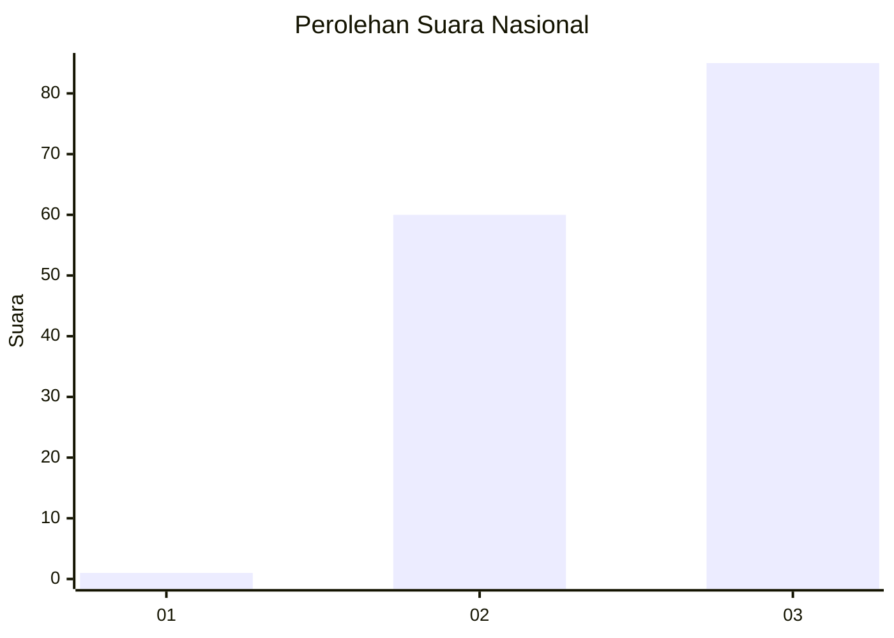
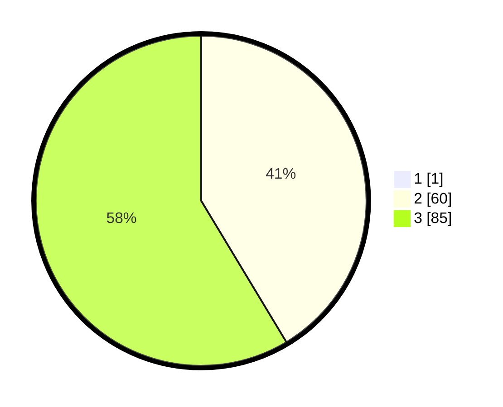

# Hasil

## Grafik

## Tabel

| No. | Nama Paslon    | Suara | Suara (raw) | Persentase |
|:--- |:-------------- | -----:| -----------:| ----------:|
| 1   | ANIES MUHAIMIN | 1     | [1][p-1]    | 0,68       |
| 2   | PRABOWO GIBRAN | 60    | [60][p-2]   | 41,10      |
| 3   | GANJAR MAHFUD  | 85    | [85][p-3]   | 58,22      |

[p-1]: https://github.com/gigit-pemilu/pemilu-2024/blob/main/pilpres/hitung-suara/sub/53-nusa-tenggara-timur/sub/03-timor-tengah-utara/sub/11-miomaffo-tengah/sub/2002-akomi/sub/002-tps/sub/paslon-1.txt
[p-2]: https://github.com/gigit-pemilu/pemilu-2024/blob/main/pilpres/hitung-suara/sub/53-nusa-tenggara-timur/sub/03-timor-tengah-utara/sub/11-miomaffo-tengah/sub/2002-akomi/sub/002-tps/sub/paslon-2.txt
[p-3]: https://github.com/gigit-pemilu/pemilu-2024/blob/main/pilpres/hitung-suara/sub/53-nusa-tenggara-timur/sub/03-timor-tengah-utara/sub/11-miomaffo-tengah/sub/2002-akomi/sub/002-tps/sub/paslon-3.txt

## Foto C Plano

https://sirekap-obj-formc.kpu.go.id/9260/pemilu/ppwp/53/03/11/20/02/5303112002002-20240215-224623--498c43bf-7038-4064-a134-1c7a7381d27e.jpg

https://sirekap-obj-formc.kpu.go.id/9260/pemilu/ppwp/53/03/11/20/02/5303112002002-20240215-225058--8d136a7b-c501-4c20-bcb4-4f1cfdb5e4cf.jpg

https://sirekap-obj-formc.kpu.go.id/9260/pemilu/ppwp/53/03/11/20/02/5303112002002-20240215-210617--7f20f2c4-0779-464f-a0af-4769bb38dd48.jpg

## Metadata

| Key        | Value               |
| ---------- | ------------------- |
| Time Stamp | 2024-02-16 00:30:27 |

