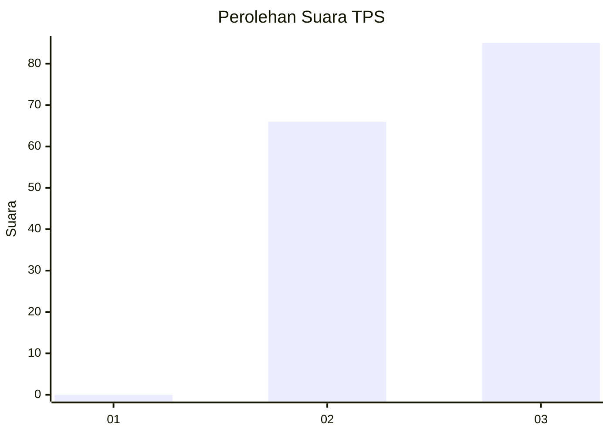
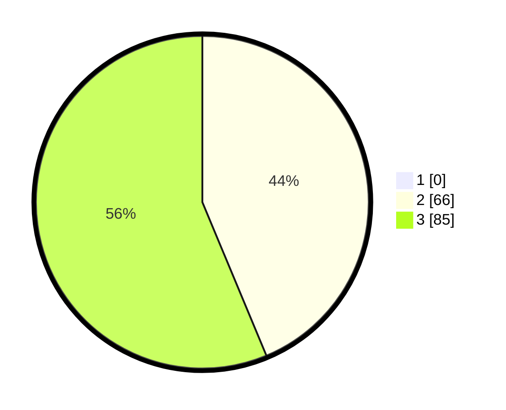

# Hasil

## Grafik

## Tabel

| No. | Nama Paslon    | Suara | Suara (raw) | Persentase |
|:--- |:-------------- | -----:| -----------:| ----------:|
| 1   | ANIES MUHAIMIN | 0     | [0][p-1]    | 0,00       |
| 2   | PRABOWO GIBRAN | 66    | [66][p-2]   | 43,71      |
| 3   | GANJAR MAHFUD  | 85    | [85][p-3]   | 56,29      |

[p-1]: https://github.com/gigit-pemilu/pemilu-2024-53-nusa-tenggara-timur/blob/main/pilpres/hitung-suara/sub/53-nusa-tenggara-timur/sub/03-timor-tengah-utara/sub/12-musi/sub/2002-oetulu/sub/003-tps/sub/paslon-1.txt
[p-2]: https://github.com/gigit-pemilu/pemilu-2024-53-nusa-tenggara-timur/blob/main/pilpres/hitung-suara/sub/53-nusa-tenggara-timur/sub/03-timor-tengah-utara/sub/12-musi/sub/2002-oetulu/sub/003-tps/sub/paslon-2.txt
[p-3]: https://github.com/gigit-pemilu/pemilu-2024-53-nusa-tenggara-timur/blob/main/pilpres/hitung-suara/sub/53-nusa-tenggara-timur/sub/03-timor-tengah-utara/sub/12-musi/sub/2002-oetulu/sub/003-tps/sub/paslon-3.txt

## Foto C Plano

https://sirekap-obj-formc.kpu.go.id/4371/pemilu/ppwp/53/03/12/20/02/5303122002003-20240215-084607--b83a09f0-d8b8-4638-8052-d14afefebb40.jpg

https://sirekap-obj-formc.kpu.go.id/4371/pemilu/ppwp/53/03/12/20/02/5303122002003-20240215-084415--98e93e27-4dbd-4cb3-87ab-b22290df2b8d.jpg

https://sirekap-obj-formc.kpu.go.id/4371/pemilu/ppwp/53/03/12/20/02/5303122002003-20240215-084535--bb3cc441-d9e8-4d86-bbd8-d67922270bb5.jpg

## Metadata

| Key        | Value               |
| ---------- | ------------------- |
| Time Stamp | 2024-03-02 19:00:00 |

