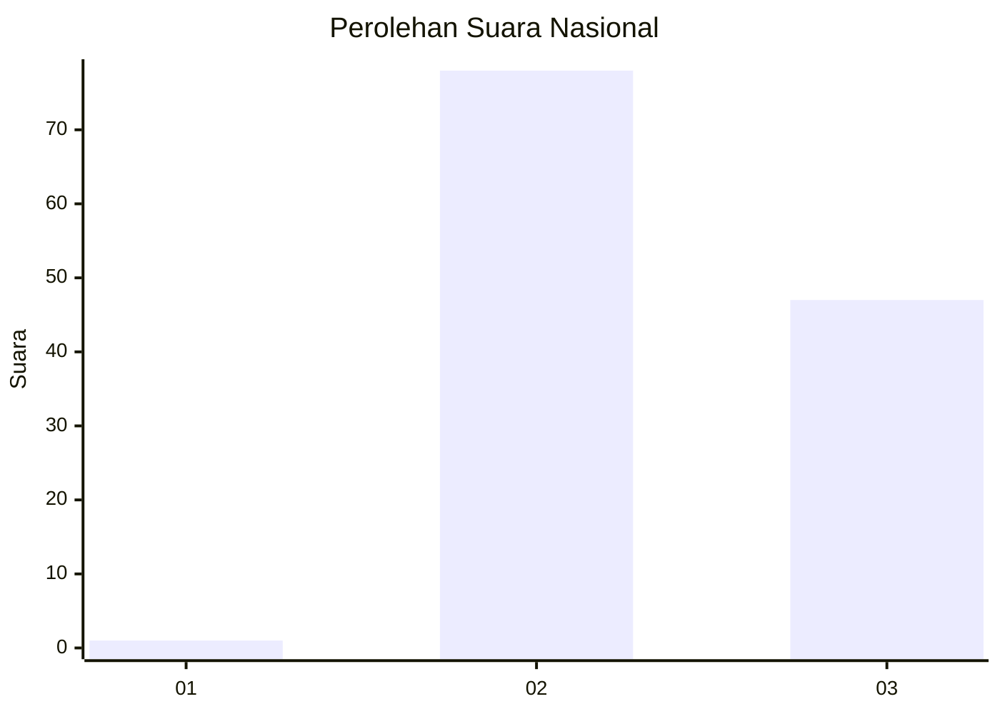
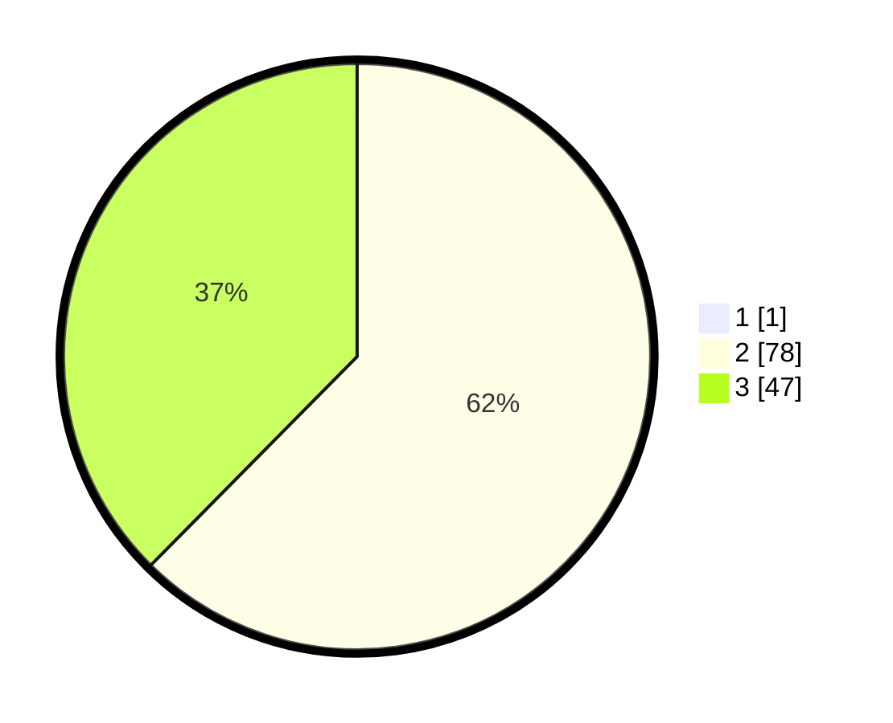

# Hasil

## Grafik

## Tabel

| No. | Nama Paslon    | Suara | Suara (raw) | Persentase |
|:--- |:-------------- | -----:| -----------:| ----------:|
| 1   | ANIES MUHAIMIN | 1     | [1][p-1]    | 0,79       |
| 2   | PRABOWO GIBRAN | 78    | [78][p-2]   | 61,90      |
| 3   | GANJAR MAHFUD  | 47    | [47][p-3]   | 37,30      |

[p-1]: https://github.com/gigit-pemilu/pemilu-2024/blob/main/pilpres/hitung-suara/sub/53-nusa-tenggara-timur/sub/03-timor-tengah-utara/sub/14-bikomi-selatan/sub/2001-oelami/sub/003-tps/sub/paslon-1.txt
[p-2]: https://github.com/gigit-pemilu/pemilu-2024/blob/main/pilpres/hitung-suara/sub/53-nusa-tenggara-timur/sub/03-timor-tengah-utara/sub/14-bikomi-selatan/sub/2001-oelami/sub/003-tps/sub/paslon-2.txt
[p-3]: https://github.com/gigit-pemilu/pemilu-2024/blob/main/pilpres/hitung-suara/sub/53-nusa-tenggara-timur/sub/03-timor-tengah-utara/sub/14-bikomi-selatan/sub/2001-oelami/sub/003-tps/sub/paslon-3.txt

## Foto C Plano

https://sirekap-obj-formc.kpu.go.id/787b/pemilu/ppwp/53/03/14/20/01/5303142001003-20240215-143851--f0254f5d-62c4-4e8a-94cb-783384a1e59b.jpg

https://sirekap-obj-formc.kpu.go.id/787b/pemilu/ppwp/53/03/14/20/01/5303142001003-20240215-143759--9dd524da-dc2c-419e-a5a5-97eecc213b13.jpg

https://sirekap-obj-formc.kpu.go.id/787b/pemilu/ppwp/53/03/14/20/01/5303142001003-20240215-140205--e2dcb599-e3d6-4de6-abc7-54bcc7f2c966.jpg

## Metadata

| Key        | Value               |
| ---------- | ------------------- |
| Time Stamp | 2024-02-25 19:00:00 |

