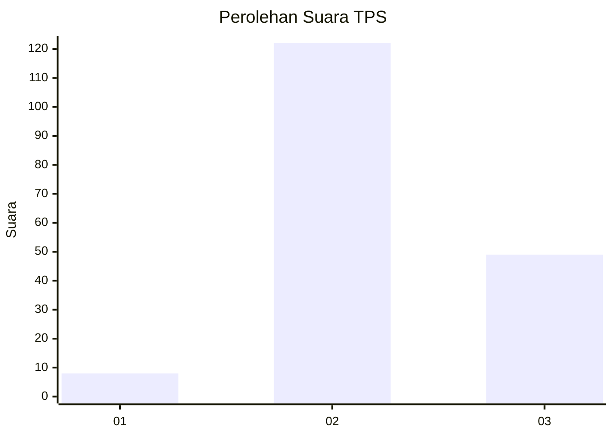

# Hasil

## Grafik

## Tabel

| No. | Nama Paslon    | Suara | Suara (raw) | Persentase |
|:--- |:-------------- | -----:| -----------:| ----------:|
| 1   | ANIES MUHAIMIN | 8     | [8][p-1]    | 4,47       |
| 2   | PRABOWO GIBRAN | 122   | [122][p-2]  | 68,16      |
| 3   | GANJAR MAHFUD  | 49    | [49][p-3]   | 27,37      |

[p-1]: https://github.com/gigit-pemilu/pemilu-2024-53-nusa-tenggara-timur/blob/main/pilpres/hitung-suara/sub/53-nusa-tenggara-timur/sub/03-timor-tengah-utara/sub/14-bikomi-selatan/sub/2001-oelami/sub/007-tps/sub/paslon-1.txt
[p-2]: https://github.com/gigit-pemilu/pemilu-2024-53-nusa-tenggara-timur/blob/main/pilpres/hitung-suara/sub/53-nusa-tenggara-timur/sub/03-timor-tengah-utara/sub/14-bikomi-selatan/sub/2001-oelami/sub/007-tps/sub/paslon-2.txt
[p-3]: https://github.com/gigit-pemilu/pemilu-2024-53-nusa-tenggara-timur/blob/main/pilpres/hitung-suara/sub/53-nusa-tenggara-timur/sub/03-timor-tengah-utara/sub/14-bikomi-selatan/sub/2001-oelami/sub/007-tps/sub/paslon-3.txt

## Foto C Plano

https://sirekap-obj-formc.kpu.go.id/4abe/pemilu/ppwp/53/03/14/20/01/5303142001007-20240216-112338--3d3b0679-22b6-456f-b6f3-436defc3bea3.jpg

https://sirekap-obj-formc.kpu.go.id/4abe/pemilu/ppwp/53/03/14/20/01/5303142001007-20240216-112357--5343bbcd-976d-4f41-ae3d-9c6eee4efe17.jpg

https://sirekap-obj-formc.kpu.go.id/4abe/pemilu/ppwp/53/03/14/20/01/5303142001007-20240216-112412--d9ce5bb5-2fee-4ca1-8113-609bcfdf9cb9.jpg

## Metadata

| Key        | Value               |
| ---------- | ------------------- |
| Time Stamp | 2024-02-25 08:00:00 |

