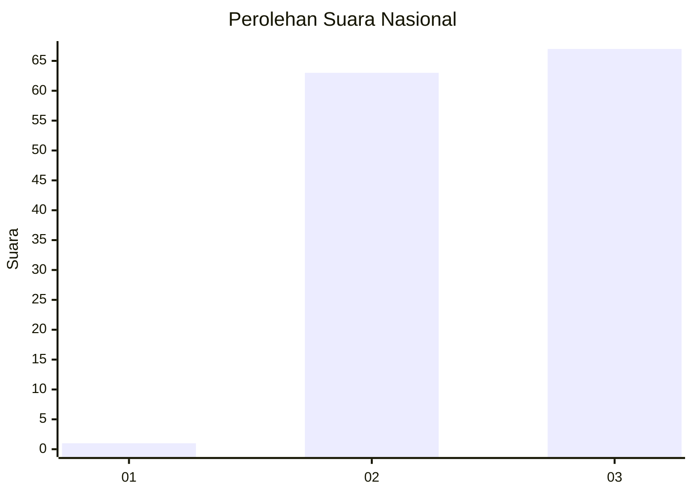
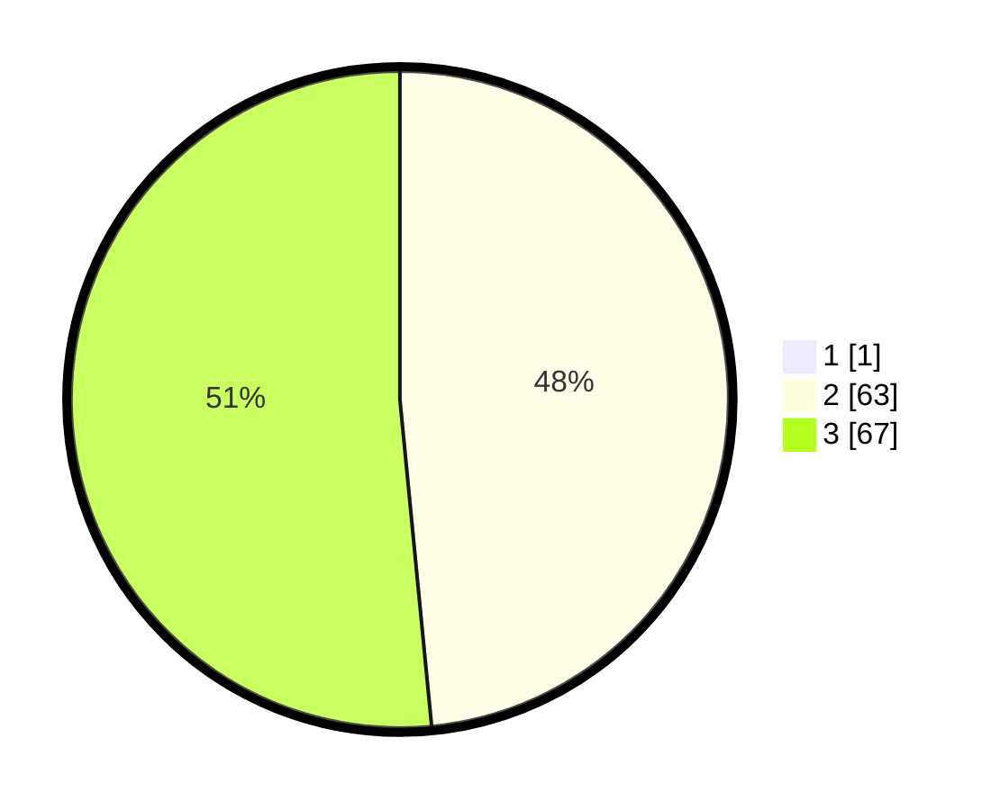

# Hasil

## Grafik

## Tabel

| No. | Nama Paslon    | Suara | Suara (raw) | Persentase |
|:--- |:-------------- | -----:| -----------:| ----------:|
| 1   | ANIES MUHAIMIN | 1     | [1][p-1]    | 0,76       |
| 2   | PRABOWO GIBRAN | 63    | [63][p-2]   | 48,09      |
| 3   | GANJAR MAHFUD  | 67    | [67][p-3]   | 51,15      |

[p-1]: https://github.com/gigit-pemilu/pemilu-2024/blob/main/pilpres/hitung-suara/sub/53-nusa-tenggara-timur/sub/03-timor-tengah-utara/sub/17-bikomi-utara/sub/2003-banain-b/sub/001-tps/sub/paslon-1.txt
[p-2]: https://github.com/gigit-pemilu/pemilu-2024/blob/main/pilpres/hitung-suara/sub/53-nusa-tenggara-timur/sub/03-timor-tengah-utara/sub/17-bikomi-utara/sub/2003-banain-b/sub/001-tps/sub/paslon-2.txt
[p-3]: https://github.com/gigit-pemilu/pemilu-2024/blob/main/pilpres/hitung-suara/sub/53-nusa-tenggara-timur/sub/03-timor-tengah-utara/sub/17-bikomi-utara/sub/2003-banain-b/sub/001-tps/sub/paslon-3.txt

## Foto C Plano

https://sirekap-obj-formc.kpu.go.id/5367/pemilu/ppwp/53/03/17/20/03/5303172003001-20240215-102535--3df0df32-5e10-40be-9245-c717b0a9dff5.jpg

https://sirekap-obj-formc.kpu.go.id/5367/pemilu/ppwp/53/03/17/20/03/5303172003001-20240215-105111--9e88c65b-2b1d-42c9-b337-c3eaf2be8342.jpg

https://sirekap-obj-formc.kpu.go.id/5367/pemilu/ppwp/53/03/17/20/03/5303172003001-20240215-110407--53e6c3af-fc74-4637-b016-76a5679d8adf.jpg

## Metadata

| Key        | Value               |
| ---------- | ------------------- |
| Time Stamp | 2024-02-24 22:31:28 |

