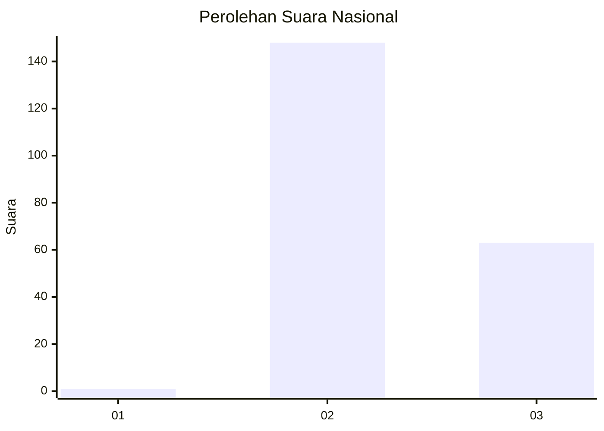
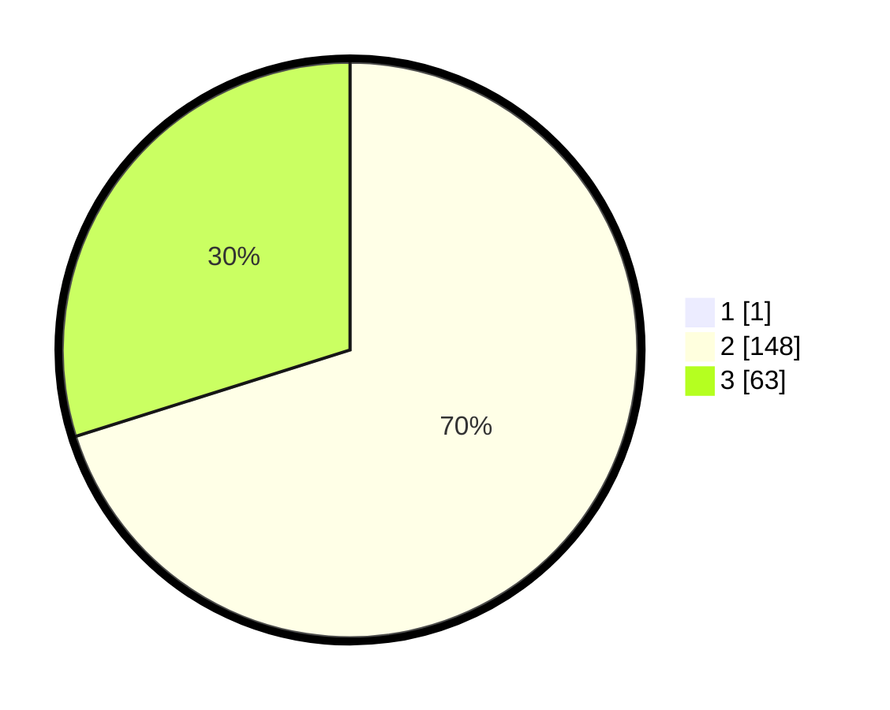

# Hasil

## Grafik

## Tabel

| No. | Nama Paslon    | Suara | Suara (raw) | Persentase |
|:--- |:-------------- | -----:| -----------:| ----------:|
| 1   | ANIES MUHAIMIN | 1     | [1][p-1]    | 0,47       |
| 2   | PRABOWO GIBRAN | 148   | [148][p-2]  | 69,81      |
| 3   | GANJAR MAHFUD  | 63    | [63][p-3]   | 29,72      |

[p-1]: https://github.com/gigit-pemilu/pemilu-2024/blob/main/pilpres/hitung-suara/sub/53-nusa-tenggara-timur/sub/03-timor-tengah-utara/sub/19-insana-fafinesu/sub/2001-fafinesu-a/sub/002-tps/sub/paslon-1.txt
[p-2]: https://github.com/gigit-pemilu/pemilu-2024/blob/main/pilpres/hitung-suara/sub/53-nusa-tenggara-timur/sub/03-timor-tengah-utara/sub/19-insana-fafinesu/sub/2001-fafinesu-a/sub/002-tps/sub/paslon-2.txt
[p-3]: https://github.com/gigit-pemilu/pemilu-2024/blob/main/pilpres/hitung-suara/sub/53-nusa-tenggara-timur/sub/03-timor-tengah-utara/sub/19-insana-fafinesu/sub/2001-fafinesu-a/sub/002-tps/sub/paslon-3.txt

## Foto C Plano

https://sirekap-obj-formc.kpu.go.id/02a0/pemilu/ppwp/53/03/19/20/01/5303192001002-20240215-094031--20f115f8-8005-4a0e-89be-aedd746e4466.jpg

https://sirekap-obj-formc.kpu.go.id/02a0/pemilu/ppwp/53/03/19/20/01/5303192001002-20240215-105010--4f17bebe-ba84-486b-b0c6-38785ce865f0.jpg

https://sirekap-obj-formc.kpu.go.id/02a0/pemilu/ppwp/53/03/19/20/01/5303192001002-20240215-110115--4c2b0b64-ffec-44ea-9149-dcf4e588dbe4.jpg

## Metadata

| Key        | Value               |
| ---------- | ------------------- |
| Time Stamp | 2024-02-25 22:00:00 |

