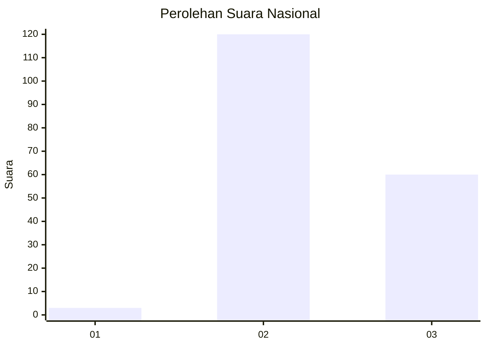
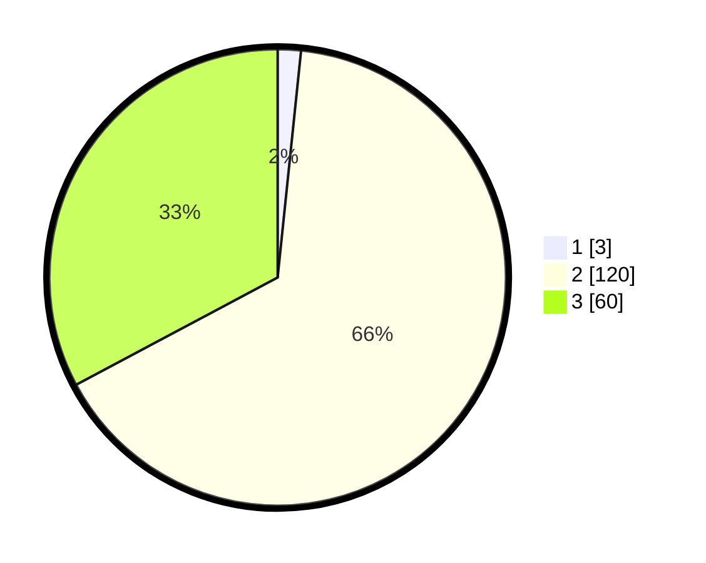

# Hasil

## Grafik

## Tabel

| No. | Nama Paslon    | Suara | Suara (raw) | Persentase |
|:--- |:-------------- | -----:| -----------:| ----------:|
| 1   | ANIES MUHAIMIN | 3     | [3][p-1]    | 1,64       |
| 2   | PRABOWO GIBRAN | 120   | [120][p-2]  | 65,57      |
| 3   | GANJAR MAHFUD  | 60    | [60][p-3]   | 32,79      |

[p-1]: https://github.com/gigit-pemilu/pemilu-2024/blob/main/pilpres/hitung-suara/sub/53-nusa-tenggara-timur/sub/03-timor-tengah-utara/sub/19-insana-fafinesu/sub/2001-fafinesu-a/sub/003-tps/sub/paslon-1.txt
[p-2]: https://github.com/gigit-pemilu/pemilu-2024/blob/main/pilpres/hitung-suara/sub/53-nusa-tenggara-timur/sub/03-timor-tengah-utara/sub/19-insana-fafinesu/sub/2001-fafinesu-a/sub/003-tps/sub/paslon-2.txt
[p-3]: https://github.com/gigit-pemilu/pemilu-2024/blob/main/pilpres/hitung-suara/sub/53-nusa-tenggara-timur/sub/03-timor-tengah-utara/sub/19-insana-fafinesu/sub/2001-fafinesu-a/sub/003-tps/sub/paslon-3.txt

## Foto C Plano

https://sirekap-obj-formc.kpu.go.id/ea7e/pemilu/ppwp/53/03/19/20/01/5303192001003-20240214-223219--35213223-eeed-401d-9fb7-b5a329c090a4.jpg

https://sirekap-obj-formc.kpu.go.id/ea7e/pemilu/ppwp/53/03/19/20/01/5303192001003-20240214-223305--bbf91fa4-1339-4d2b-8fa1-697d4896872f.jpg

https://sirekap-obj-formc.kpu.go.id/ea7e/pemilu/ppwp/53/03/19/20/01/5303192001003-20240214-223502--d6513f7b-d88d-47e3-a883-9732ecfdf097.jpg

## Metadata

| Key        | Value               |
| ---------- | ------------------- |
| Time Stamp | 2024-02-24 22:31:28 |

