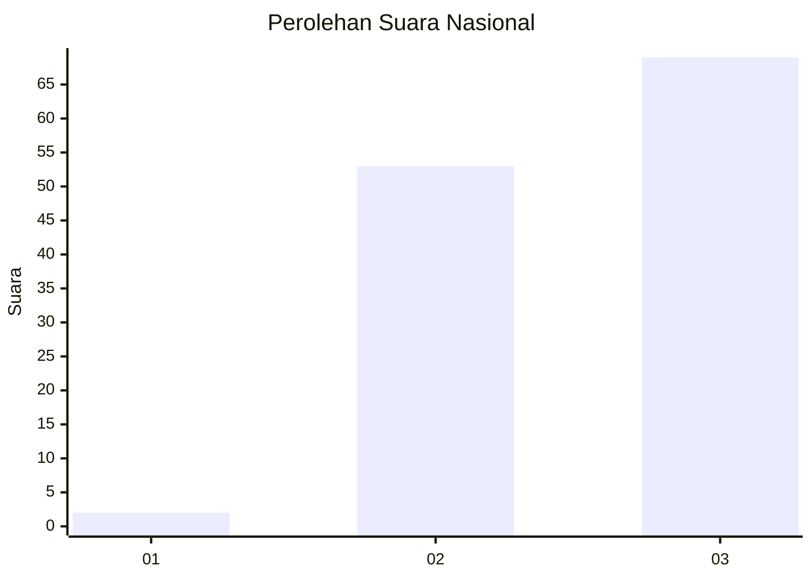
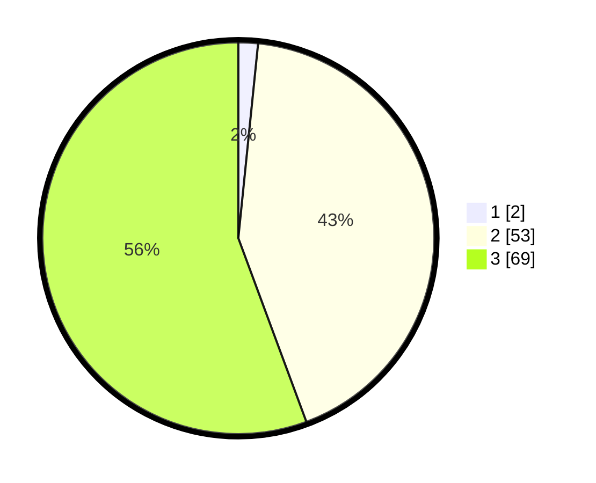

# Hasil

## Grafik

## Tabel

| No. | Nama Paslon    | Suara | Suara (raw) | Persentase |
|:--- |:-------------- | -----:| -----------:| ----------:|
| 1   | ANIES MUHAIMIN | 2     | [2][p-1]    | 1,61       |
| 2   | PRABOWO GIBRAN | 53    | [53][p-2]   | 42,74      |
| 3   | GANJAR MAHFUD  | 69    | [69][p-3]   | 55,65      |

[p-1]: https://github.com/gigit-pemilu/pemilu-2024/blob/main/pilpres/hitung-suara/sub/53-nusa-tenggara-timur/sub/03-timor-tengah-utara/sub/21-insana-tengah/sub/2001-lanaus/sub/004-tps/sub/paslon-1.txt
[p-2]: https://github.com/gigit-pemilu/pemilu-2024/blob/main/pilpres/hitung-suara/sub/53-nusa-tenggara-timur/sub/03-timor-tengah-utara/sub/21-insana-tengah/sub/2001-lanaus/sub/004-tps/sub/paslon-2.txt
[p-3]: https://github.com/gigit-pemilu/pemilu-2024/blob/main/pilpres/hitung-suara/sub/53-nusa-tenggara-timur/sub/03-timor-tengah-utara/sub/21-insana-tengah/sub/2001-lanaus/sub/004-tps/sub/paslon-3.txt

## Foto C Plano

https://sirekap-obj-formc.kpu.go.id/3525/pemilu/ppwp/53/03/21/20/01/5303212001004-20240216-144932--e75015e1-75f6-41af-86a0-ce5c9f5ab8f3.jpg

https://sirekap-obj-formc.kpu.go.id/3525/pemilu/ppwp/53/03/21/20/01/5303212001004-20240216-145124--ace6f74e-7cc2-4855-8f9b-35f67940b672.jpg

https://sirekap-obj-formc.kpu.go.id/3525/pemilu/ppwp/53/03/21/20/01/5303212001004-20240216-145230--6a9f574e-8221-4045-9b1d-f2a92525e572.jpg

## Metadata

| Key        | Value               |
| ---------- | ------------------- |
| Time Stamp | 2024-02-25 14:00:00 |

