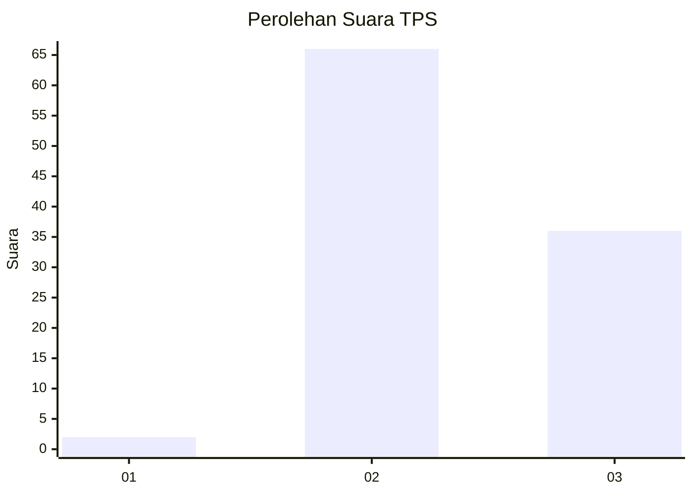
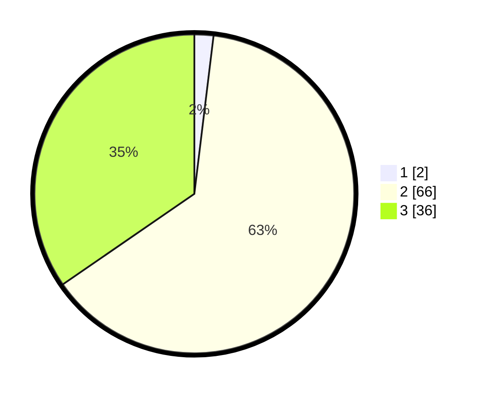

# Hasil

## Grafik

## Tabel

| No. | Nama Paslon    | Suara | Suara (raw) | Persentase |
|:--- |:-------------- | -----:| -----------:| ----------:|
| 1   | ANIES MUHAIMIN | 2     | [2][p-1]    | 1,92       |
| 2   | PRABOWO GIBRAN | 66    | [66][p-2]   | 63,46      |
| 3   | GANJAR MAHFUD  | 36    | [36][p-3]   | 34,62      |

[p-1]: https://github.com/gigit-pemilu/pemilu-2024-53-nusa-tenggara-timur/blob/main/pilpres/hitung-suara/sub/53-nusa-tenggara-timur/sub/03-timor-tengah-utara/sub/22-biboki-tan-pah/sub/2001-teba/sub/004-tps/sub/paslon-1.txt
[p-2]: https://github.com/gigit-pemilu/pemilu-2024-53-nusa-tenggara-timur/blob/main/pilpres/hitung-suara/sub/53-nusa-tenggara-timur/sub/03-timor-tengah-utara/sub/22-biboki-tan-pah/sub/2001-teba/sub/004-tps/sub/paslon-2.txt
[p-3]: https://github.com/gigit-pemilu/pemilu-2024-53-nusa-tenggara-timur/blob/main/pilpres/hitung-suara/sub/53-nusa-tenggara-timur/sub/03-timor-tengah-utara/sub/22-biboki-tan-pah/sub/2001-teba/sub/004-tps/sub/paslon-3.txt

## Foto C Plano

https://sirekap-obj-formc.kpu.go.id/336b/pemilu/ppwp/53/03/22/20/01/5303222001004-20240215-092448--3bf17916-12c9-436e-8d75-6954a042bd11.jpg

https://sirekap-obj-formc.kpu.go.id/336b/pemilu/ppwp/53/03/22/20/01/5303222001004-20240215-092636--50761e6c-8308-4b42-aa7f-03c465b85165.jpg

https://sirekap-obj-formc.kpu.go.id/336b/pemilu/ppwp/53/03/22/20/01/5303222001004-20240215-092850--f0f49b22-4308-4769-b119-f2f74c2a8e59.jpg

## Metadata

| Key        | Value               |
| ---------- | ------------------- |
| Time Stamp | 2024-02-25 15:00:00 |

