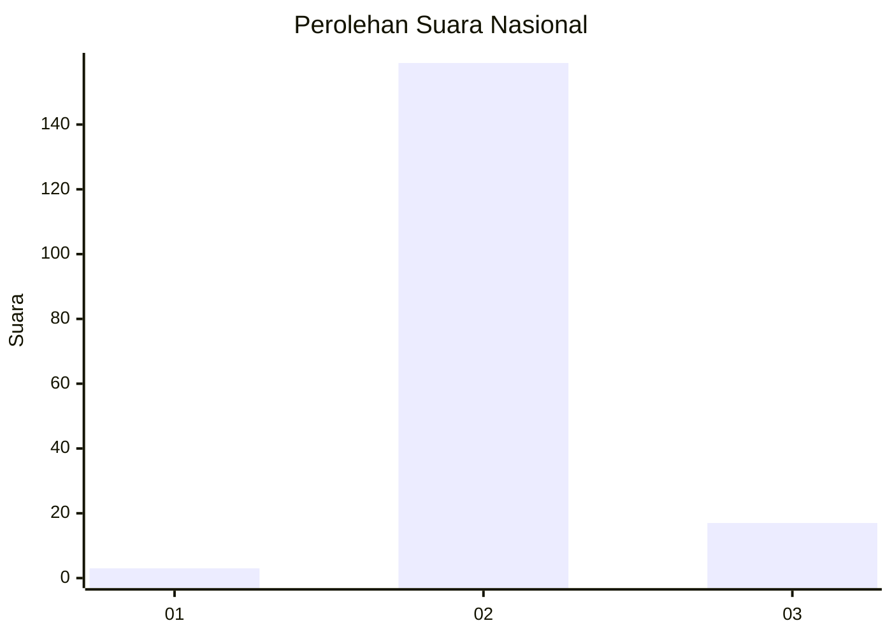
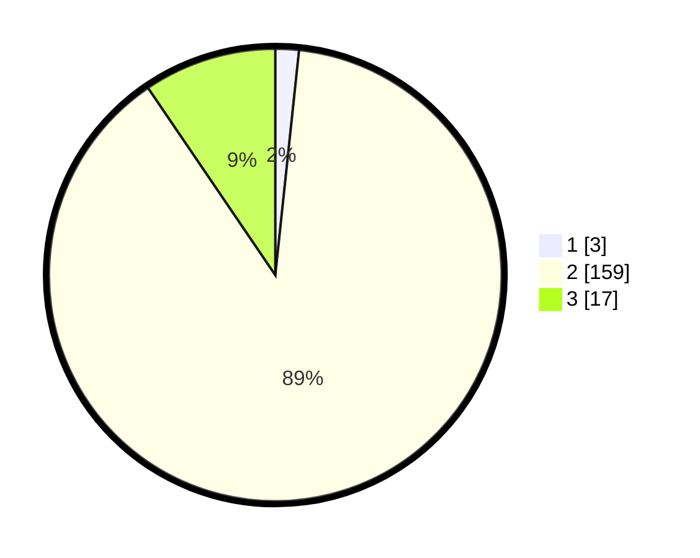

# Hasil

## Grafik

## Tabel

| No. | Nama Paslon    | Suara | Suara (raw) | Persentase |
|:--- |:-------------- | -----:| -----------:| ----------:|
| 1   | ANIES MUHAIMIN | 3     | [3][p-1]    | 1,68       |
| 2   | PRABOWO GIBRAN | 159   | [159][p-2]  | 88,83      |
| 3   | GANJAR MAHFUD  | 17    | [17][p-3]   | 9,50       |

[p-1]: https://github.com/gigit-pemilu/pemilu-2024/blob/main/pilpres/hitung-suara/sub/53-nusa-tenggara-timur/sub/04-belu/sub/01-lamaknen/sub/2001-kewar/sub/001-tps/sub/paslon-1.txt
[p-2]: https://github.com/gigit-pemilu/pemilu-2024/blob/main/pilpres/hitung-suara/sub/53-nusa-tenggara-timur/sub/04-belu/sub/01-lamaknen/sub/2001-kewar/sub/001-tps/sub/paslon-2.txt
[p-3]: https://github.com/gigit-pemilu/pemilu-2024/blob/main/pilpres/hitung-suara/sub/53-nusa-tenggara-timur/sub/04-belu/sub/01-lamaknen/sub/2001-kewar/sub/001-tps/sub/paslon-3.txt

## Foto C Plano

https://sirekap-obj-formc.kpu.go.id/7fb1/pemilu/ppwp/53/04/01/20/01/5304012001001-20240214-205810--9756452c-a472-4e17-a8a9-187fd59a3173.jpg

https://sirekap-obj-formc.kpu.go.id/7fb1/pemilu/ppwp/53/04/01/20/01/5304012001001-20240214-205832--95981ffd-b211-48e4-af28-a903dcf6d636.jpg

https://sirekap-obj-formc.kpu.go.id/7fb1/pemilu/ppwp/53/04/01/20/01/5304012001001-20240214-205910--31a66498-6f4a-4fa3-9264-b2df3ed73107.jpg

## Metadata

| Key        | Value               |
| ---------- | ------------------- |
| Time Stamp | 2024-02-25 00:00:00 |

