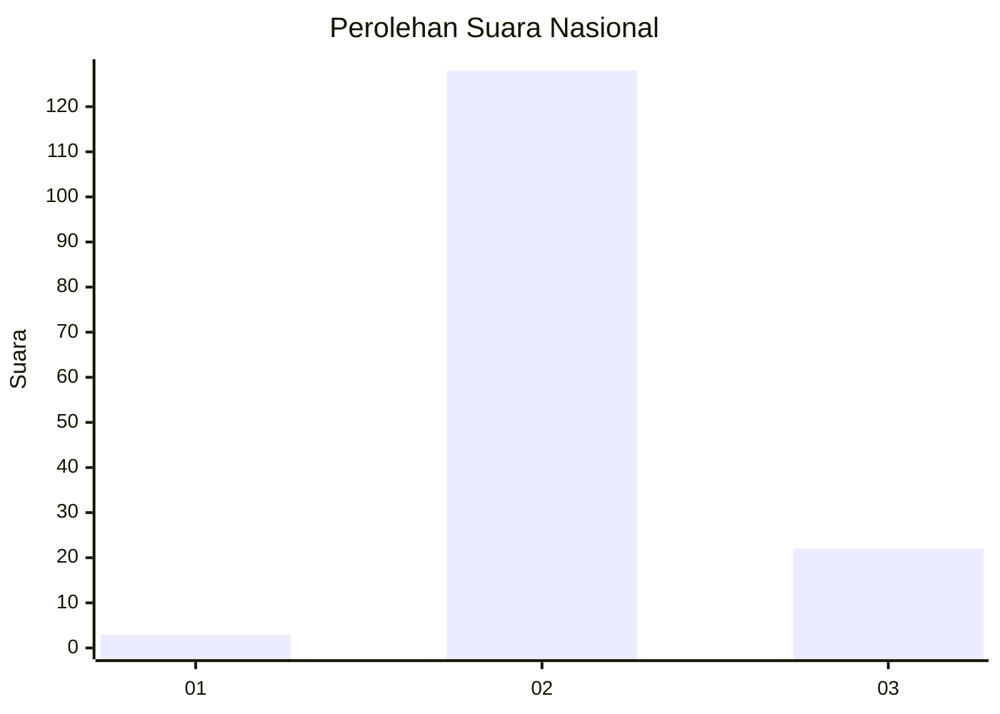
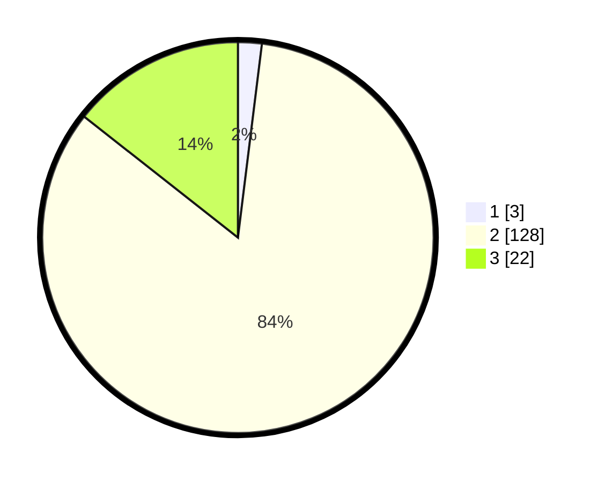

# Hasil

## Grafik

## Tabel

| No. | Nama Paslon    | Suara | Suara (raw) | Persentase |
|:--- |:-------------- | -----:| -----------:| ----------:|
| 1   | ANIES MUHAIMIN | 3     | [3][p-1]    | 1,96       |
| 2   | PRABOWO GIBRAN | 128   | [128][p-2]  | 83,66      |
| 3   | GANJAR MAHFUD  | 22    | [22][p-3]   | 14,38      |

[p-1]: https://github.com/gigit-pemilu/pemilu-2024/blob/main/pilpres/hitung-suara/sub/53-nusa-tenggara-timur/sub/04-belu/sub/01-lamaknen/sub/2001-kewar/sub/002-tps/sub/paslon-1.txt
[p-2]: https://github.com/gigit-pemilu/pemilu-2024/blob/main/pilpres/hitung-suara/sub/53-nusa-tenggara-timur/sub/04-belu/sub/01-lamaknen/sub/2001-kewar/sub/002-tps/sub/paslon-2.txt
[p-3]: https://github.com/gigit-pemilu/pemilu-2024/blob/main/pilpres/hitung-suara/sub/53-nusa-tenggara-timur/sub/04-belu/sub/01-lamaknen/sub/2001-kewar/sub/002-tps/sub/paslon-3.txt

## Foto C Plano

https://sirekap-obj-formc.kpu.go.id/28e8/pemilu/ppwp/53/04/01/20/01/5304012001002-20240215-170738--daad70bf-12f3-4d6b-9636-c12696773375.jpg

https://sirekap-obj-formc.kpu.go.id/28e8/pemilu/ppwp/53/04/01/20/01/5304012001002-20240215-171030--2ddd86c7-5a9c-4a47-8ef9-fe1ae023f3c8.jpg

https://sirekap-obj-formc.kpu.go.id/28e8/pemilu/ppwp/53/04/01/20/01/5304012001002-20240215-152754--03a7a720-c604-4c2a-a778-a3f7f41389b5.jpg

## Metadata

| Key        | Value               |
| ---------- | ------------------- |
| Time Stamp | 2024-02-24 22:31:28 |

