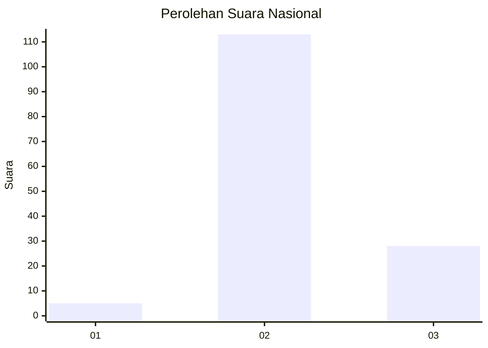
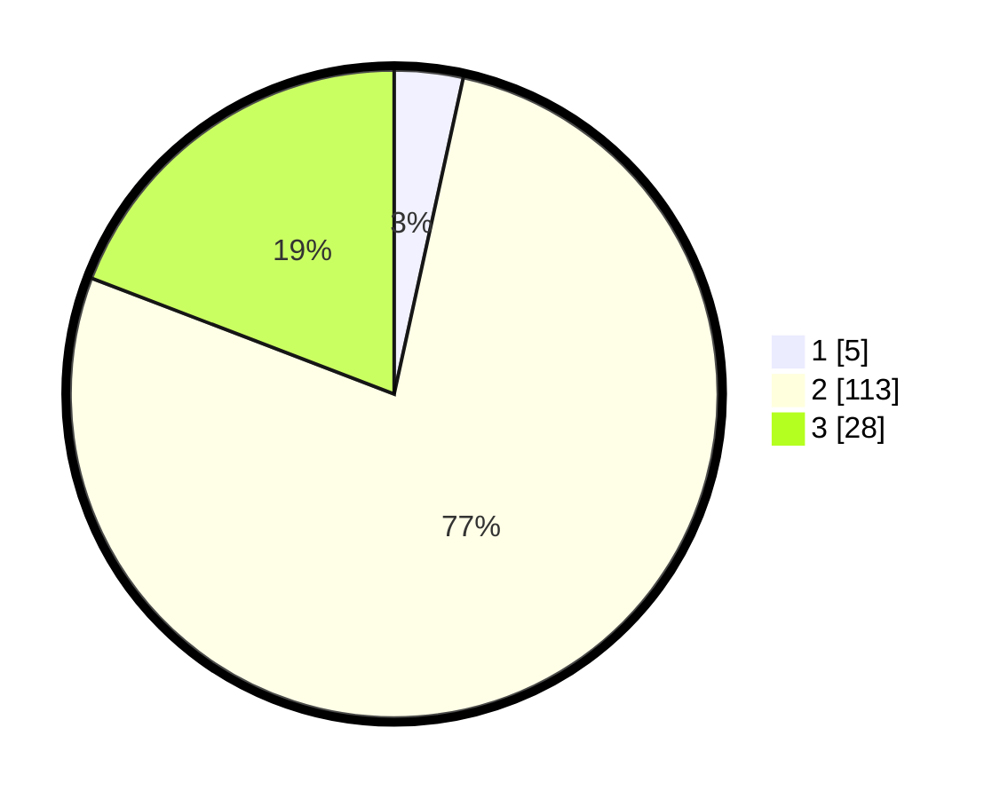

# Hasil

## Grafik

## Tabel

| No. | Nama Paslon    | Suara | Suara (raw) | Persentase |
|:--- |:-------------- | -----:| -----------:| ----------:|
| 1   | ANIES MUHAIMIN | 5     | [5][p-1]    | 3,42       |
| 2   | PRABOWO GIBRAN | 113   | [113][p-2]  | 77,40      |
| 3   | GANJAR MAHFUD  | 28    | [28][p-3]   | 19,18      |

[p-1]: https://github.com/gigit-pemilu/pemilu-2024/blob/main/pilpres/hitung-suara/sub/53-nusa-tenggara-timur/sub/04-belu/sub/01-lamaknen/sub/2001-kewar/sub/005-tps/sub/paslon-1.txt
[p-2]: https://github.com/gigit-pemilu/pemilu-2024/blob/main/pilpres/hitung-suara/sub/53-nusa-tenggara-timur/sub/04-belu/sub/01-lamaknen/sub/2001-kewar/sub/005-tps/sub/paslon-2.txt
[p-3]: https://github.com/gigit-pemilu/pemilu-2024/blob/main/pilpres/hitung-suara/sub/53-nusa-tenggara-timur/sub/04-belu/sub/01-lamaknen/sub/2001-kewar/sub/005-tps/sub/paslon-3.txt

## Foto C Plano

https://sirekap-obj-formc.kpu.go.id/7939/pemilu/ppwp/53/04/01/20/01/5304012001005-20240215-111858--66f7cbe8-16f8-4ee3-8d62-2cea73af4f8a.jpg

https://sirekap-obj-formc.kpu.go.id/7939/pemilu/ppwp/53/04/01/20/01/5304012001005-20240215-112046--dca6a31a-6524-43cc-8f9d-ac5dd4b5a18a.jpg

https://sirekap-obj-formc.kpu.go.id/7939/pemilu/ppwp/53/04/01/20/01/5304012001005-20240215-112332--35f092b9-558f-4d68-97b1-19405d1ab375.jpg

## Metadata

| Key        | Value               |
| ---------- | ------------------- |
| Time Stamp | 2024-02-25 15:00:00 |

