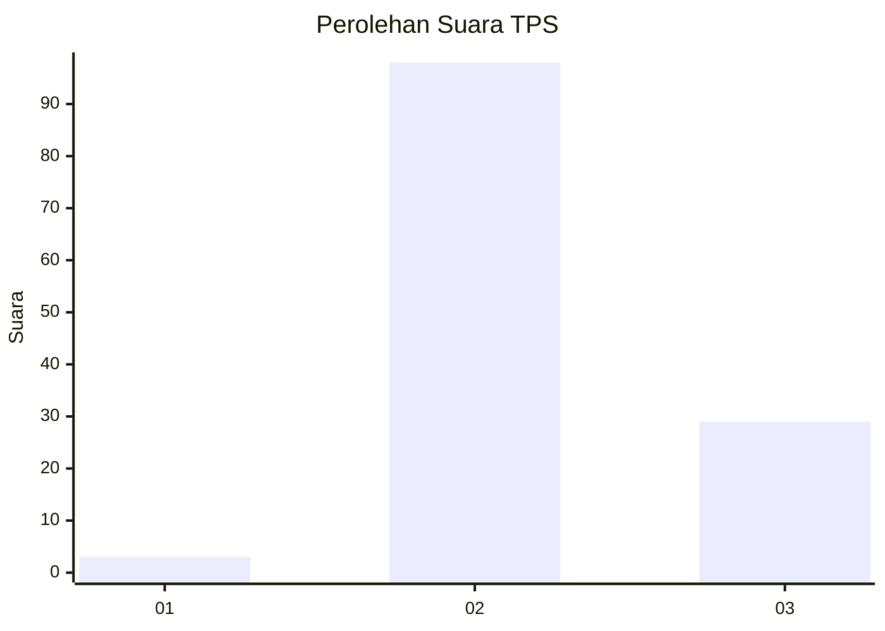
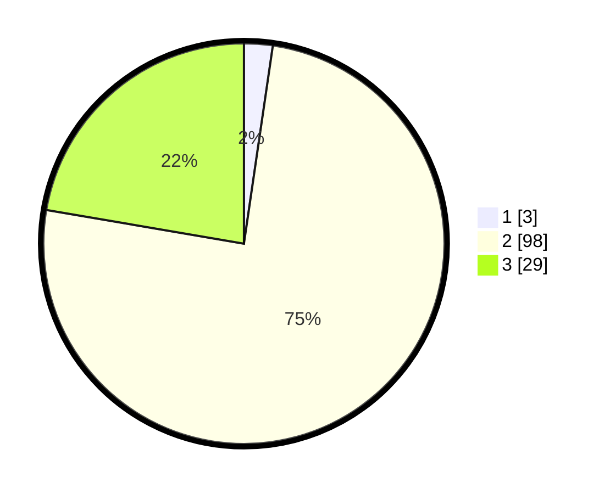

# Hasil

## Grafik

## Tabel

| No. | Nama Paslon    | Suara | Suara (raw) | Persentase |
|:--- |:-------------- | -----:| -----------:| ----------:|
| 1   | ANIES MUHAIMIN | 3     | [3][p-1]    | 2,31       |
| 2   | PRABOWO GIBRAN | 98    | [98][p-2]   | 75,38      |
| 3   | GANJAR MAHFUD  | 29    | [29][p-3]   | 22,31      |

[p-1]: https://github.com/gigit-pemilu/pemilu-2024-53-nusa-tenggara-timur/blob/main/pilpres/hitung-suara/sub/53-nusa-tenggara-timur/sub/04-belu/sub/01-lamaknen/sub/2002-fulur/sub/001-tps/sub/paslon-1.txt
[p-2]: https://github.com/gigit-pemilu/pemilu-2024-53-nusa-tenggara-timur/blob/main/pilpres/hitung-suara/sub/53-nusa-tenggara-timur/sub/04-belu/sub/01-lamaknen/sub/2002-fulur/sub/001-tps/sub/paslon-2.txt
[p-3]: https://github.com/gigit-pemilu/pemilu-2024-53-nusa-tenggara-timur/blob/main/pilpres/hitung-suara/sub/53-nusa-tenggara-timur/sub/04-belu/sub/01-lamaknen/sub/2002-fulur/sub/001-tps/sub/paslon-3.txt

## Foto C Plano

https://sirekap-obj-formc.kpu.go.id/5c83/pemilu/ppwp/53/04/01/20/02/5304012002001-20240215-100732--26eb4b34-6345-4fd9-9bcb-ff85e6d30599.jpg

https://sirekap-obj-formc.kpu.go.id/5c83/pemilu/ppwp/53/04/01/20/02/5304012002001-20240215-101443--7d1dc5f2-3f78-46ce-b73c-aaaecb721685.jpg

https://sirekap-obj-formc.kpu.go.id/5c83/pemilu/ppwp/53/04/01/20/02/5304012002001-20240215-101830--6f4a8534-b69c-4225-8da4-973a630d90ce.jpg

## Metadata

| Key        | Value               |
| ---------- | ------------------- |
| Time Stamp | 2024-02-25 12:00:00 |

