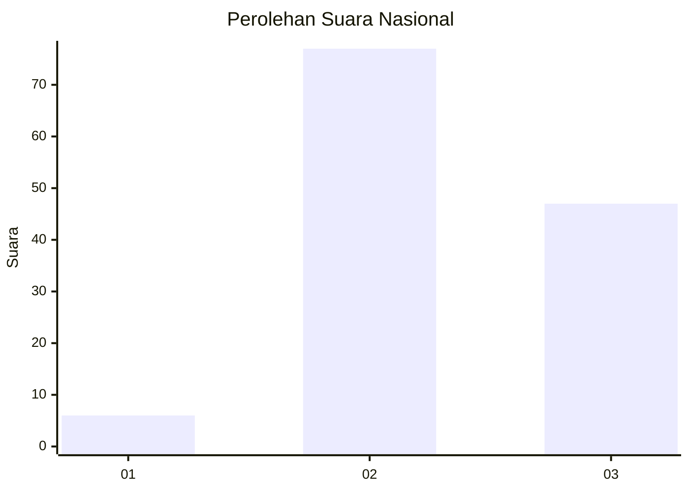
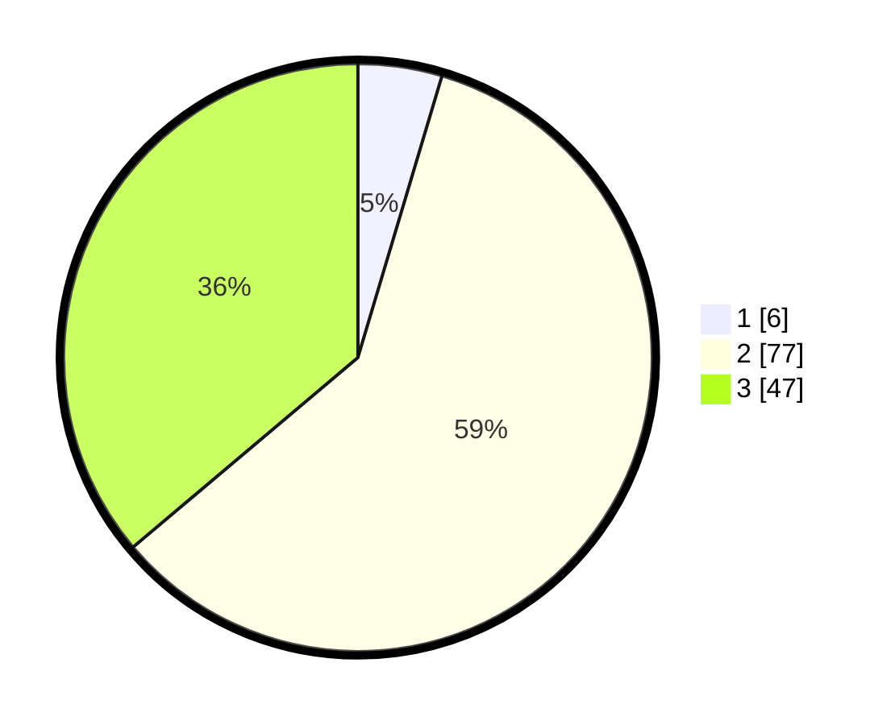

# Hasil

## Grafik

## Tabel

| No. | Nama Paslon    | Suara | Suara (raw) | Persentase |
|:--- |:-------------- | -----:| -----------:| ----------:|
| 1   | ANIES MUHAIMIN | 6     | [6][p-1]    | 4,62       |
| 2   | PRABOWO GIBRAN | 77    | [77][p-2]   | 59,23      |
| 3   | GANJAR MAHFUD  | 47    | [47][p-3]   | 36,15      |

[p-1]: https://github.com/gigit-pemilu/pemilu-2024/blob/main/pilpres/hitung-suara/sub/53-nusa-tenggara-timur/sub/04-belu/sub/01-lamaknen/sub/2002-fulur/sub/002-tps/sub/paslon-1.txt
[p-2]: https://github.com/gigit-pemilu/pemilu-2024/blob/main/pilpres/hitung-suara/sub/53-nusa-tenggara-timur/sub/04-belu/sub/01-lamaknen/sub/2002-fulur/sub/002-tps/sub/paslon-2.txt
[p-3]: https://github.com/gigit-pemilu/pemilu-2024/blob/main/pilpres/hitung-suara/sub/53-nusa-tenggara-timur/sub/04-belu/sub/01-lamaknen/sub/2002-fulur/sub/002-tps/sub/paslon-3.txt

## Foto C Plano

https://sirekap-obj-formc.kpu.go.id/5fc3/pemilu/ppwp/53/04/01/20/02/5304012002002-20240215-105031--70f0f7c3-dcbb-4f9f-9e39-a79294df2341.jpg

https://sirekap-obj-formc.kpu.go.id/5fc3/pemilu/ppwp/53/04/01/20/02/5304012002002-20240215-105249--2b1c2d78-d87e-44aa-ab91-191dd621f6bf.jpg

https://sirekap-obj-formc.kpu.go.id/5fc3/pemilu/ppwp/53/04/01/20/02/5304012002002-20240215-105629--e45ec4aa-c4cb-487d-b816-4edc6d411e0c.jpg

## Metadata

| Key        | Value               |
| ---------- | ------------------- |
| Time Stamp | 2024-02-25 19:00:00 |

