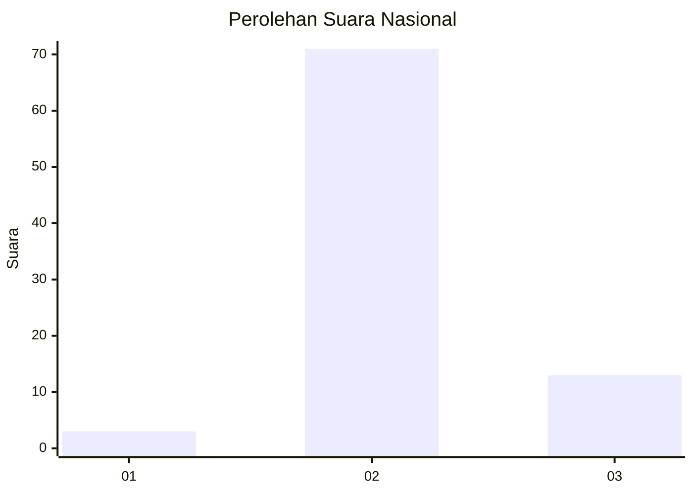
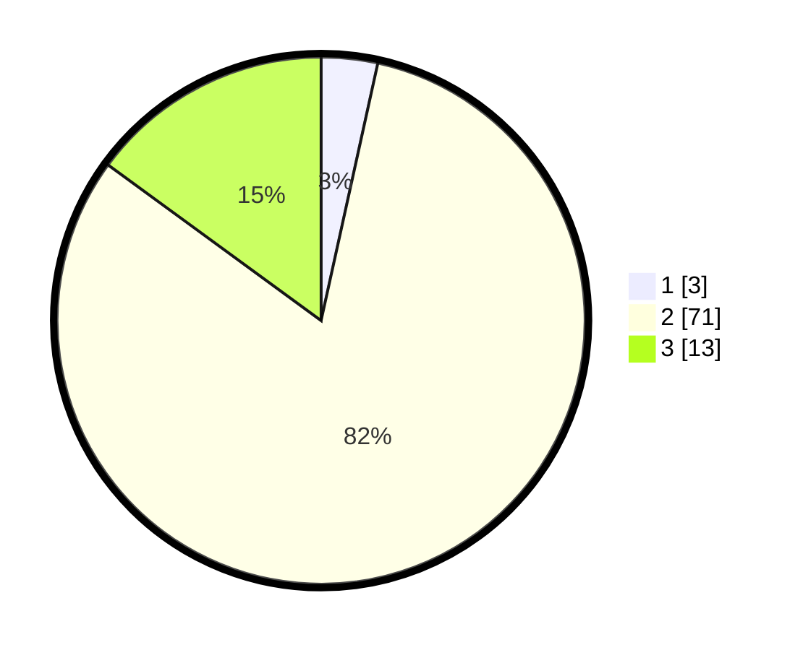

# Hasil

## Grafik

## Tabel

| No. | Nama Paslon    | Suara | Suara (raw) | Persentase |
|:--- |:-------------- | -----:| -----------:| ----------:|
| 1   | ANIES MUHAIMIN | 3     | [3][p-1]    | 3,45       |
| 2   | PRABOWO GIBRAN | 71    | [71][p-2]   | 81,61      |
| 3   | GANJAR MAHFUD  | 13    | [13][p-3]   | 14,94      |

[p-1]: https://github.com/gigit-pemilu/pemilu-2024/blob/main/pilpres/hitung-suara/sub/53-nusa-tenggara-timur/sub/04-belu/sub/01-lamaknen/sub/2009-leowalu/sub/003-tps/sub/paslon-1.txt
[p-2]: https://github.com/gigit-pemilu/pemilu-2024/blob/main/pilpres/hitung-suara/sub/53-nusa-tenggara-timur/sub/04-belu/sub/01-lamaknen/sub/2009-leowalu/sub/003-tps/sub/paslon-2.txt
[p-3]: https://github.com/gigit-pemilu/pemilu-2024/blob/main/pilpres/hitung-suara/sub/53-nusa-tenggara-timur/sub/04-belu/sub/01-lamaknen/sub/2009-leowalu/sub/003-tps/sub/paslon-3.txt

## Foto C Plano

https://sirekap-obj-formc.kpu.go.id/abf0/pemilu/ppwp/53/04/01/20/09/5304012009003-20240215-080659--c29d22d9-ca3b-49c7-86da-2ec36f7af6ab.jpg

https://sirekap-obj-formc.kpu.go.id/abf0/pemilu/ppwp/53/04/01/20/09/5304012009003-20240215-081442--baa2ae5e-2592-4eff-96df-c40e3bf1f28d.jpg

https://sirekap-obj-formc.kpu.go.id/abf0/pemilu/ppwp/53/04/01/20/09/5304012009003-20240215-082603--73d50b40-ac7d-41ac-aedf-fe9f6f68c1aa.jpg

## Metadata

| Key        | Value               |
| ---------- | ------------------- |
| Time Stamp | 2024-02-15 20:30:46 |

