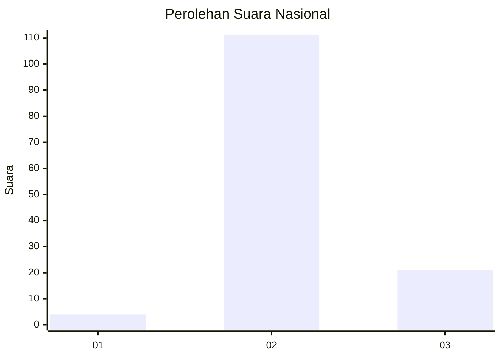
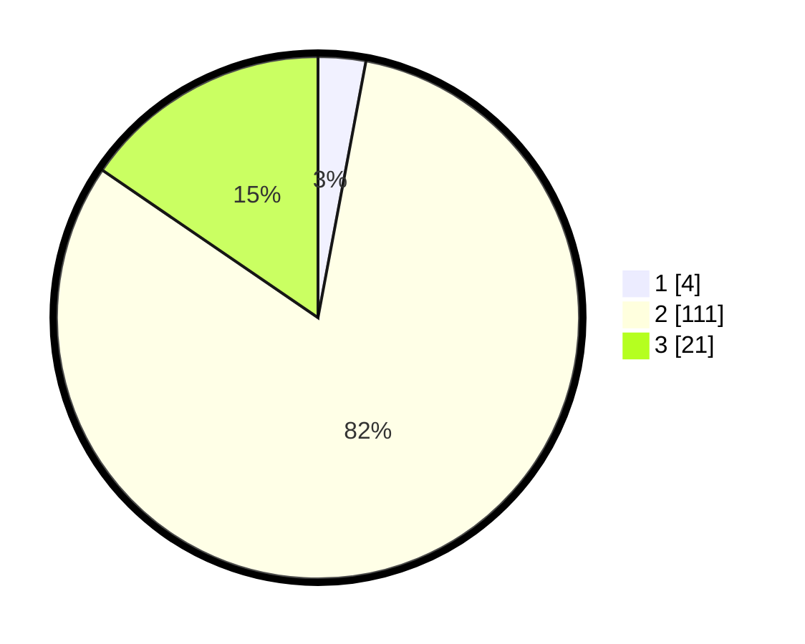

# Hasil

## Grafik

## Tabel

| No. | Nama Paslon    | Suara | Suara (raw) | Persentase |
|:--- |:-------------- | -----:| -----------:| ----------:|
| 1   | ANIES MUHAIMIN | 4     | [4][p-1]    | 2,94       |
| 2   | PRABOWO GIBRAN | 111   | [111][p-2]  | 81,62      |
| 3   | GANJAR MAHFUD  | 21    | [21][p-3]   | 15,44      |

[p-1]: https://github.com/gigit-pemilu/pemilu-2024/blob/main/pilpres/hitung-suara/sub/53-nusa-tenggara-timur/sub/04-belu/sub/04-tasifeto-barat/sub/2001-tukuneno/sub/011-tps/sub/paslon-1.txt
[p-2]: https://github.com/gigit-pemilu/pemilu-2024/blob/main/pilpres/hitung-suara/sub/53-nusa-tenggara-timur/sub/04-belu/sub/04-tasifeto-barat/sub/2001-tukuneno/sub/011-tps/sub/paslon-2.txt
[p-3]: https://github.com/gigit-pemilu/pemilu-2024/blob/main/pilpres/hitung-suara/sub/53-nusa-tenggara-timur/sub/04-belu/sub/04-tasifeto-barat/sub/2001-tukuneno/sub/011-tps/sub/paslon-3.txt

## Foto C Plano

https://sirekap-obj-formc.kpu.go.id/0446/pemilu/ppwp/53/04/04/20/01/5304042001011-20240215-092500--ed78af39-f90e-40c2-93e1-a9b560467934.jpg

https://sirekap-obj-formc.kpu.go.id/0446/pemilu/ppwp/53/04/04/20/01/5304042001011-20240215-092513--55b7aa9c-7930-4378-8fdd-aa33b94d7167.jpg

https://sirekap-obj-formc.kpu.go.id/0446/pemilu/ppwp/53/04/04/20/01/5304042001011-20240214-140957--674d7426-b1eb-483b-bfbc-35dc76ca6292.jpg

## Metadata

| Key        | Value               |
| ---------- | ------------------- |
| Time Stamp | 2024-02-24 22:31:28 |

