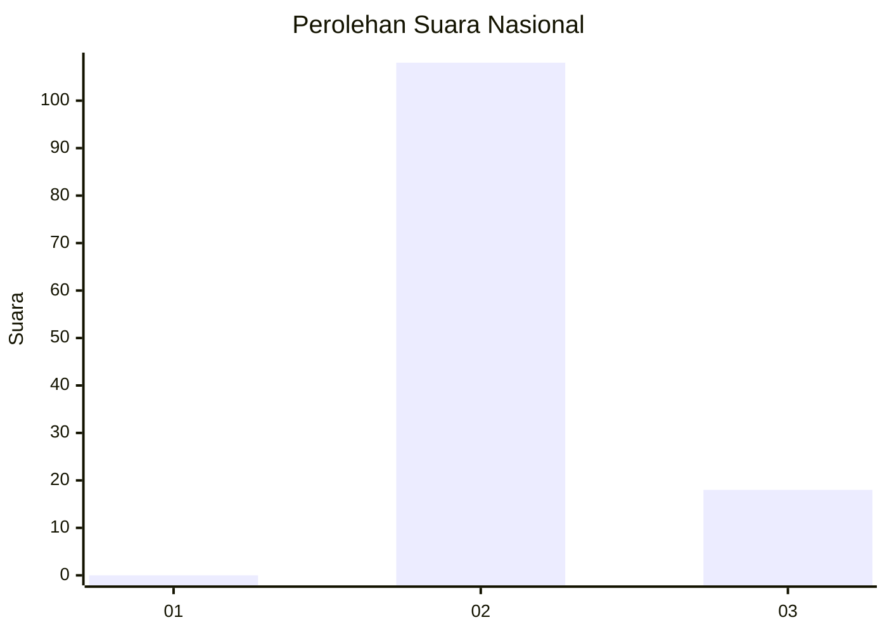
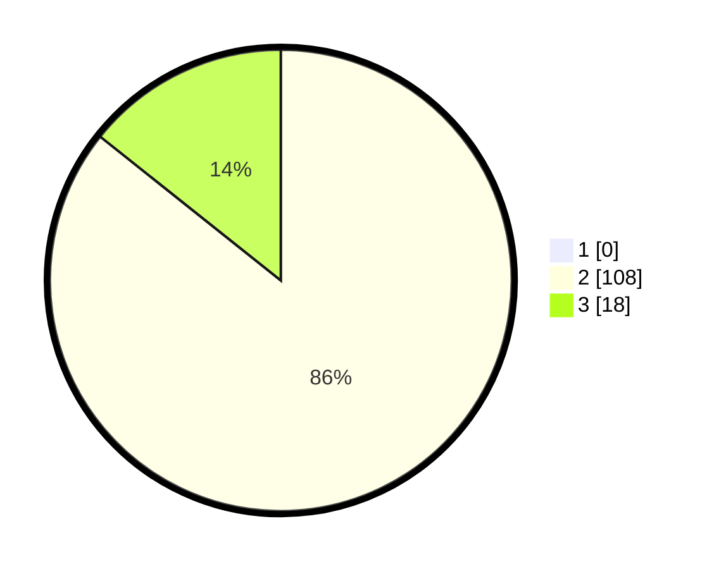

# Hasil

## Grafik

## Tabel

| No. | Nama Paslon    | Suara | Suara (raw) | Persentase |
|:--- |:-------------- | -----:| -----------:| ----------:|
| 1   | ANIES MUHAIMIN | 0     | [0][p-1]    | 0,00       |
| 2   | PRABOWO GIBRAN | 108   | [108][p-2]  | 85,71      |
| 3   | GANJAR MAHFUD  | 18    | [18][p-3]   | 14,29      |

[p-1]: https://github.com/gigit-pemilu/pemilu-2024/blob/main/pilpres/hitung-suara/sub/53-nusa-tenggara-timur/sub/04-belu/sub/04-tasifeto-barat/sub/2001-tukuneno/sub/013-tps/sub/paslon-1.txt
[p-2]: https://github.com/gigit-pemilu/pemilu-2024/blob/main/pilpres/hitung-suara/sub/53-nusa-tenggara-timur/sub/04-belu/sub/04-tasifeto-barat/sub/2001-tukuneno/sub/013-tps/sub/paslon-2.txt
[p-3]: https://github.com/gigit-pemilu/pemilu-2024/blob/main/pilpres/hitung-suara/sub/53-nusa-tenggara-timur/sub/04-belu/sub/04-tasifeto-barat/sub/2001-tukuneno/sub/013-tps/sub/paslon-3.txt

## Foto C Plano

https://sirekap-obj-formc.kpu.go.id/44fa/pemilu/ppwp/53/04/04/20/01/5304042001013-20240215-122854--b6aad966-dab2-4a93-b692-2c7e769caa0b.jpg

https://sirekap-obj-formc.kpu.go.id/44fa/pemilu/ppwp/53/04/04/20/01/5304042001013-20240215-062354--6454b74c-eaa9-499b-83f7-82a0233bd559.jpg

https://sirekap-obj-formc.kpu.go.id/44fa/pemilu/ppwp/53/04/04/20/01/5304042001013-20240215-062435--a2f33161-334e-44c4-81f5-b26ba2d8c421.jpg

## Metadata

| Key        | Value               |
| ---------- | ------------------- |
| Time Stamp | 2024-02-24 22:31:28 |

