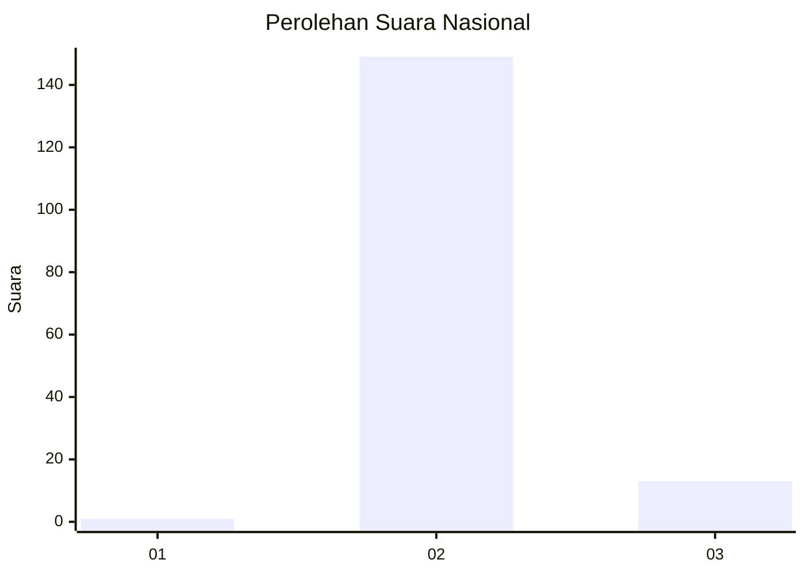
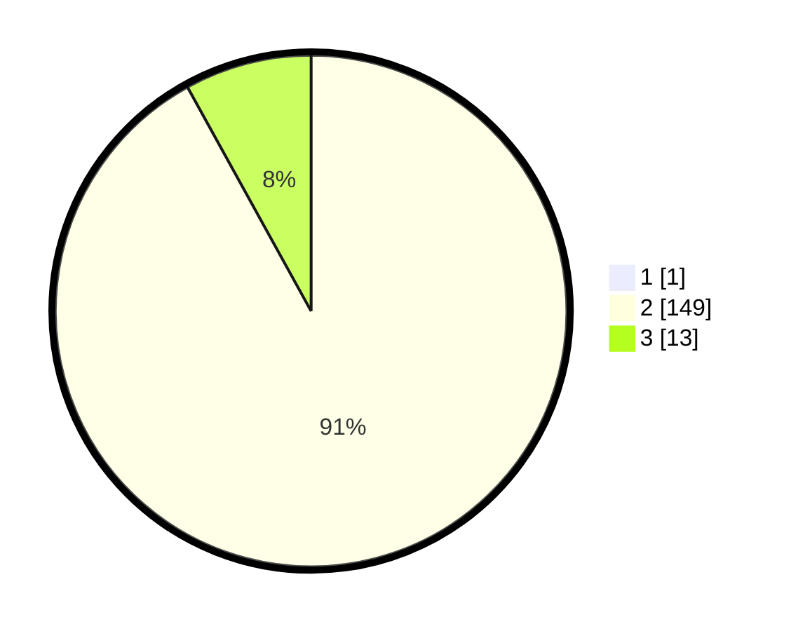

# Hasil

## Grafik

## Tabel

| No. | Nama Paslon    | Suara | Suara (raw) | Persentase |
|:--- |:-------------- | -----:| -----------:| ----------:|
| 1   | ANIES MUHAIMIN | 1     | [1][p-1]    | 0,61       |
| 2   | PRABOWO GIBRAN | 149   | [149][p-2]  | 91,41      |
| 3   | GANJAR MAHFUD  | 13    | [13][p-3]   | 7,98       |

[p-1]: https://github.com/gigit-pemilu/pemilu-2024/blob/main/pilpres/hitung-suara/sub/53-nusa-tenggara-timur/sub/04-belu/sub/04-tasifeto-barat/sub/2005-bakustulama/sub/002-tps/sub/paslon-1.txt
[p-2]: https://github.com/gigit-pemilu/pemilu-2024/blob/main/pilpres/hitung-suara/sub/53-nusa-tenggara-timur/sub/04-belu/sub/04-tasifeto-barat/sub/2005-bakustulama/sub/002-tps/sub/paslon-2.txt
[p-3]: https://github.com/gigit-pemilu/pemilu-2024/blob/main/pilpres/hitung-suara/sub/53-nusa-tenggara-timur/sub/04-belu/sub/04-tasifeto-barat/sub/2005-bakustulama/sub/002-tps/sub/paslon-3.txt

## Foto C Plano

https://sirekap-obj-formc.kpu.go.id/aba1/pemilu/ppwp/53/04/04/20/05/5304042005002-20240215-150313--4c2ea3b3-386e-4cc5-bcec-36eb6da0b0c7.jpg

https://sirekap-obj-formc.kpu.go.id/aba1/pemilu/ppwp/53/04/04/20/05/5304042005002-20240215-093525--c4ffeec1-c297-4cf1-b592-dbd957b3a6e5.jpg

https://sirekap-obj-formc.kpu.go.id/aba1/pemilu/ppwp/53/04/04/20/05/5304042005002-20240215-093607--6cbce17d-8a0e-4419-8bbc-066035cae2c3.jpg

## Metadata

| Key        | Value               |
| ---------- | ------------------- |
| Time Stamp | 2024-02-25 14:00:00 |

