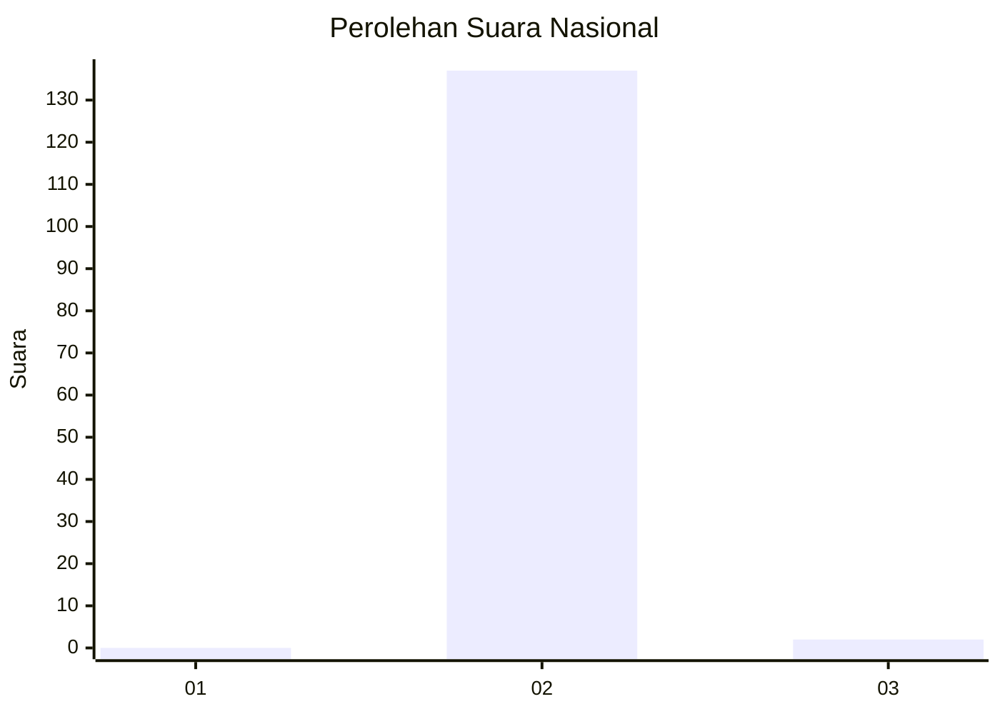
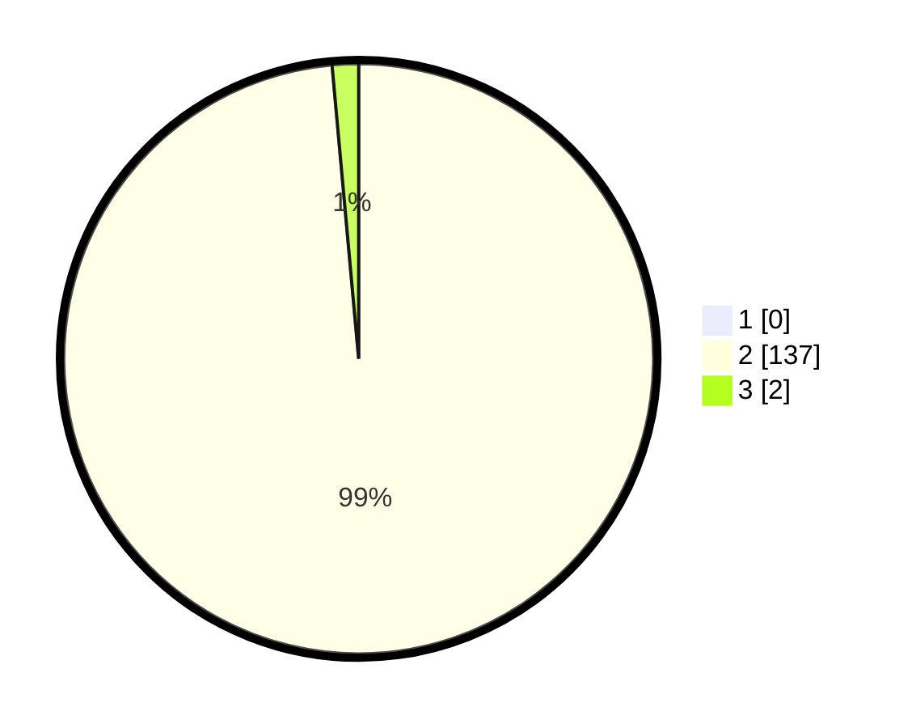

# Hasil

## Grafik

## Tabel

| No. | Nama Paslon    | Suara | Suara (raw) | Persentase |
|:--- |:-------------- | -----:| -----------:| ----------:|
| 1   | ANIES MUHAIMIN | 0     | [0][p-1]    | 0,00       |
| 2   | PRABOWO GIBRAN | 137   | [137][p-2]  | 98,56      |
| 3   | GANJAR MAHFUD  | 2     | [2][p-3]    | 1,44       |

[p-1]: https://github.com/gigit-pemilu/pemilu-2024/blob/main/pilpres/hitung-suara/sub/53-nusa-tenggara-timur/sub/04-belu/sub/05-kakuluk-mesak/sub/2001-fatuketi/sub/004-tps/sub/paslon-1.txt
[p-2]: https://github.com/gigit-pemilu/pemilu-2024/blob/main/pilpres/hitung-suara/sub/53-nusa-tenggara-timur/sub/04-belu/sub/05-kakuluk-mesak/sub/2001-fatuketi/sub/004-tps/sub/paslon-2.txt
[p-3]: https://github.com/gigit-pemilu/pemilu-2024/blob/main/pilpres/hitung-suara/sub/53-nusa-tenggara-timur/sub/04-belu/sub/05-kakuluk-mesak/sub/2001-fatuketi/sub/004-tps/sub/paslon-3.txt

## Foto C Plano

https://sirekap-obj-formc.kpu.go.id/ce4a/pemilu/ppwp/53/04/05/20/01/5304052001004-20240215-092301--adc768bb-01b7-4210-aa8a-ef3fc457b538.jpg

https://sirekap-obj-formc.kpu.go.id/ce4a/pemilu/ppwp/53/04/05/20/01/5304052001004-20240215-092715--4f54d89d-b38b-4a1c-9f7e-cbde7f7eca12.jpg

https://sirekap-obj-formc.kpu.go.id/ce4a/pemilu/ppwp/53/04/05/20/01/5304052001004-20240215-092939--3ed42464-ad9c-4306-9d0c-d778f189e00c.jpg

## Metadata

| Key        | Value               |
| ---------- | ------------------- |
| Time Stamp | 2024-02-24 23:00:00 |

