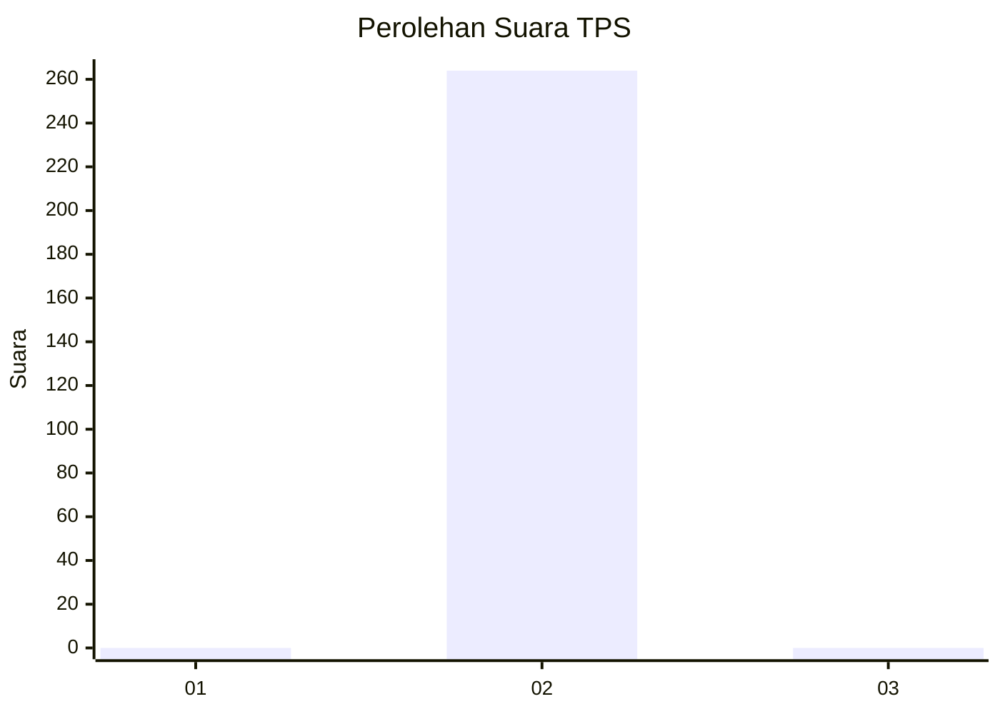
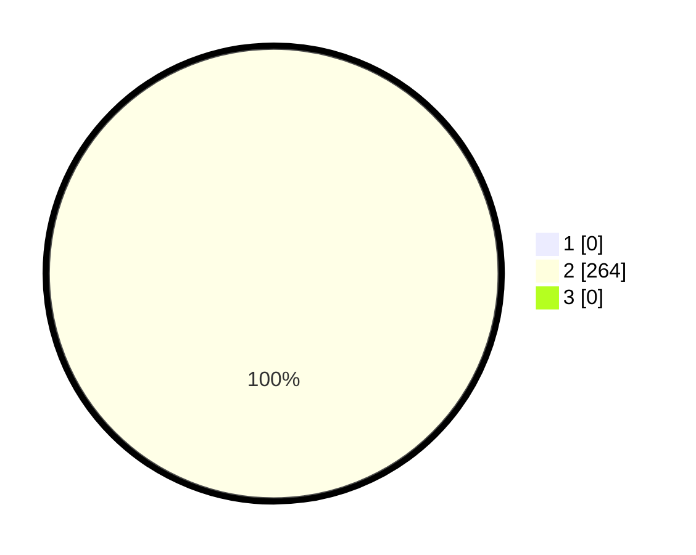

# Hasil

## Grafik

## Tabel

| No. | Nama Paslon    | Suara | Suara (raw) | Persentase |
|:--- |:-------------- | -----:| -----------:| ----------:|
| 1   | ANIES MUHAIMIN | 0     | [0][p-1]    | 0,00       |
| 2   | PRABOWO GIBRAN | 264   | [264][p-2]  | 100,00     |
| 3   | GANJAR MAHFUD  | 0     | [0][p-3]    | 0,00       |

[p-1]: https://github.com/gigit-pemilu/pemilu-2024-53-nusa-tenggara-timur/blob/main/pilpres/hitung-suara/sub/53-nusa-tenggara-timur/sub/04-belu/sub/05-kakuluk-mesak/sub/2001-fatuketi/sub/901-tps/sub/paslon-1.txt
[p-2]: https://github.com/gigit-pemilu/pemilu-2024-53-nusa-tenggara-timur/blob/main/pilpres/hitung-suara/sub/53-nusa-tenggara-timur/sub/04-belu/sub/05-kakuluk-mesak/sub/2001-fatuketi/sub/901-tps/sub/paslon-2.txt
[p-3]: https://github.com/gigit-pemilu/pemilu-2024-53-nusa-tenggara-timur/blob/main/pilpres/hitung-suara/sub/53-nusa-tenggara-timur/sub/04-belu/sub/05-kakuluk-mesak/sub/2001-fatuketi/sub/901-tps/sub/paslon-3.txt

## Foto C Plano

https://sirekap-obj-formc.kpu.go.id/3021/pemilu/ppwp/53/04/05/20/01/5304052001901-20240214-155602--9115fcd1-6237-47b4-a778-efa24c726fe6.jpg

https://sirekap-obj-formc.kpu.go.id/3021/pemilu/ppwp/53/04/05/20/01/5304052001901-20240214-155655--2dc5cdf0-feb7-4bfa-9f81-295f07c8373e.jpg

https://sirekap-obj-formc.kpu.go.id/3021/pemilu/ppwp/53/04/05/20/01/5304052001901-20240214-155754--d1bca2ae-8080-4c4f-8532-853a917084df.jpg

## Metadata

| Key        | Value               |
| ---------- | ------------------- |
| Time Stamp | 2024-02-24 22:31:28 |

