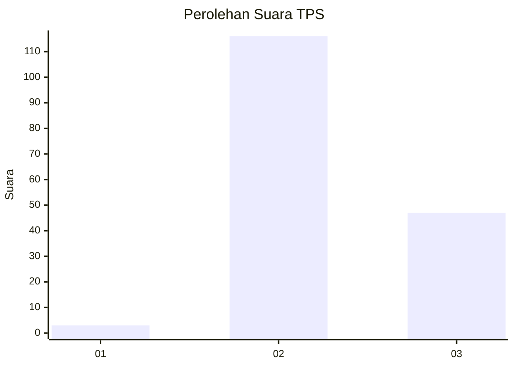
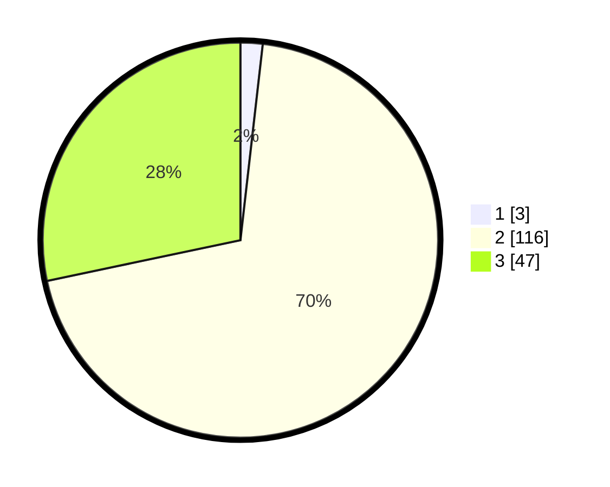

# Hasil

## Grafik

## Tabel

| No. | Nama Paslon    | Suara | Suara (raw) | Persentase |
|:--- |:-------------- | -----:| -----------:| ----------:|
| 1   | ANIES MUHAIMIN | 3     | [3][p-1]    | 1,81       |
| 2   | PRABOWO GIBRAN | 116   | [116][p-2]  | 69,88      |
| 3   | GANJAR MAHFUD  | 47    | [47][p-3]   | 28,31      |

[p-1]: https://github.com/gigit-pemilu/pemilu-2024-53-nusa-tenggara-timur/blob/main/pilpres/hitung-suara/sub/53-nusa-tenggara-timur/sub/04-belu/sub/17-lasiolat/sub/2002-maneikun/sub/001-tps/sub/paslon-1.txt
[p-2]: https://github.com/gigit-pemilu/pemilu-2024-53-nusa-tenggara-timur/blob/main/pilpres/hitung-suara/sub/53-nusa-tenggara-timur/sub/04-belu/sub/17-lasiolat/sub/2002-maneikun/sub/001-tps/sub/paslon-2.txt
[p-3]: https://github.com/gigit-pemilu/pemilu-2024-53-nusa-tenggara-timur/blob/main/pilpres/hitung-suara/sub/53-nusa-tenggara-timur/sub/04-belu/sub/17-lasiolat/sub/2002-maneikun/sub/001-tps/sub/paslon-3.txt

## Foto C Plano

https://sirekap-obj-formc.kpu.go.id/0965/pemilu/ppwp/53/04/17/20/02/5304172002001-20240215-093811--70b14087-9eb5-4e92-b2b2-5b4feb41b551.jpg

https://sirekap-obj-formc.kpu.go.id/0965/pemilu/ppwp/53/04/17/20/02/5304172002001-20240215-175625--010c8c69-406c-4068-9c0b-db60d102f8b1.jpg

https://sirekap-obj-formc.kpu.go.id/0965/pemilu/ppwp/53/04/17/20/02/5304172002001-20240215-094658--21e9656e-d753-4056-ba36-baf1b9186bd1.jpg

## Metadata

| Key        | Value               |
| ---------- | ------------------- |
| Time Stamp | 2024-02-25 18:00:00 |

