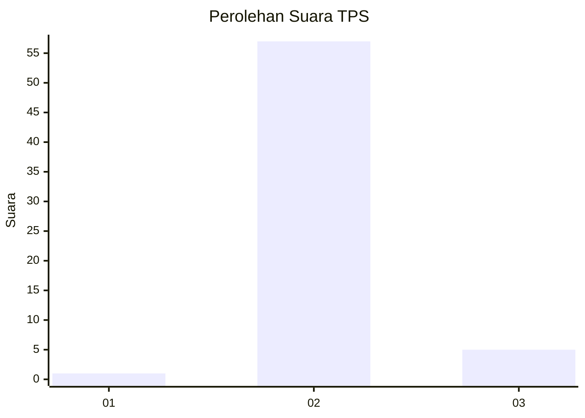
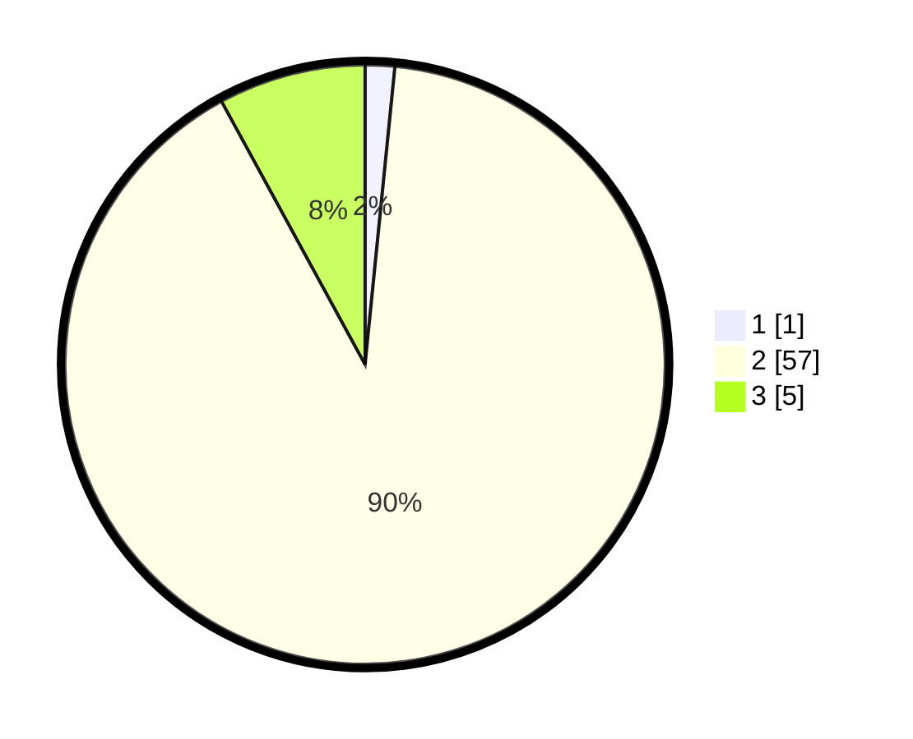

# Hasil

## Grafik

## Tabel

| No. | Nama Paslon    | Suara | Suara (raw) | Persentase |
|:--- |:-------------- | -----:| -----------:| ----------:|
| 1   | ANIES MUHAIMIN | 1     | [1][p-1]    | 1,59       |
| 2   | PRABOWO GIBRAN | 57    | [57][p-2]   | 90,48      |
| 3   | GANJAR MAHFUD  | 5     | [5][p-3]    | 7,94       |

[p-1]: https://github.com/gigit-pemilu/pemilu-2024-53-nusa-tenggara-timur/blob/main/pilpres/hitung-suara/sub/53-nusa-tenggara-timur/sub/04-belu/sub/18-lamaknen-selatan/sub/2001-ekin/sub/004-tps/sub/paslon-1.txt
[p-2]: https://github.com/gigit-pemilu/pemilu-2024-53-nusa-tenggara-timur/blob/main/pilpres/hitung-suara/sub/53-nusa-tenggara-timur/sub/04-belu/sub/18-lamaknen-selatan/sub/2001-ekin/sub/004-tps/sub/paslon-2.txt
[p-3]: https://github.com/gigit-pemilu/pemilu-2024-53-nusa-tenggara-timur/blob/main/pilpres/hitung-suara/sub/53-nusa-tenggara-timur/sub/04-belu/sub/18-lamaknen-selatan/sub/2001-ekin/sub/004-tps/sub/paslon-3.txt

## Foto C Plano

https://sirekap-obj-formc.kpu.go.id/8ffd/pemilu/ppwp/53/04/18/20/01/5304182001004-20240214-141755--aec217ec-d529-4637-a11b-45cd09b42582.jpg

https://sirekap-obj-formc.kpu.go.id/8ffd/pemilu/ppwp/53/04/18/20/01/5304182001004-20240214-141337--0053280c-dde8-4d90-9ecd-c338b3dd4bac.jpg

https://sirekap-obj-formc.kpu.go.id/8ffd/pemilu/ppwp/53/04/18/20/01/5304182001004-20240214-141515--322a662a-2b49-4b64-b1e1-8d3a102fe7c8.jpg

## Metadata

| Key        | Value               |
| ---------- | ------------------- |
| Time Stamp | 2024-02-24 22:31:28 |

