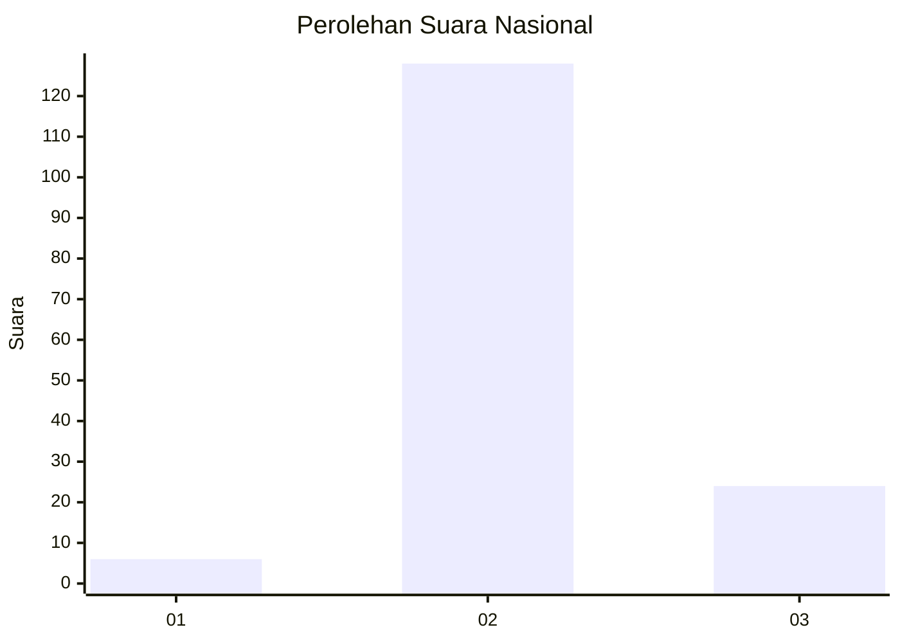
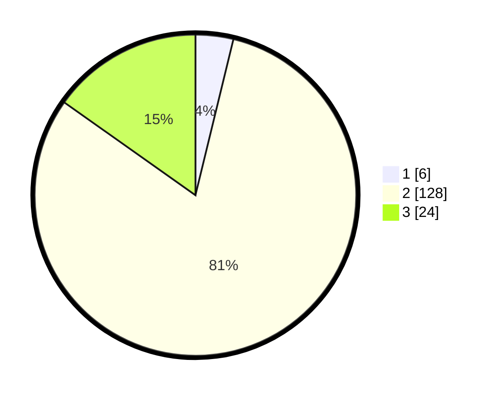

# Hasil

## Grafik

## Tabel

| No. | Nama Paslon    | Suara | Suara (raw) | Persentase |
|:--- |:-------------- | -----:| -----------:| ----------:|
| 1   | ANIES MUHAIMIN | 6     | [6][p-1]    | 3,80       |
| 2   | PRABOWO GIBRAN | 128   | [128][p-2]  | 81,01      |
| 3   | GANJAR MAHFUD  | 24    | [24][p-3]   | 15,19      |

[p-1]: https://github.com/gigit-pemilu/pemilu-2024/blob/main/pilpres/hitung-suara/sub/53-nusa-tenggara-timur/sub/04-belu/sub/21-atambua-barat/sub/1001-bardao/sub/004-tps/sub/paslon-1.txt
[p-2]: https://github.com/gigit-pemilu/pemilu-2024/blob/main/pilpres/hitung-suara/sub/53-nusa-tenggara-timur/sub/04-belu/sub/21-atambua-barat/sub/1001-bardao/sub/004-tps/sub/paslon-2.txt
[p-3]: https://github.com/gigit-pemilu/pemilu-2024/blob/main/pilpres/hitung-suara/sub/53-nusa-tenggara-timur/sub/04-belu/sub/21-atambua-barat/sub/1001-bardao/sub/004-tps/sub/paslon-3.txt

## Foto C Plano

https://sirekap-obj-formc.kpu.go.id/b2a9/pemilu/ppwp/53/04/21/10/01/5304211001004-20240215-051919--aa9ccaed-6469-4889-b44a-bbc95ce1bd99.jpg

https://sirekap-obj-formc.kpu.go.id/b2a9/pemilu/ppwp/53/04/21/10/01/5304211001004-20240215-052019--d1e5218b-3b1d-45a2-b210-4e4e805eb6bf.jpg

https://sirekap-obj-formc.kpu.go.id/b2a9/pemilu/ppwp/53/04/21/10/01/5304211001004-20240215-052211--4bae8c9a-3be6-4081-8eb7-af6d5a72db0e.jpg

## Metadata

| Key        | Value               |
| ---------- | ------------------- |
| Time Stamp | 2024-02-25 23:00:00 |

