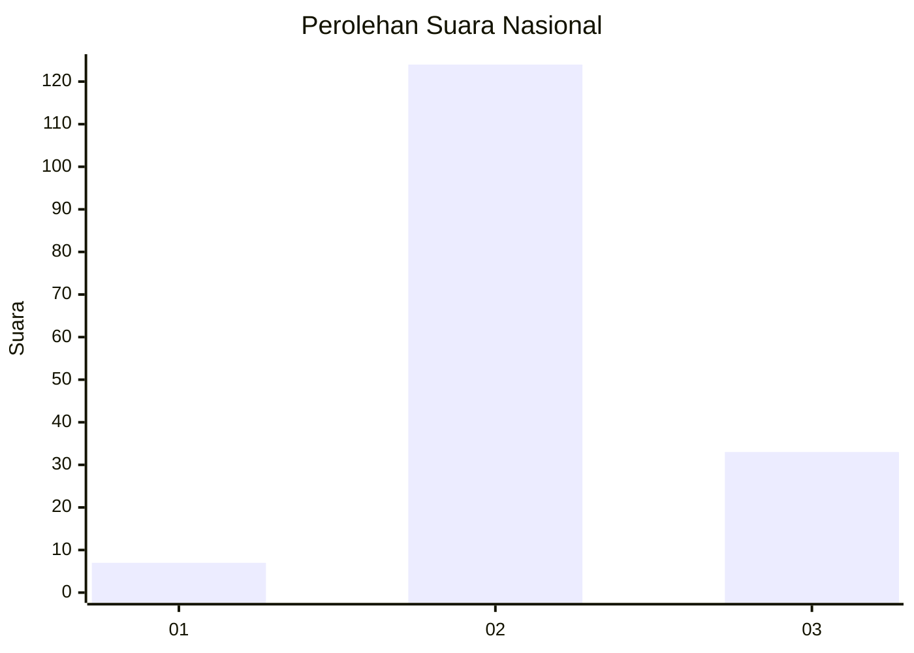

# Hasil

## Grafik

## Tabel

| No. | Nama Paslon    | Suara | Suara (raw) | Persentase |
|:--- |:-------------- | -----:| -----------:| ----------:|
| 1   | ANIES MUHAIMIN | 7     | [7][p-1]    | 4,27       |
| 2   | PRABOWO GIBRAN | 124   | [124][p-2]  | 75,61      |
| 3   | GANJAR MAHFUD  | 33    | [33][p-3]   | 20,12      |

[p-1]: https://github.com/gigit-pemilu/pemilu-2024/blob/main/pilpres/hitung-suara/sub/53-nusa-tenggara-timur/sub/04-belu/sub/21-atambua-barat/sub/1001-bardao/sub/006-tps/sub/paslon-1.txt
[p-2]: https://github.com/gigit-pemilu/pemilu-2024/blob/main/pilpres/hitung-suara/sub/53-nusa-tenggara-timur/sub/04-belu/sub/21-atambua-barat/sub/1001-bardao/sub/006-tps/sub/paslon-2.txt
[p-3]: https://github.com/gigit-pemilu/pemilu-2024/blob/main/pilpres/hitung-suara/sub/53-nusa-tenggara-timur/sub/04-belu/sub/21-atambua-barat/sub/1001-bardao/sub/006-tps/sub/paslon-3.txt

## Foto C Plano

https://sirekap-obj-formc.kpu.go.id/330e/pemilu/ppwp/53/04/21/10/01/5304211001006-20240215-041751--5c0d62f7-d816-4d53-8fcb-c7cb68c87065.jpg

https://sirekap-obj-formc.kpu.go.id/330e/pemilu/ppwp/53/04/21/10/01/5304211001006-20240215-123633--bc878691-4008-49a2-804d-a68577889010.jpg

https://sirekap-obj-formc.kpu.go.id/330e/pemilu/ppwp/53/04/21/10/01/5304211001006-20240215-123733--86b3da5b-7481-47d8-b3c6-321711b2db54.jpg

## Metadata

| Key        | Value               |
| ---------- | ------------------- |
| Time Stamp | 2024-02-25 22:00:00 |

