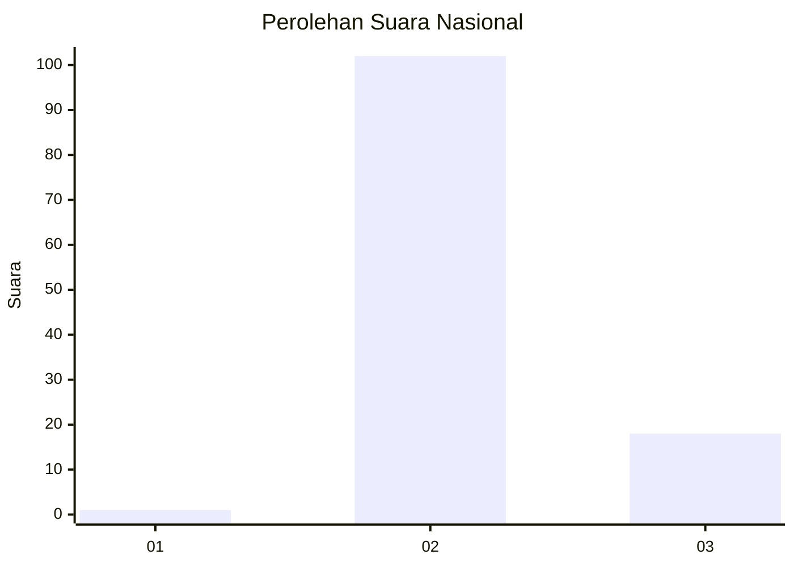
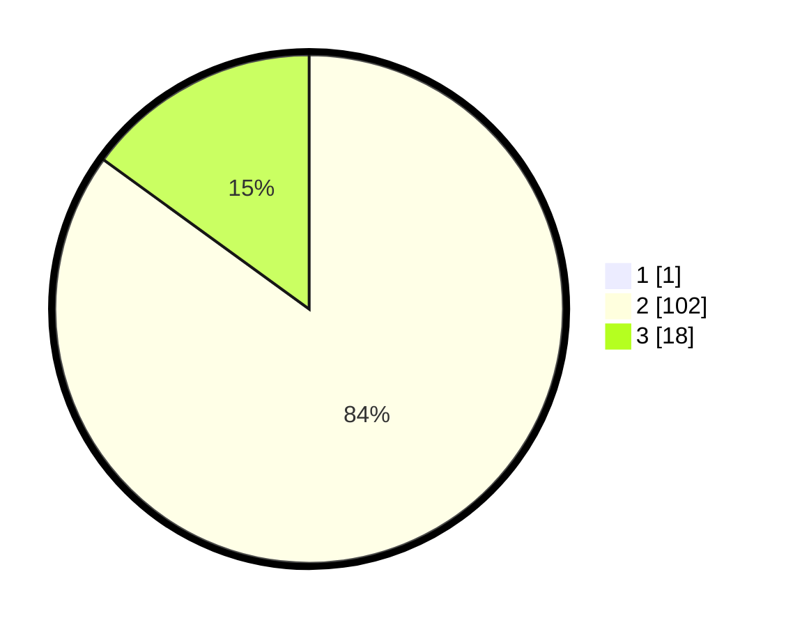

# Hasil

## Grafik

## Tabel

| No. | Nama Paslon    | Suara | Suara (raw) | Persentase |
|:--- |:-------------- | -----:| -----------:| ----------:|
| 1   | ANIES MUHAIMIN | 1     | [1][p-1]    | 0,83       |
| 2   | PRABOWO GIBRAN | 102   | [102][p-2]  | 84,30      |
| 3   | GANJAR MAHFUD  | 18    | [18][p-3]   | 14,88      |

[p-1]: https://github.com/gigit-pemilu/pemilu-2024/blob/main/pilpres/hitung-suara/sub/53-nusa-tenggara-timur/sub/04-belu/sub/21-atambua-barat/sub/1002-tulamalae/sub/002-tps/sub/paslon-1.txt
[p-2]: https://github.com/gigit-pemilu/pemilu-2024/blob/main/pilpres/hitung-suara/sub/53-nusa-tenggara-timur/sub/04-belu/sub/21-atambua-barat/sub/1002-tulamalae/sub/002-tps/sub/paslon-2.txt
[p-3]: https://github.com/gigit-pemilu/pemilu-2024/blob/main/pilpres/hitung-suara/sub/53-nusa-tenggara-timur/sub/04-belu/sub/21-atambua-barat/sub/1002-tulamalae/sub/002-tps/sub/paslon-3.txt

## Foto C Plano

https://sirekap-obj-formc.kpu.go.id/301d/pemilu/ppwp/53/04/21/10/02/5304211002002-20240215-012518--64a18aa1-9f38-4800-b001-21ed65d55142.jpg

https://sirekap-obj-formc.kpu.go.id/301d/pemilu/ppwp/53/04/21/10/02/5304211002002-20240215-001012--942227b7-6096-43d7-a039-d8ccfdb0804b.jpg

https://sirekap-obj-formc.kpu.go.id/301d/pemilu/ppwp/53/04/21/10/02/5304211002002-20240215-012652--9b96a109-7755-4800-9b43-d9211d3300bf.jpg

## Metadata

| Key        | Value               |
| ---------- | ------------------- |
| Time Stamp | 2024-02-25 23:00:00 |

