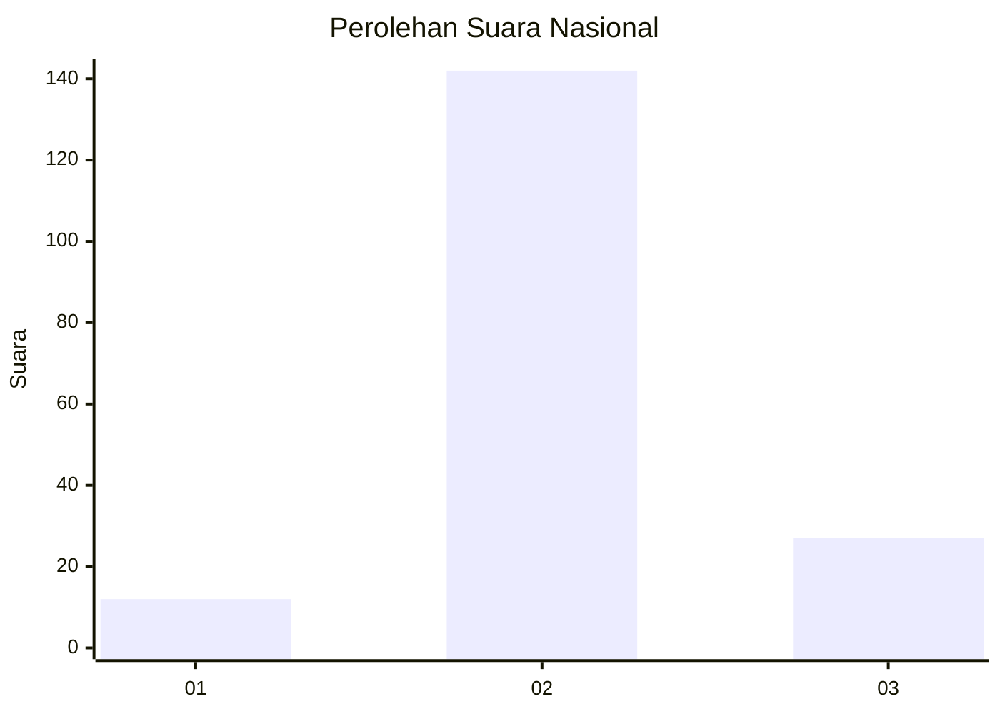

# Hasil

## Grafik

## Tabel

| No. | Nama Paslon    | Suara | Suara (raw) | Persentase |
|:--- |:-------------- | -----:| -----------:| ----------:|
| 1   | ANIES MUHAIMIN | 12    | [12][p-1]   | 6,63       |
| 2   | PRABOWO GIBRAN | 142   | [142][p-2]  | 78,45      |
| 3   | GANJAR MAHFUD  | 27    | [27][p-3]   | 14,92      |

[p-1]: https://github.com/gigit-pemilu/pemilu-2024/blob/main/pilpres/hitung-suara/sub/53-nusa-tenggara-timur/sub/04-belu/sub/22-atambua-selatan/sub/1001-manuaman/sub/002-tps/sub/paslon-1.txt
[p-2]: https://github.com/gigit-pemilu/pemilu-2024/blob/main/pilpres/hitung-suara/sub/53-nusa-tenggara-timur/sub/04-belu/sub/22-atambua-selatan/sub/1001-manuaman/sub/002-tps/sub/paslon-2.txt
[p-3]: https://github.com/gigit-pemilu/pemilu-2024/blob/main/pilpres/hitung-suara/sub/53-nusa-tenggara-timur/sub/04-belu/sub/22-atambua-selatan/sub/1001-manuaman/sub/002-tps/sub/paslon-3.txt

## Foto C Plano

https://sirekap-obj-formc.kpu.go.id/0981/pemilu/ppwp/53/04/22/10/01/5304221001002-20240215-051228--e6182c59-a351-4892-a76b-7a34bf3e5bc3.jpg

https://sirekap-obj-formc.kpu.go.id/0981/pemilu/ppwp/53/04/22/10/01/5304221001002-20240215-051441--8b539f6d-d532-47d2-954f-303cedd7a1ca.jpg

https://sirekap-obj-formc.kpu.go.id/0981/pemilu/ppwp/53/04/22/10/01/5304221001002-20240215-051535--74915e19-cf60-4c68-874e-b3ea72fe3117.jpg

## Metadata

| Key        | Value               |
| ---------- | ------------------- |
| Time Stamp | 2024-02-24 22:31:28 |

