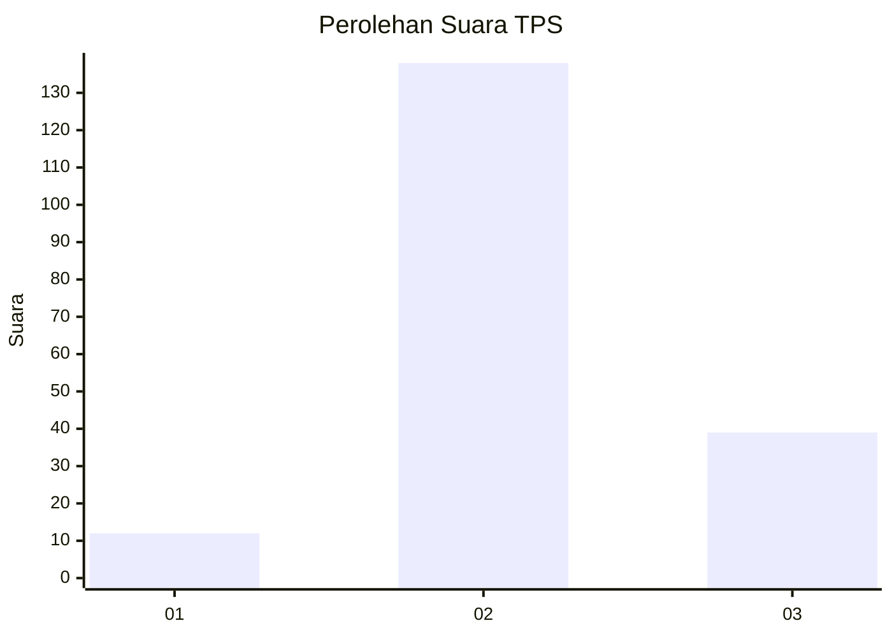

# Hasil

## Grafik

## Tabel

| No. | Nama Paslon    | Suara | Suara (raw) | Persentase |
|:--- |:-------------- | -----:| -----------:| ----------:|
| 1   | ANIES MUHAIMIN | 12    | [12][p-1]   | 6,35       |
| 2   | PRABOWO GIBRAN | 138   | [138][p-2]  | 73,02      |
| 3   | GANJAR MAHFUD  | 39    | [39][p-3]   | 20,63      |

[p-1]: https://github.com/gigit-pemilu/pemilu-2024-53-nusa-tenggara-timur/blob/main/pilpres/hitung-suara/sub/53-nusa-tenggara-timur/sub/04-belu/sub/22-atambua-selatan/sub/1001-manuaman/sub/005-tps/sub/paslon-1.txt
[p-2]: https://github.com/gigit-pemilu/pemilu-2024-53-nusa-tenggara-timur/blob/main/pilpres/hitung-suara/sub/53-nusa-tenggara-timur/sub/04-belu/sub/22-atambua-selatan/sub/1001-manuaman/sub/005-tps/sub/paslon-2.txt
[p-3]: https://github.com/gigit-pemilu/pemilu-2024-53-nusa-tenggara-timur/blob/main/pilpres/hitung-suara/sub/53-nusa-tenggara-timur/sub/04-belu/sub/22-atambua-selatan/sub/1001-manuaman/sub/005-tps/sub/paslon-3.txt

## Foto C Plano

https://sirekap-obj-formc.kpu.go.id/16bc/pemilu/ppwp/53/04/22/10/01/5304221001005-20240215-160745--303748e4-1d03-4a47-8971-5476d267c853.jpg

https://sirekap-obj-formc.kpu.go.id/16bc/pemilu/ppwp/53/04/22/10/01/5304221001005-20240215-161412--1d2a8b73-9ffd-4247-aa63-58bd26c9f675.jpg

https://sirekap-obj-formc.kpu.go.id/16bc/pemilu/ppwp/53/04/22/10/01/5304221001005-20240215-162003--545104e7-d875-46b8-a5ed-c447c5861ff0.jpg

## Metadata

| Key        | Value               |
| ---------- | ------------------- |
| Time Stamp | 2024-02-24 22:31:28 |

