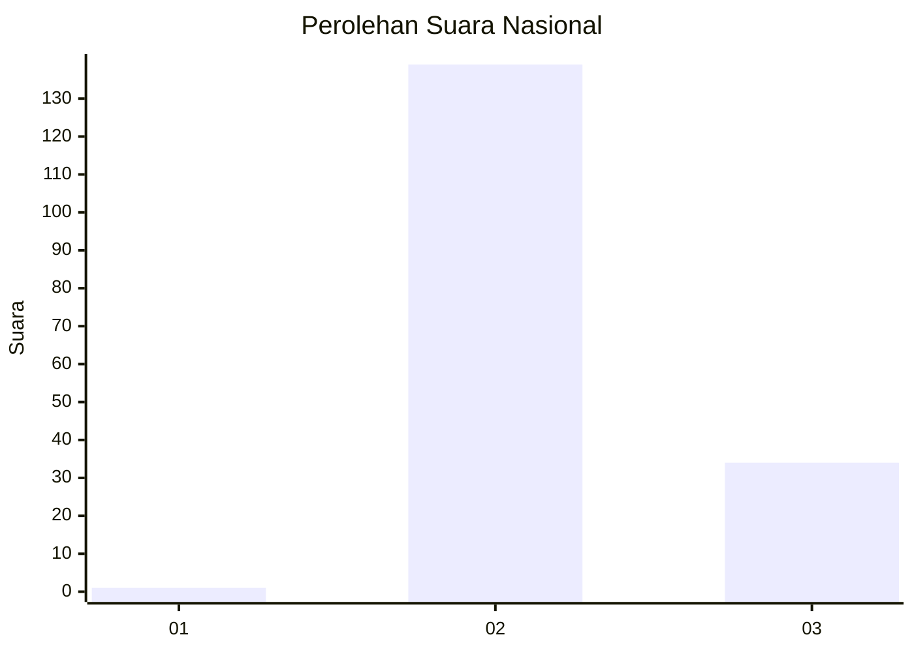
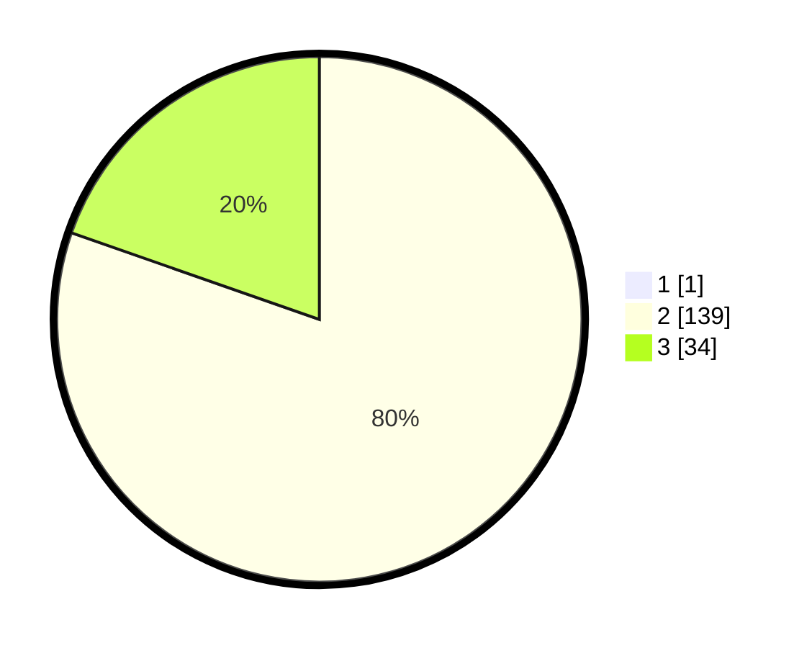

# Hasil

## Grafik

## Tabel

| No. | Nama Paslon    | Suara | Suara (raw) | Persentase |
|:--- |:-------------- | -----:| -----------:| ----------:|
| 1   | ANIES MUHAIMIN | 1     | [1][p-1]    | 0,57       |
| 2   | PRABOWO GIBRAN | 139   | [139][p-2]  | 79,89      |
| 3   | GANJAR MAHFUD  | 34    | [34][p-3]   | 19,54      |

[p-1]: https://github.com/gigit-pemilu/pemilu-2024/blob/main/pilpres/hitung-suara/sub/53-nusa-tenggara-timur/sub/04-belu/sub/22-atambua-selatan/sub/1001-manuaman/sub/006-tps/sub/paslon-1.txt
[p-2]: https://github.com/gigit-pemilu/pemilu-2024/blob/main/pilpres/hitung-suara/sub/53-nusa-tenggara-timur/sub/04-belu/sub/22-atambua-selatan/sub/1001-manuaman/sub/006-tps/sub/paslon-2.txt
[p-3]: https://github.com/gigit-pemilu/pemilu-2024/blob/main/pilpres/hitung-suara/sub/53-nusa-tenggara-timur/sub/04-belu/sub/22-atambua-selatan/sub/1001-manuaman/sub/006-tps/sub/paslon-3.txt

## Foto C Plano

https://sirekap-obj-formc.kpu.go.id/e1b2/pemilu/ppwp/53/04/22/10/01/5304221001006-20240214-232028--49fc3366-c35f-4692-8de6-688c98611278.jpg

https://sirekap-obj-formc.kpu.go.id/e1b2/pemilu/ppwp/53/04/22/10/01/5304221001006-20240215-000212--4b96ef29-8259-41bb-84b5-73f2889e18f3.jpg

https://sirekap-obj-formc.kpu.go.id/e1b2/pemilu/ppwp/53/04/22/10/01/5304221001006-20240215-065333--781a6608-b90a-4136-b76b-e9c44b7fe560.jpg

## Metadata

| Key        | Value               |
| ---------- | ------------------- |
| Time Stamp | 2024-02-16 06:00:27 |

