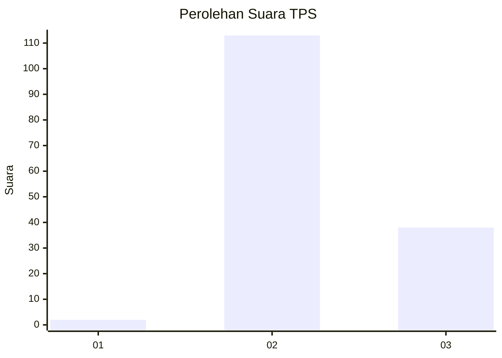
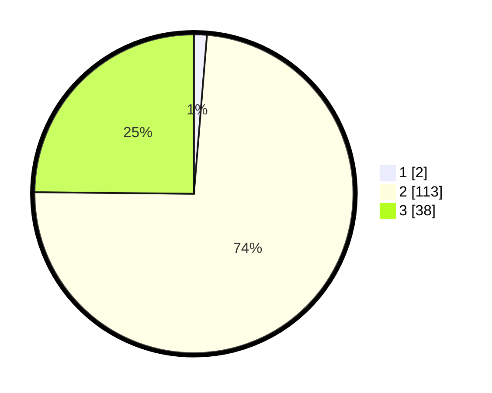

# Hasil

## Grafik

## Tabel

| No. | Nama Paslon    | Suara | Suara (raw) | Persentase |
|:--- |:-------------- | -----:| -----------:| ----------:|
| 1   | ANIES MUHAIMIN | 2     | [2][p-1]    | 1,31       |
| 2   | PRABOWO GIBRAN | 113   | [113][p-2]  | 73,86      |
| 3   | GANJAR MAHFUD  | 38    | [38][p-3]   | 24,84      |

[p-1]: https://github.com/gigit-pemilu/pemilu-2024-53-nusa-tenggara-timur/blob/main/pilpres/hitung-suara/sub/53-nusa-tenggara-timur/sub/04-belu/sub/22-atambua-selatan/sub/1001-manuaman/sub/009-tps/sub/paslon-1.txt
[p-2]: https://github.com/gigit-pemilu/pemilu-2024-53-nusa-tenggara-timur/blob/main/pilpres/hitung-suara/sub/53-nusa-tenggara-timur/sub/04-belu/sub/22-atambua-selatan/sub/1001-manuaman/sub/009-tps/sub/paslon-2.txt
[p-3]: https://github.com/gigit-pemilu/pemilu-2024-53-nusa-tenggara-timur/blob/main/pilpres/hitung-suara/sub/53-nusa-tenggara-timur/sub/04-belu/sub/22-atambua-selatan/sub/1001-manuaman/sub/009-tps/sub/paslon-3.txt

## Foto C Plano

https://sirekap-obj-formc.kpu.go.id/0988/pemilu/ppwp/53/04/22/10/01/5304221001009-20240215-072202--caf3c17c-eab7-4cd9-a236-75dd13087df9.jpg

https://sirekap-obj-formc.kpu.go.id/0988/pemilu/ppwp/53/04/22/10/01/5304221001009-20240215-072421--010a1ea8-afff-43cf-9f9d-201c0724c017.jpg

https://sirekap-obj-formc.kpu.go.id/0988/pemilu/ppwp/53/04/22/10/01/5304221001009-20240215-072517--34b0c2ff-d5e4-43db-a3b4-282eb429f86d.jpg

## Metadata

| Key        | Value               |
| ---------- | ------------------- |
| Time Stamp | 2024-02-24 23:00:00 |

