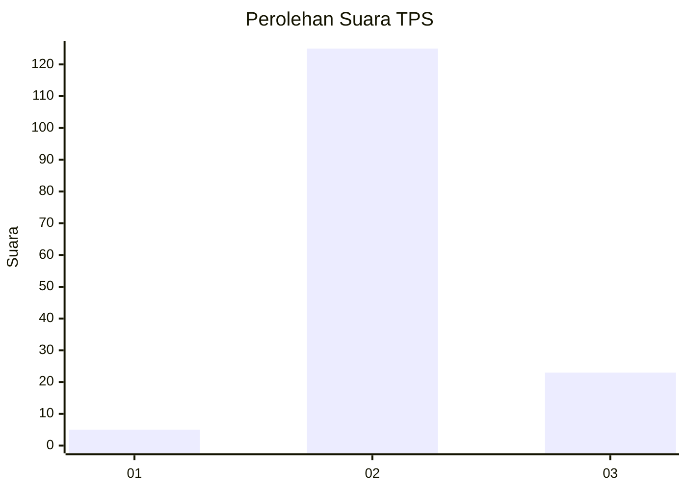

# Hasil

## Grafik

## Tabel

| No. | Nama Paslon    | Suara | Suara (raw) | Persentase |
|:--- |:-------------- | -----:| -----------:| ----------:|
| 1   | ANIES MUHAIMIN | 5     | [5][p-1]    | 3,27       |
| 2   | PRABOWO GIBRAN | 125   | [125][p-2]  | 81,70      |
| 3   | GANJAR MAHFUD  | 23    | [23][p-3]   | 15,03      |

[p-1]: https://github.com/gigit-pemilu/pemilu-2024-53-nusa-tenggara-timur/blob/main/pilpres/hitung-suara/sub/53-nusa-tenggara-timur/sub/04-belu/sub/23-nanaet-duabesi/sub/2002-nanaet/sub/002-tps/sub/paslon-1.txt
[p-2]: https://github.com/gigit-pemilu/pemilu-2024-53-nusa-tenggara-timur/blob/main/pilpres/hitung-suara/sub/53-nusa-tenggara-timur/sub/04-belu/sub/23-nanaet-duabesi/sub/2002-nanaet/sub/002-tps/sub/paslon-2.txt
[p-3]: https://github.com/gigit-pemilu/pemilu-2024-53-nusa-tenggara-timur/blob/main/pilpres/hitung-suara/sub/53-nusa-tenggara-timur/sub/04-belu/sub/23-nanaet-duabesi/sub/2002-nanaet/sub/002-tps/sub/paslon-3.txt

## Foto C Plano

https://sirekap-obj-formc.kpu.go.id/629a/pemilu/ppwp/53/04/23/20/02/5304232002002-20240214-192047--614b8b22-7341-448d-b3e3-ab47a46f4aa8.jpg

https://sirekap-obj-formc.kpu.go.id/629a/pemilu/ppwp/53/04/23/20/02/5304232002002-20240214-192208--86dd8f2e-ffb9-4dca-b8b4-3d03adc09d06.jpg

https://sirekap-obj-formc.kpu.go.id/629a/pemilu/ppwp/53/04/23/20/02/5304232002002-20240214-192308--cad9772e-e90d-44a0-801d-8abf2ee7faea.jpg

## Metadata

| Key        | Value               |
| ---------- | ------------------- |
| Time Stamp | 2024-02-25 11:00:00 |

