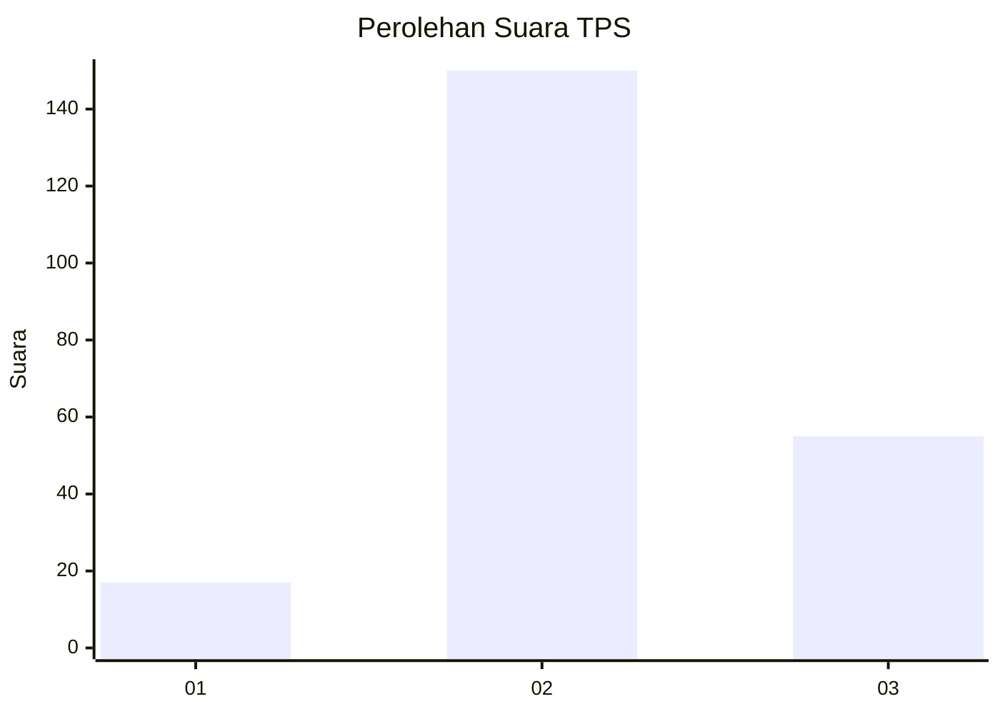
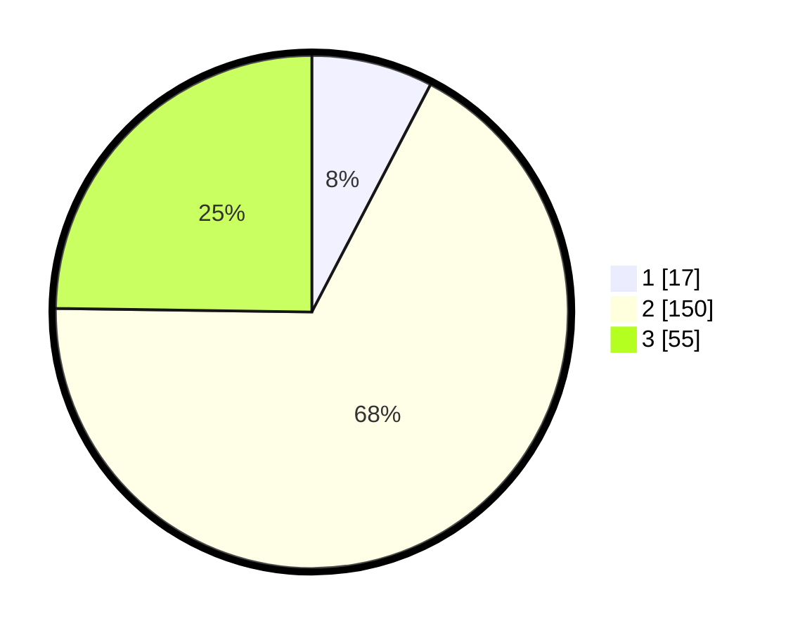

# Hasil

## Grafik

## Tabel

| No. | Nama Paslon    | Suara | Suara (raw) | Persentase |
|:--- |:-------------- | -----:| -----------:| ----------:|
| 1   | ANIES MUHAIMIN | 17    | [17][p-1]   | 7,66       |
| 2   | PRABOWO GIBRAN | 150   | [150][p-2]  | 67,57      |
| 3   | GANJAR MAHFUD  | 55    | [55][p-3]   | 24,77      |

[p-1]: https://github.com/gigit-pemilu/pemilu-2024-53-nusa-tenggara-timur/blob/main/pilpres/hitung-suara/sub/53-nusa-tenggara-timur/sub/05-alor/sub/01-teluk-mutiara/sub/1001-kalabahi-barat/sub/006-tps/sub/paslon-1.txt
[p-2]: https://github.com/gigit-pemilu/pemilu-2024-53-nusa-tenggara-timur/blob/main/pilpres/hitung-suara/sub/53-nusa-tenggara-timur/sub/05-alor/sub/01-teluk-mutiara/sub/1001-kalabahi-barat/sub/006-tps/sub/paslon-2.txt
[p-3]: https://github.com/gigit-pemilu/pemilu-2024-53-nusa-tenggara-timur/blob/main/pilpres/hitung-suara/sub/53-nusa-tenggara-timur/sub/05-alor/sub/01-teluk-mutiara/sub/1001-kalabahi-barat/sub/006-tps/sub/paslon-3.txt

## Foto C Plano

https://sirekap-obj-formc.kpu.go.id/de83/pemilu/ppwp/53/05/01/10/01/5305011001006-20240216-105401--6d716ab9-bb23-42d5-9bef-84f9241f976a.jpg

https://sirekap-obj-formc.kpu.go.id/de83/pemilu/ppwp/53/05/01/10/01/5305011001006-20240215-090925--303804c8-b85f-41d5-b860-ed0fb1ab2ab0.jpg

https://sirekap-obj-formc.kpu.go.id/de83/pemilu/ppwp/53/05/01/10/01/5305011001006-20240214-185800--6e8e219e-d2b2-45e8-8404-a06c9df3372f.jpg

## Metadata

| Key        | Value               |
| ---------- | ------------------- |
| Time Stamp | 2024-02-16 11:00:29 |

