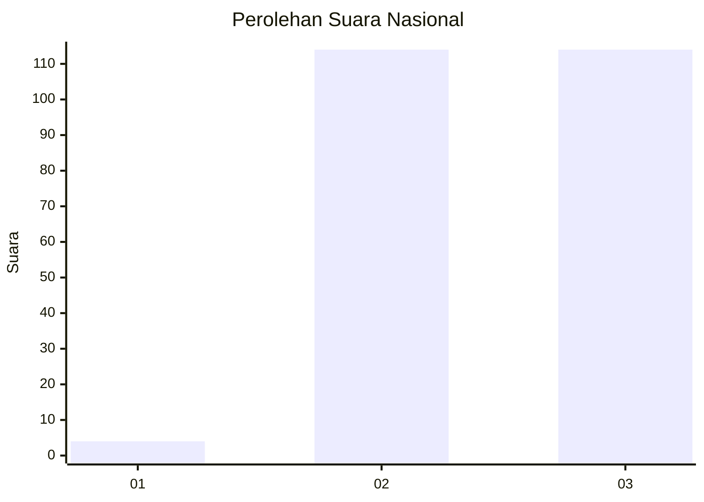
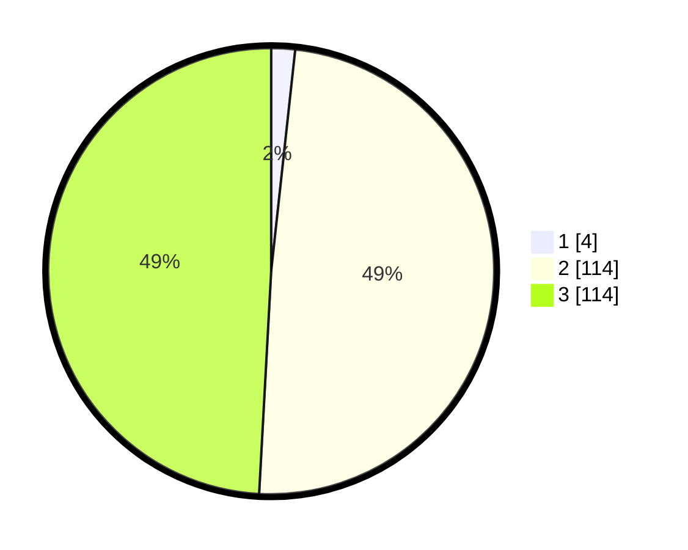

# Hasil

## Grafik

## Tabel

| No. | Nama Paslon    | Suara | Suara (raw) | Persentase |
|:--- |:-------------- | -----:| -----------:| ----------:|
| 1   | ANIES MUHAIMIN | 4     | [4][p-1]    | 1,72       |
| 2   | PRABOWO GIBRAN | 114   | [114][p-2]  | 49,14      |
| 3   | GANJAR MAHFUD  | 114   | [114][p-3]  | 49,14      |

[p-1]: https://github.com/gigit-pemilu/pemilu-2024/blob/main/pilpres/hitung-suara/sub/53-nusa-tenggara-timur/sub/05-alor/sub/07-alor-tengah-utara/sub/2002-lembur-tengah/sub/001-tps/sub/paslon-1.txt
[p-2]: https://github.com/gigit-pemilu/pemilu-2024/blob/main/pilpres/hitung-suara/sub/53-nusa-tenggara-timur/sub/05-alor/sub/07-alor-tengah-utara/sub/2002-lembur-tengah/sub/001-tps/sub/paslon-2.txt
[p-3]: https://github.com/gigit-pemilu/pemilu-2024/blob/main/pilpres/hitung-suara/sub/53-nusa-tenggara-timur/sub/05-alor/sub/07-alor-tengah-utara/sub/2002-lembur-tengah/sub/001-tps/sub/paslon-3.txt

## Foto C Plano

https://sirekap-obj-formc.kpu.go.id/114d/pemilu/ppwp/53/05/07/20/02/5305072002001-20240216-152059--06938f8c-082c-442e-a744-444e2e857554.jpg

https://sirekap-obj-formc.kpu.go.id/114d/pemilu/ppwp/53/05/07/20/02/5305072002001-20240216-154113--f5d95933-167f-4ee8-ba3e-0d3c6c5fa922.jpg

https://sirekap-obj-formc.kpu.go.id/114d/pemilu/ppwp/53/05/07/20/02/5305072002001-20240216-152656--fd07a0d5-4aab-4d2b-a049-aba7180eabaa.jpg

## Metadata

| Key        | Value               |
| ---------- | ------------------- |
| Time Stamp | 2024-02-16 16:25:10 |

