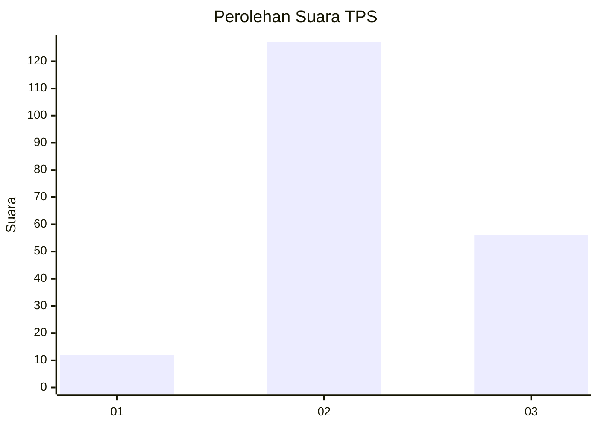
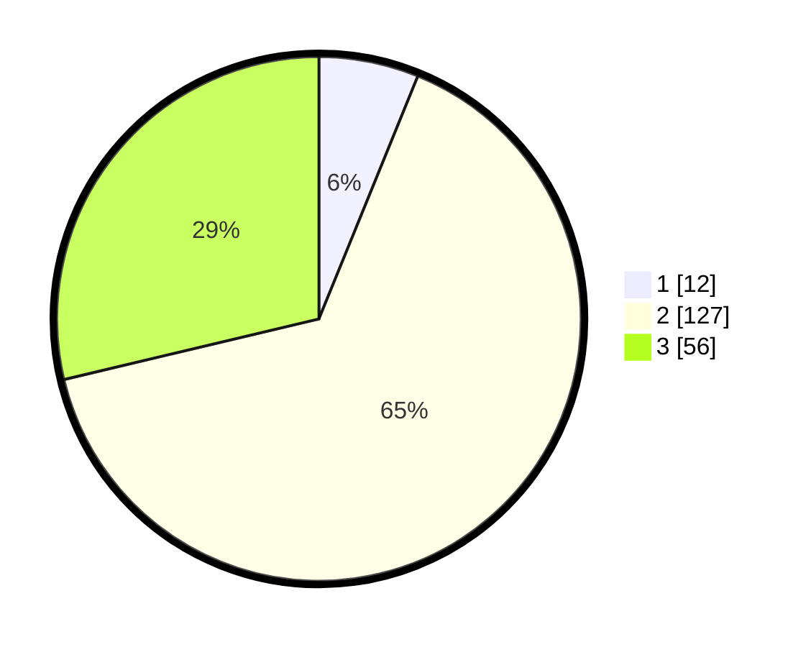

# Hasil

## Grafik

## Tabel

| No. | Nama Paslon    | Suara | Suara (raw) | Persentase |
|:--- |:-------------- | -----:| -----------:| ----------:|
| 1   | ANIES MUHAIMIN | 12    | [12][p-1]   | 6,15       |
| 2   | PRABOWO GIBRAN | 127   | [127][p-2]  | 65,13      |
| 3   | GANJAR MAHFUD  | 56    | [56][p-3]   | 28,72      |

[p-1]: https://github.com/gigit-pemilu/pemilu-2024-53-nusa-tenggara-timur/blob/main/pilpres/hitung-suara/sub/53-nusa-tenggara-timur/sub/05-alor/sub/10-kabola/sub/1001-kabola/sub/006-tps/sub/paslon-1.txt
[p-2]: https://github.com/gigit-pemilu/pemilu-2024-53-nusa-tenggara-timur/blob/main/pilpres/hitung-suara/sub/53-nusa-tenggara-timur/sub/05-alor/sub/10-kabola/sub/1001-kabola/sub/006-tps/sub/paslon-2.txt
[p-3]: https://github.com/gigit-pemilu/pemilu-2024-53-nusa-tenggara-timur/blob/main/pilpres/hitung-suara/sub/53-nusa-tenggara-timur/sub/05-alor/sub/10-kabola/sub/1001-kabola/sub/006-tps/sub/paslon-3.txt

## Foto C Plano

https://sirekap-obj-formc.kpu.go.id/9e5b/pemilu/ppwp/53/05/10/10/01/5305101001006-20240215-182215--9a101a50-e73c-4696-9528-03583c7c2f92.jpg

https://sirekap-obj-formc.kpu.go.id/9e5b/pemilu/ppwp/53/05/10/10/01/5305101001006-20240215-182509--c325d1e9-bd00-4360-8d9d-bbee14771e27.jpg

https://sirekap-obj-formc.kpu.go.id/9e5b/pemilu/ppwp/53/05/10/10/01/5305101001006-20240215-182638--3f592f94-8dcf-451b-a59b-73acafd4b576.jpg

## Metadata

| Key        | Value               |
| ---------- | ------------------- |
| Time Stamp | 2024-02-24 22:31:28 |

