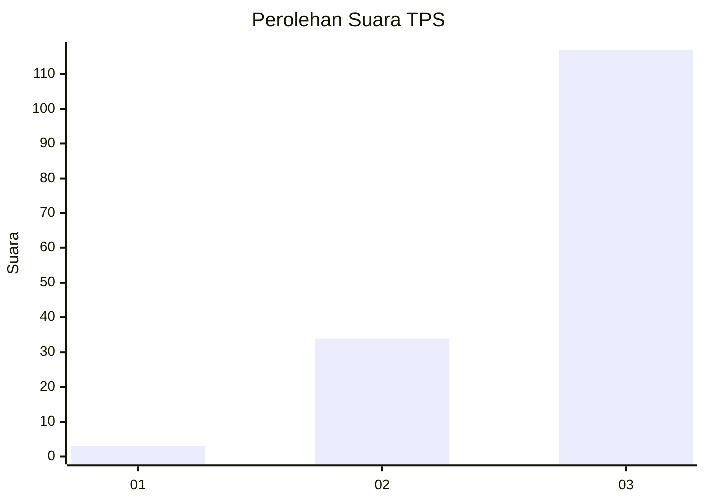
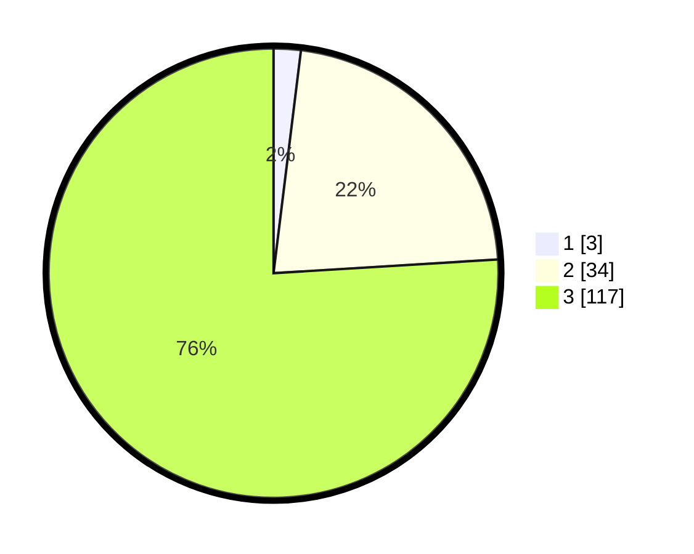

# Hasil

## Grafik

## Tabel

| No. | Nama Paslon    | Suara | Suara (raw) | Persentase |
|:--- |:-------------- | -----:| -----------:| ----------:|
| 1   | ANIES MUHAIMIN | 3     | [3][p-1]    | 1,95       |
| 2   | PRABOWO GIBRAN | 34    | [34][p-2]   | 22,08      |
| 3   | GANJAR MAHFUD  | 117   | [117][p-3]  | 75,97      |

[p-1]: https://github.com/gigit-pemilu/pemilu-2024-53-nusa-tenggara-timur/blob/main/pilpres/hitung-suara/sub/53-nusa-tenggara-timur/sub/05-alor/sub/18-abad-selatan/sub/2001-tribur/sub/007-tps/sub/paslon-1.txt
[p-2]: https://github.com/gigit-pemilu/pemilu-2024-53-nusa-tenggara-timur/blob/main/pilpres/hitung-suara/sub/53-nusa-tenggara-timur/sub/05-alor/sub/18-abad-selatan/sub/2001-tribur/sub/007-tps/sub/paslon-2.txt
[p-3]: https://github.com/gigit-pemilu/pemilu-2024-53-nusa-tenggara-timur/blob/main/pilpres/hitung-suara/sub/53-nusa-tenggara-timur/sub/05-alor/sub/18-abad-selatan/sub/2001-tribur/sub/007-tps/sub/paslon-3.txt

## Foto C Plano

https://sirekap-obj-formc.kpu.go.id/6376/pemilu/ppwp/53/05/18/20/01/5305182001007-20240215-134914--004d16a3-13b4-4e3c-a475-38f36410fb70.jpg

https://sirekap-obj-formc.kpu.go.id/6376/pemilu/ppwp/53/05/18/20/01/5305182001007-20240215-131807--7308e21f-d4e9-4796-92d8-38bbe5dab280.jpg

## Metadata

| Key        | Value               |
| ---------- | ------------------- |
| Time Stamp | 2024-02-25 16:00:00 |

