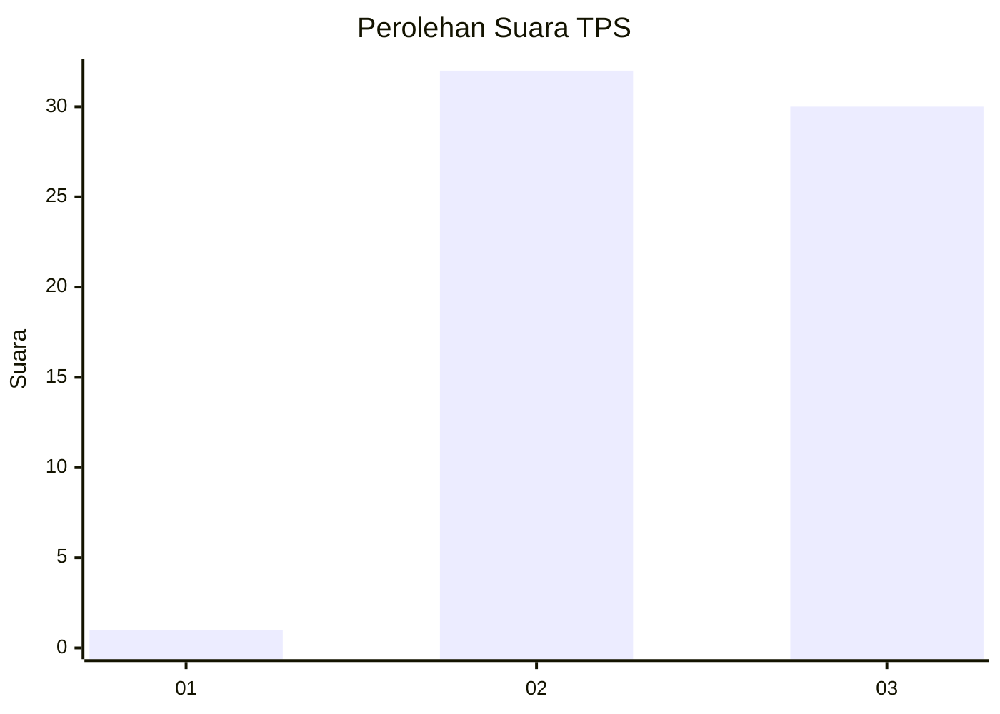
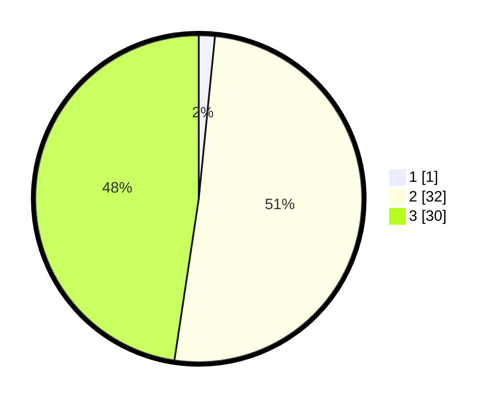

# Hasil

## Grafik

## Tabel

| No. | Nama Paslon    | Suara | Suara (raw) | Persentase |
|:--- |:-------------- | -----:| -----------:| ----------:|
| 1   | ANIES MUHAIMIN | 1     | [1][p-1]    | 1,59       |
| 2   | PRABOWO GIBRAN | 32    | [32][p-2]   | 50,79      |
| 3   | GANJAR MAHFUD  | 30    | [30][p-3]   | 47,62      |

[p-1]: https://github.com/gigit-pemilu/pemilu-2024-53-nusa-tenggara-timur/blob/main/pilpres/hitung-suara/sub/53-nusa-tenggara-timur/sub/06-flores-timur/sub/02-titehena/sub/2008-watowara/sub/005-tps/sub/paslon-1.txt
[p-2]: https://github.com/gigit-pemilu/pemilu-2024-53-nusa-tenggara-timur/blob/main/pilpres/hitung-suara/sub/53-nusa-tenggara-timur/sub/06-flores-timur/sub/02-titehena/sub/2008-watowara/sub/005-tps/sub/paslon-2.txt
[p-3]: https://github.com/gigit-pemilu/pemilu-2024-53-nusa-tenggara-timur/blob/main/pilpres/hitung-suara/sub/53-nusa-tenggara-timur/sub/06-flores-timur/sub/02-titehena/sub/2008-watowara/sub/005-tps/sub/paslon-3.txt

## Foto C Plano

https://sirekap-obj-formc.kpu.go.id/15b8/pemilu/ppwp/53/06/02/20/08/5306022008005-20240215-074045--44c1d939-fbd6-4937-8e30-1c34c58e12d3.jpg

https://sirekap-obj-formc.kpu.go.id/15b8/pemilu/ppwp/53/06/02/20/08/5306022008005-20240215-074622--36d2abad-087f-4c89-8430-2fffbb1083cb.jpg

https://sirekap-obj-formc.kpu.go.id/15b8/pemilu/ppwp/53/06/02/20/08/5306022008005-20240215-075004--92d17d51-d8e3-44f6-887c-6bbbf34fe3ee.jpg

## Metadata

| Key        | Value               |
| ---------- | ------------------- |
| Time Stamp | 2024-02-25 22:00:00 |

