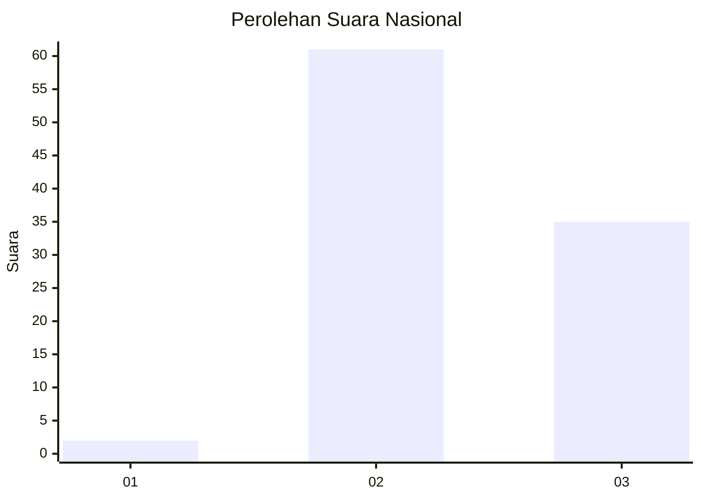
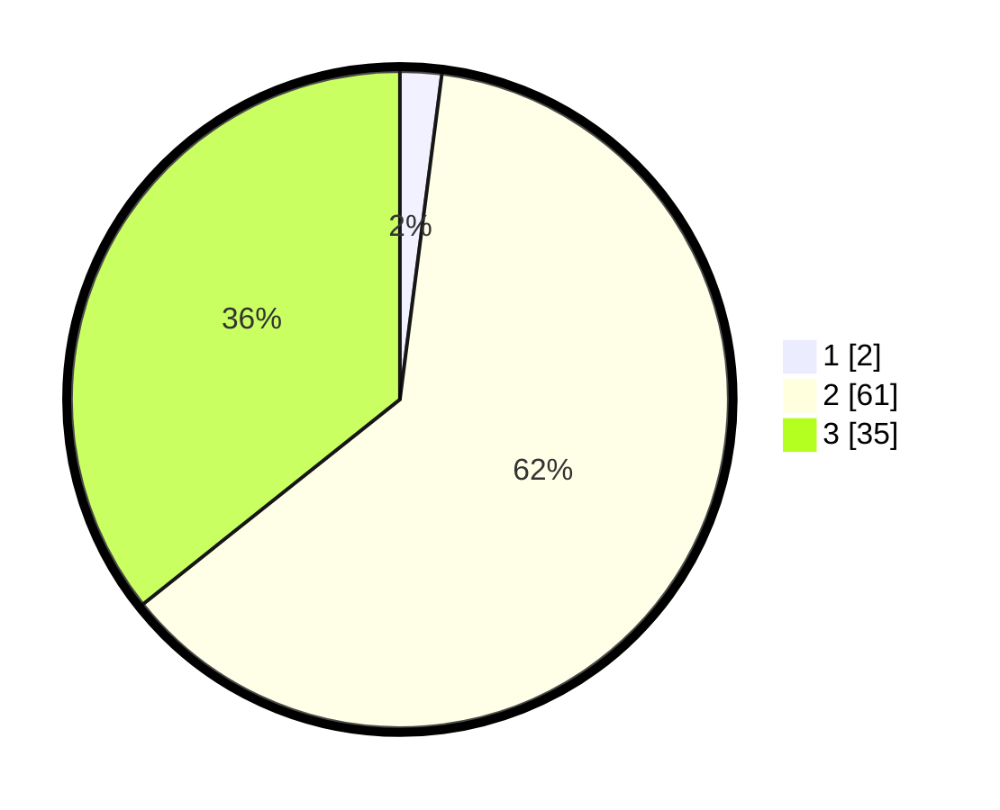

# Hasil

## Grafik

## Tabel

| No. | Nama Paslon    | Suara | Suara (raw) | Persentase |
|:--- |:-------------- | -----:| -----------:| ----------:|
| 1   | ANIES MUHAIMIN | 2     | [2][p-1]    | 2,04       |
| 2   | PRABOWO GIBRAN | 61    | [61][p-2]   | 62,24      |
| 3   | GANJAR MAHFUD  | 35    | [35][p-3]   | 35,71      |

[p-1]: https://github.com/gigit-pemilu/pemilu-2024/blob/main/pilpres/hitung-suara/sub/53-nusa-tenggara-timur/sub/06-flores-timur/sub/02-titehena/sub/2014-bokang-wolomatang/sub/002-tps/sub/paslon-1.txt
[p-2]: https://github.com/gigit-pemilu/pemilu-2024/blob/main/pilpres/hitung-suara/sub/53-nusa-tenggara-timur/sub/06-flores-timur/sub/02-titehena/sub/2014-bokang-wolomatang/sub/002-tps/sub/paslon-2.txt
[p-3]: https://github.com/gigit-pemilu/pemilu-2024/blob/main/pilpres/hitung-suara/sub/53-nusa-tenggara-timur/sub/06-flores-timur/sub/02-titehena/sub/2014-bokang-wolomatang/sub/002-tps/sub/paslon-3.txt

## Foto C Plano

https://sirekap-obj-formc.kpu.go.id/c4a6/pemilu/ppwp/53/06/02/20/14/5306022014002-20240214-141754--2fa7f629-bba6-41be-bd99-98905115467f.jpg

https://sirekap-obj-formc.kpu.go.id/c4a6/pemilu/ppwp/53/06/02/20/14/5306022014002-20240214-191729--a2b43844-64d6-44c6-9716-8165ce323c02.jpg

https://sirekap-obj-formc.kpu.go.id/c4a6/pemilu/ppwp/53/06/02/20/14/5306022014002-20240214-141643--9e1a5ce9-35a7-461b-8802-42c0f2b15fef.jpg

## Metadata

| Key        | Value               |
| ---------- | ------------------- |
| Time Stamp | 2024-02-21 21:00:04 |

