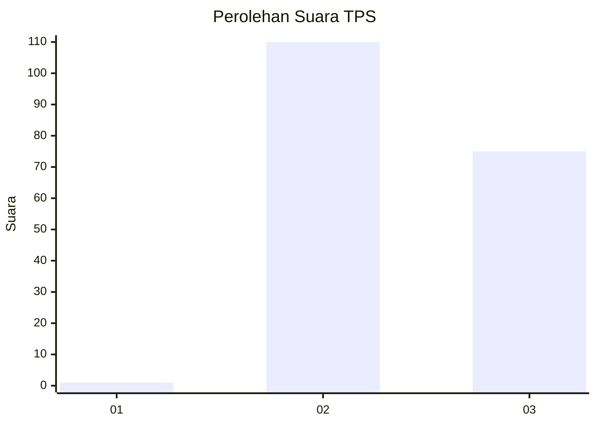
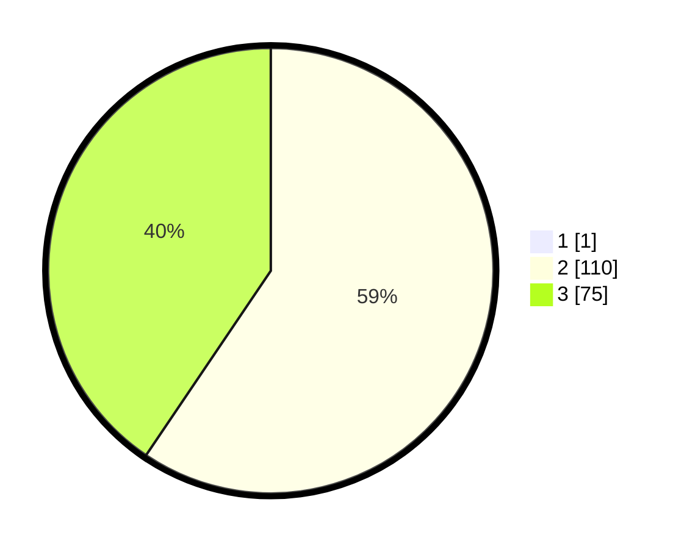

# Hasil

## Grafik

## Tabel

| No. | Nama Paslon    | Suara | Suara (raw) | Persentase |
|:--- |:-------------- | -----:| -----------:| ----------:|
| 1   | ANIES MUHAIMIN | 1     | [1][p-1]    | 0,54       |
| 2   | PRABOWO GIBRAN | 110   | [110][p-2]  | 59,14      |
| 3   | GANJAR MAHFUD  | 75    | [75][p-3]   | 40,32      |

[p-1]: https://github.com/gigit-pemilu/pemilu-2024-53-nusa-tenggara-timur/blob/main/pilpres/hitung-suara/sub/53-nusa-tenggara-timur/sub/06-flores-timur/sub/06-solor-barat/sub/1001-ritaebang/sub/003-tps/sub/paslon-1.txt
[p-2]: https://github.com/gigit-pemilu/pemilu-2024-53-nusa-tenggara-timur/blob/main/pilpres/hitung-suara/sub/53-nusa-tenggara-timur/sub/06-flores-timur/sub/06-solor-barat/sub/1001-ritaebang/sub/003-tps/sub/paslon-2.txt
[p-3]: https://github.com/gigit-pemilu/pemilu-2024-53-nusa-tenggara-timur/blob/main/pilpres/hitung-suara/sub/53-nusa-tenggara-timur/sub/06-flores-timur/sub/06-solor-barat/sub/1001-ritaebang/sub/003-tps/sub/paslon-3.txt

## Foto C Plano

https://sirekap-obj-formc.kpu.go.id/d409/pemilu/ppwp/53/06/06/10/01/5306061001003-20240215-085104--de8ef52d-5f36-4fbd-b463-c9d2bf4a57f1.jpg

https://sirekap-obj-formc.kpu.go.id/d409/pemilu/ppwp/53/06/06/10/01/5306061001003-20240214-235926--d4b9702a-0ed7-4fe7-ae3a-ebb3cb36bdfb.jpg

https://sirekap-obj-formc.kpu.go.id/d409/pemilu/ppwp/53/06/06/10/01/5306061001003-20240215-003901--ea03a1ec-025d-4e49-8087-8e7efb4148a7.jpg

## Metadata

| Key        | Value               |
| ---------- | ------------------- |
| Time Stamp | 2024-02-25 15:00:00 |

