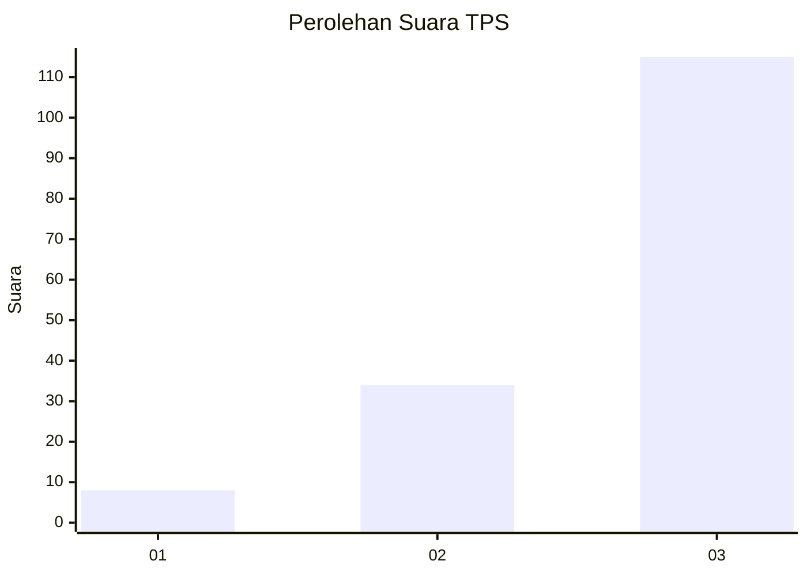
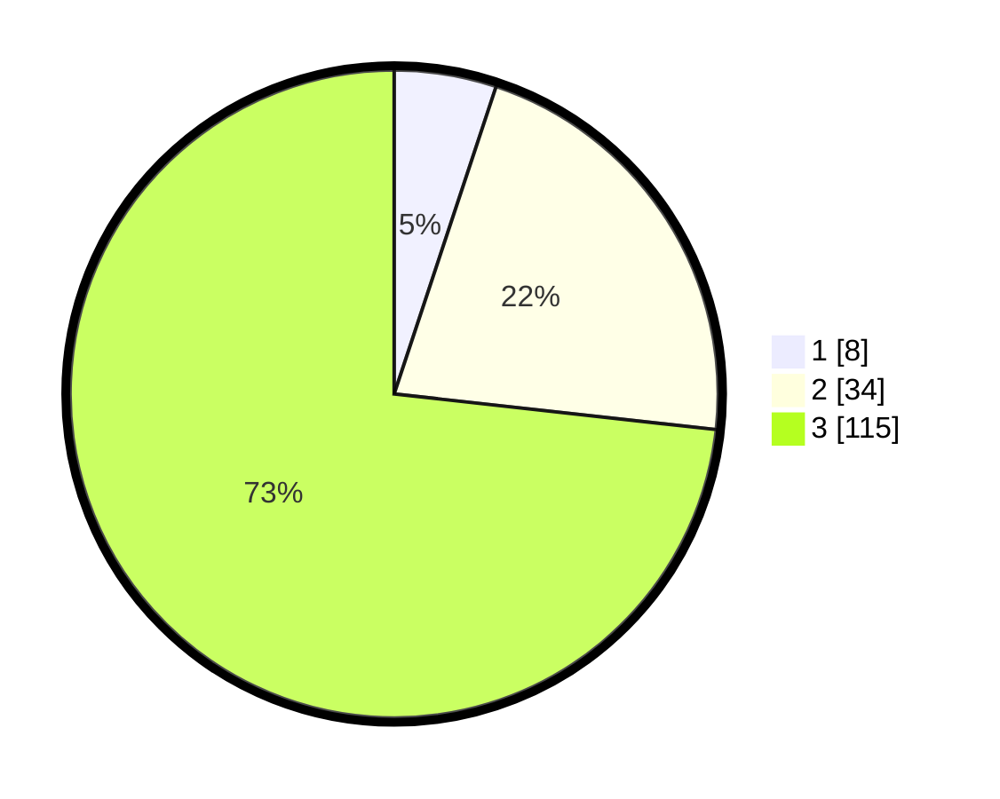

# Hasil

## Grafik

## Tabel

| No. | Nama Paslon    | Suara | Suara (raw) | Persentase |
|:--- |:-------------- | -----:| -----------:| ----------:|
| 1   | ANIES MUHAIMIN | 8     | [8][p-1]    | 5,10       |
| 2   | PRABOWO GIBRAN | 34    | [34][p-2]   | 21,66      |
| 3   | GANJAR MAHFUD  | 115   | [115][p-3]  | 73,25      |

[p-1]: https://github.com/gigit-pemilu/pemilu-2024-53-nusa-tenggara-timur/blob/main/pilpres/hitung-suara/sub/53-nusa-tenggara-timur/sub/06-flores-timur/sub/06-solor-barat/sub/2012-ongalereng/sub/003-tps/sub/paslon-1.txt
[p-2]: https://github.com/gigit-pemilu/pemilu-2024-53-nusa-tenggara-timur/blob/main/pilpres/hitung-suara/sub/53-nusa-tenggara-timur/sub/06-flores-timur/sub/06-solor-barat/sub/2012-ongalereng/sub/003-tps/sub/paslon-2.txt
[p-3]: https://github.com/gigit-pemilu/pemilu-2024-53-nusa-tenggara-timur/blob/main/pilpres/hitung-suara/sub/53-nusa-tenggara-timur/sub/06-flores-timur/sub/06-solor-barat/sub/2012-ongalereng/sub/003-tps/sub/paslon-3.txt

## Foto C Plano

https://sirekap-obj-formc.kpu.go.id/874f/pemilu/ppwp/53/06/06/20/12/5306062012003-20240215-081027--dc43faa5-b05f-4238-ab16-d68105348a0e.jpg

https://sirekap-obj-formc.kpu.go.id/874f/pemilu/ppwp/53/06/06/20/12/5306062012003-20240215-064157--6af79d73-c5e9-4776-b401-ee8fdaa2d12e.jpg

https://sirekap-obj-formc.kpu.go.id/874f/pemilu/ppwp/53/06/06/20/12/5306062012003-20240215-062426--13250ce5-4d0f-48b3-a360-6812f31887fd.jpg

## Metadata

| Key        | Value               |
| ---------- | ------------------- |
| Time Stamp | 2024-02-24 22:31:28 |

