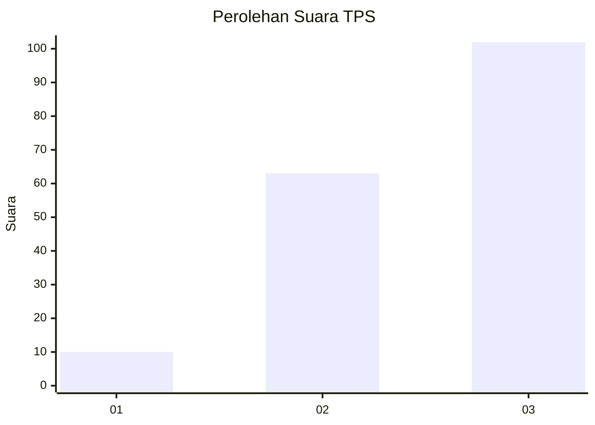
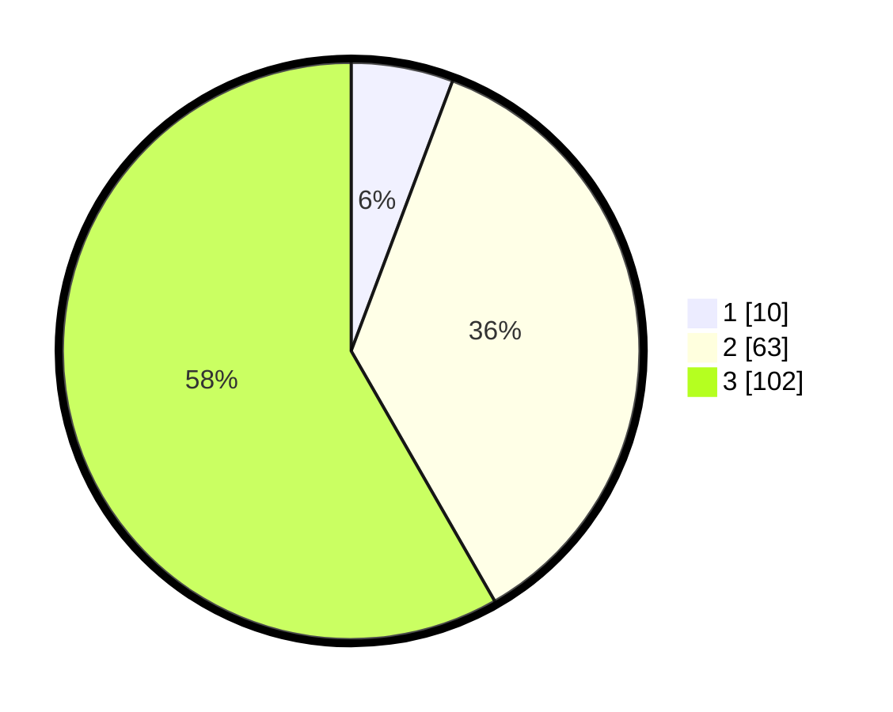

# Hasil

## Grafik

## Tabel

| No. | Nama Paslon    | Suara | Suara (raw) | Persentase |
|:--- |:-------------- | -----:| -----------:| ----------:|
| 1   | ANIES MUHAIMIN | 10    | [10][p-1]   | 5,71       |
| 2   | PRABOWO GIBRAN | 63    | [63][p-2]   | 36,00      |
| 3   | GANJAR MAHFUD  | 102   | [102][p-3]  | 58,29      |

[p-1]: https://github.com/gigit-pemilu/pemilu-2024-53-nusa-tenggara-timur/blob/main/pilpres/hitung-suara/sub/53-nusa-tenggara-timur/sub/06-flores-timur/sub/07-solor-timur/sub/2003-lebao/sub/001-tps/sub/paslon-1.txt
[p-2]: https://github.com/gigit-pemilu/pemilu-2024-53-nusa-tenggara-timur/blob/main/pilpres/hitung-suara/sub/53-nusa-tenggara-timur/sub/06-flores-timur/sub/07-solor-timur/sub/2003-lebao/sub/001-tps/sub/paslon-2.txt
[p-3]: https://github.com/gigit-pemilu/pemilu-2024-53-nusa-tenggara-timur/blob/main/pilpres/hitung-suara/sub/53-nusa-tenggara-timur/sub/06-flores-timur/sub/07-solor-timur/sub/2003-lebao/sub/001-tps/sub/paslon-3.txt

## Foto C Plano

https://sirekap-obj-formc.kpu.go.id/1ddd/pemilu/ppwp/53/06/07/20/03/5306072003001-20240215-113521--b871d297-dee8-4deb-8ed1-b47a1ebbb4db.jpg

https://sirekap-obj-formc.kpu.go.id/1ddd/pemilu/ppwp/53/06/07/20/03/5306072003001-20240215-113916--ff88dee4-fd98-4d6c-ba6e-a857c0bb6c39.jpg

https://sirekap-obj-formc.kpu.go.id/1ddd/pemilu/ppwp/53/06/07/20/03/5306072003001-20240215-114154--132bf408-a47b-4352-b6b1-a9e8a09a61b0.jpg

## Metadata

| Key        | Value               |
| ---------- | ------------------- |
| Time Stamp | 2024-02-25 11:00:00 |

