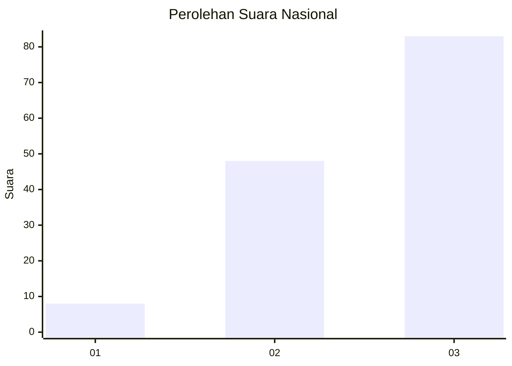
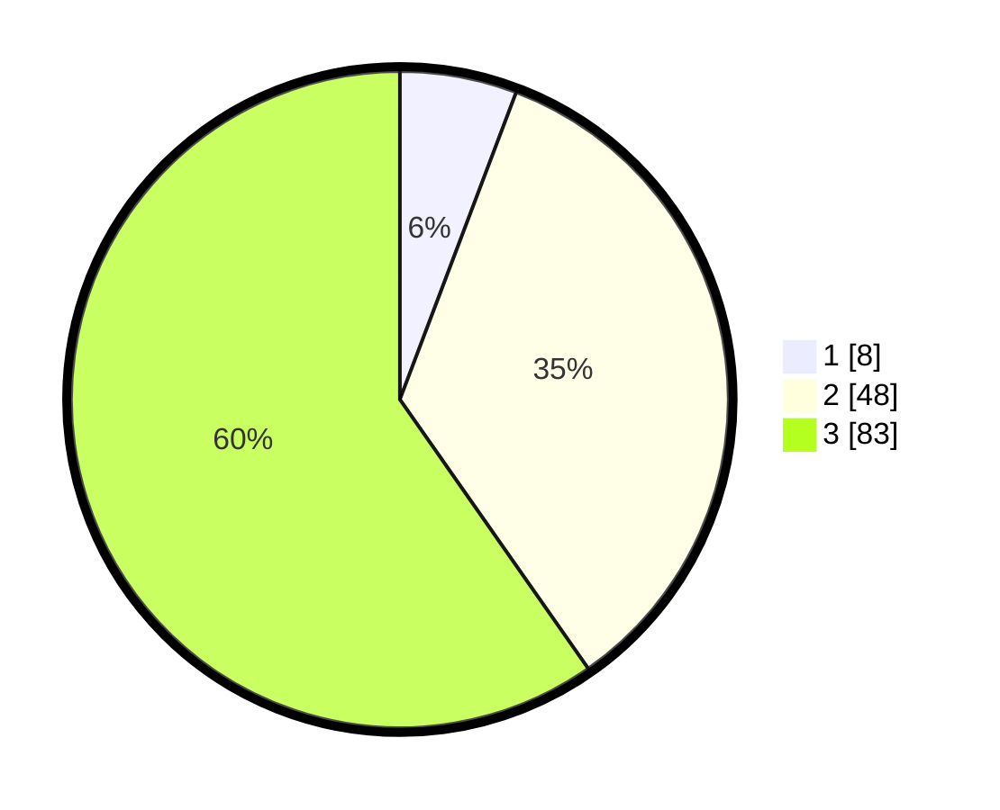

# Hasil

## Grafik

## Tabel

| No. | Nama Paslon    | Suara | Suara (raw) | Persentase |
|:--- |:-------------- | -----:| -----------:| ----------:|
| 1   | ANIES MUHAIMIN | 8     | [8][p-1]    | 5,76       |
| 2   | PRABOWO GIBRAN | 48    | [48][p-2]   | 34,53      |
| 3   | GANJAR MAHFUD  | 83    | [83][p-3]   | 59,71      |

[p-1]: https://github.com/gigit-pemilu/pemilu-2024/blob/main/pilpres/hitung-suara/sub/53-nusa-tenggara-timur/sub/06-flores-timur/sub/07-solor-timur/sub/2003-lebao/sub/002-tps/sub/paslon-1.txt
[p-2]: https://github.com/gigit-pemilu/pemilu-2024/blob/main/pilpres/hitung-suara/sub/53-nusa-tenggara-timur/sub/06-flores-timur/sub/07-solor-timur/sub/2003-lebao/sub/002-tps/sub/paslon-2.txt
[p-3]: https://github.com/gigit-pemilu/pemilu-2024/blob/main/pilpres/hitung-suara/sub/53-nusa-tenggara-timur/sub/06-flores-timur/sub/07-solor-timur/sub/2003-lebao/sub/002-tps/sub/paslon-3.txt

## Foto C Plano

https://sirekap-obj-formc.kpu.go.id/8c58/pemilu/ppwp/53/06/07/20/03/5306072003002-20240215-121733--b3cbf7d0-59fc-4a44-8af8-cd6bbe2919e6.jpg

https://sirekap-obj-formc.kpu.go.id/8c58/pemilu/ppwp/53/06/07/20/03/5306072003002-20240215-121928--748e5d91-37a4-44c8-9fe8-734155d37090.jpg

https://sirekap-obj-formc.kpu.go.id/8c58/pemilu/ppwp/53/06/07/20/03/5306072003002-20240215-122246--65f86310-f3d8-4c3c-a742-5ed9cd2a811b.jpg

## Metadata

| Key        | Value               |
| ---------- | ------------------- |
| Time Stamp | 2024-02-24 22:31:28 |

