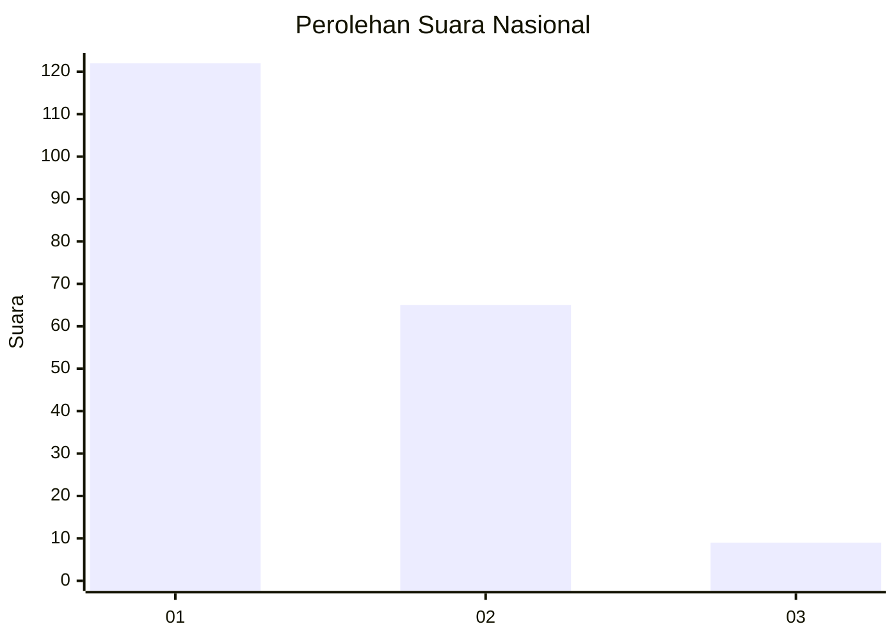
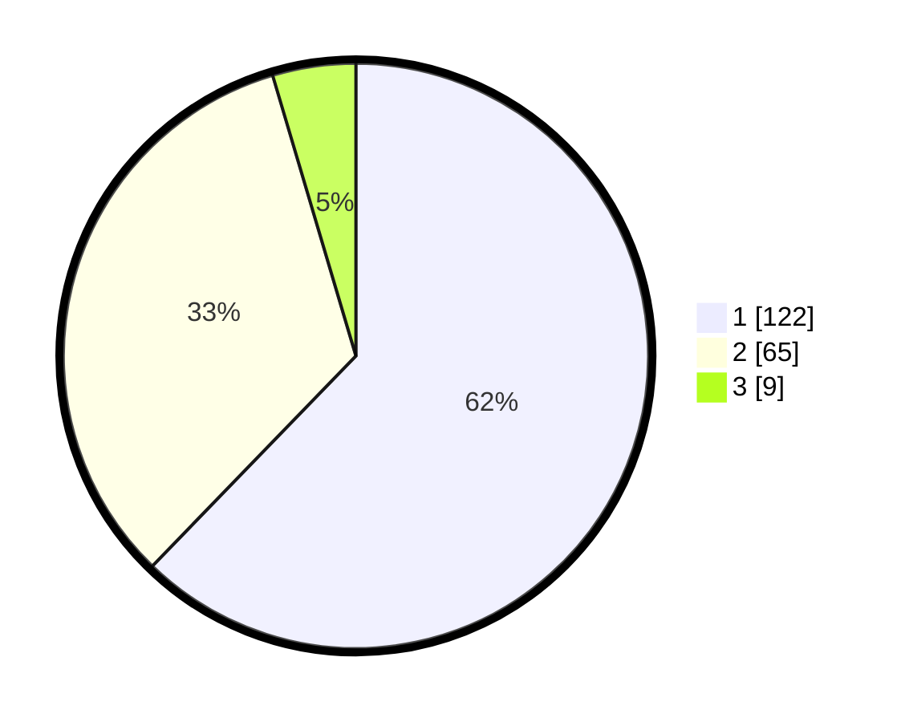

# Hasil

## Grafik

## Tabel

| No. | Nama Paslon    | Suara | Suara (raw) | Persentase |
|:--- |:-------------- | -----:| -----------:| ----------:|
| 1   | ANIES MUHAIMIN | 122   | [122][p-1]  | 62,24      |
| 2   | PRABOWO GIBRAN | 65    | [65][p-2]   | 33,16      |
| 3   | GANJAR MAHFUD  | 9     | [9][p-3]    | 4,59       |

[p-1]: https://github.com/gigit-pemilu/pemilu-2024/blob/main/pilpres/hitung-suara/sub/53-nusa-tenggara-timur/sub/06-flores-timur/sub/07-solor-timur/sub/2004-watohari/sub/001-tps/sub/paslon-1.txt
[p-2]: https://github.com/gigit-pemilu/pemilu-2024/blob/main/pilpres/hitung-suara/sub/53-nusa-tenggara-timur/sub/06-flores-timur/sub/07-solor-timur/sub/2004-watohari/sub/001-tps/sub/paslon-2.txt
[p-3]: https://github.com/gigit-pemilu/pemilu-2024/blob/main/pilpres/hitung-suara/sub/53-nusa-tenggara-timur/sub/06-flores-timur/sub/07-solor-timur/sub/2004-watohari/sub/001-tps/sub/paslon-3.txt

## Foto C Plano

https://sirekap-obj-formc.kpu.go.id/54d6/pemilu/ppwp/53/06/07/20/04/5306072004001-20240215-162040--323455a8-85fd-4854-9386-af1c67d2bcb9.jpg

https://sirekap-obj-formc.kpu.go.id/54d6/pemilu/ppwp/53/06/07/20/04/5306072004001-20240215-162207--00b72fb0-0d5b-4d4b-88ce-59d02376191a.jpg

https://sirekap-obj-formc.kpu.go.id/54d6/pemilu/ppwp/53/06/07/20/04/5306072004001-20240215-162338--eb57d0ed-3d91-437e-87bd-237c562ddce1.jpg

## Metadata

| Key        | Value               |
| ---------- | ------------------- |
| Time Stamp | 2024-02-25 12:00:00 |

