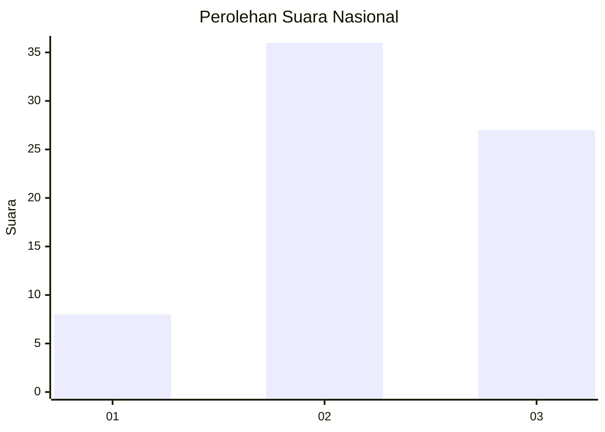
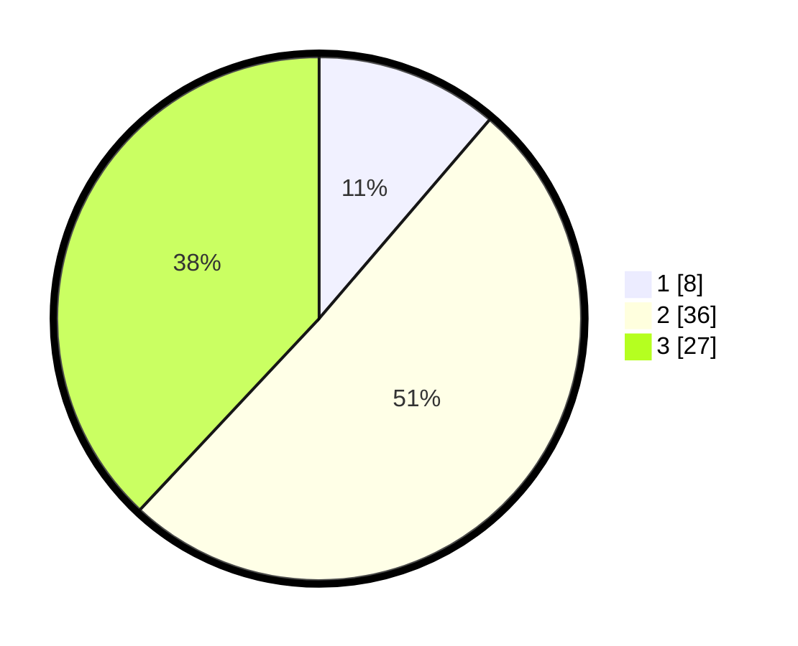

# Hasil

## Grafik

## Tabel

| No. | Nama Paslon    | Suara | Suara (raw) | Persentase |
|:--- |:-------------- | -----:| -----------:| ----------:|
| 1   | ANIES MUHAIMIN | 8     | [8][p-1]    | 11,27      |
| 2   | PRABOWO GIBRAN | 36    | [36][p-2]   | 50,70      |
| 3   | GANJAR MAHFUD  | 27    | [27][p-3]   | 38,03      |

[p-1]: https://github.com/gigit-pemilu/pemilu-2024/blob/main/pilpres/hitung-suara/sub/53-nusa-tenggara-timur/sub/06-flores-timur/sub/07-solor-timur/sub/2008-menanga/sub/005-tps/sub/paslon-1.txt
[p-2]: https://github.com/gigit-pemilu/pemilu-2024/blob/main/pilpres/hitung-suara/sub/53-nusa-tenggara-timur/sub/06-flores-timur/sub/07-solor-timur/sub/2008-menanga/sub/005-tps/sub/paslon-2.txt
[p-3]: https://github.com/gigit-pemilu/pemilu-2024/blob/main/pilpres/hitung-suara/sub/53-nusa-tenggara-timur/sub/06-flores-timur/sub/07-solor-timur/sub/2008-menanga/sub/005-tps/sub/paslon-3.txt

## Foto C Plano

https://sirekap-obj-formc.kpu.go.id/73fb/pemilu/ppwp/53/06/07/20/08/5306072008005-20240215-021744--117736b0-c1cb-4f68-a325-df1497883aa3.jpg

https://sirekap-obj-formc.kpu.go.id/73fb/pemilu/ppwp/53/06/07/20/08/5306072008005-20240215-021918--78174e45-e56a-42a8-9cc0-eff3ba221109.jpg

https://sirekap-obj-formc.kpu.go.id/73fb/pemilu/ppwp/53/06/07/20/08/5306072008005-20240215-024128--d25813d1-b205-4e9d-9a61-ea716a13bd5d.jpg

## Metadata

| Key        | Value               |
| ---------- | ------------------- |
| Time Stamp | 2024-02-15 15:00:29 |

